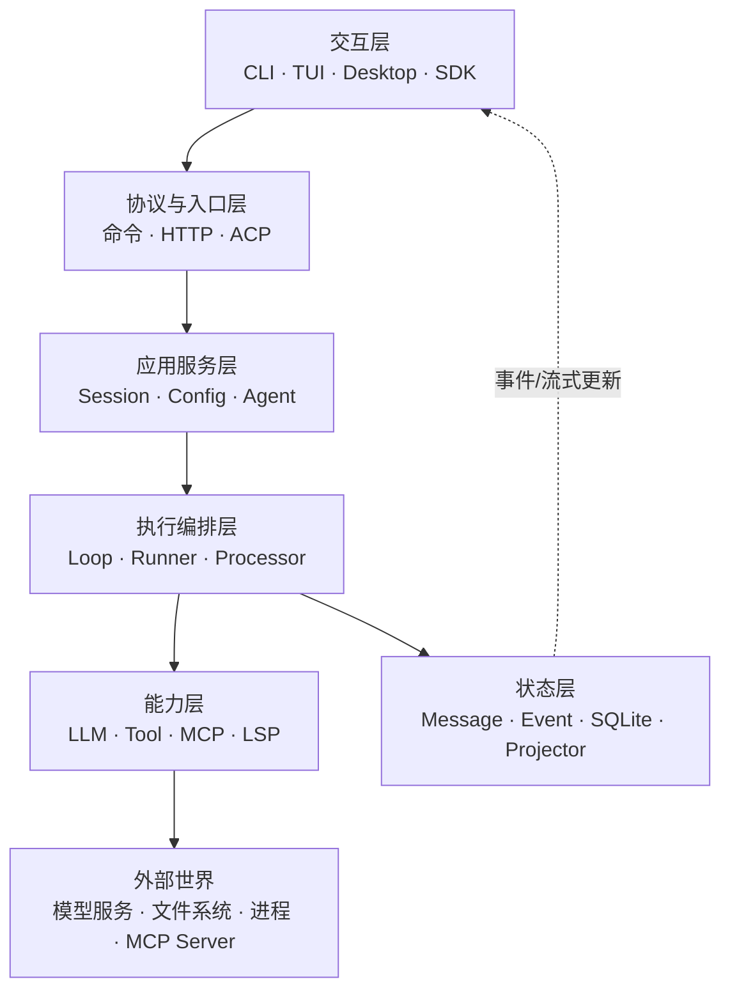
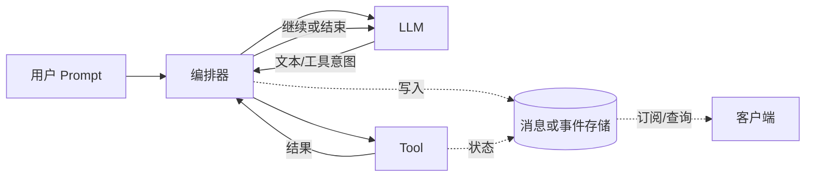
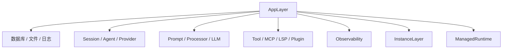
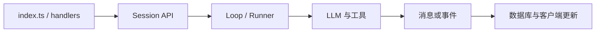

> **一句话理解**
> OpenCode 不是“在终端里套一层聊天界面”，而是一个本地优先的 Agent 应用平台：客户端负责交互，服务端和会话运行时负责编排，模型负责产生下一步意图，工具负责真实执行，事件与数据库负责让整个过程可观察、可恢复。

## 1. 先看整体，而不是先钻进某个函数

一次看似简单的“读取文件并解释”会跨过六层：



各层的职责可以压缩为：

| 层 | 主要问题 | 不应该承担的职责 |
| --- | --- | --- |
| 交互层 | 用户怎样输入、查看进度、批准操作 | 决定 Agent 的核心执行流程 |
| 协议与入口层 | 怎样接收和校验请求 | 直接拼装所有底层依赖 |
| 应用服务层 | 会话、配置、Agent 等业务能力 | 绑定某一家模型协议 |
| 执行编排层 | 何时调用模型、工具、继续或停止 | 绕过权限直接操作外部资源 |
| 能力层 | 调模型或执行确定性操作 | 决定整个任务何时结束 |
| 状态层 | 保存事实、生成查询视图、广播变化 | 替模型做语义决策 |

## 2. 当前仓库同时存在两套会话执行结构

理解当前源码的关键不是背目录，而是先接受一个事实：本地版本中，成熟的 `packages/opencode` 执行栈与新的 Session V2 栈正在并存。

### 2.1 经典应用栈

主要位于 `packages/opencode`：

```text
CLI / Hono Route
  -> SessionPrompt.prompt
  -> SessionPrompt.runLoop
  -> SessionProcessor
  -> LLM stream
  -> Tool execution
  -> Message / Part 持久化与事件通知
```

它的特点是：

- 业务能力集中且完整，CLI、TUI、HTTP、Provider、MCP、LSP 等都已接入。
- `SessionPrompt` 是会话编排中心，循环读取历史、构造上下文、调用模型并判断是否继续。
- `SessionProcessor` 把模型流转成文本、推理、工具、步骤等 Part。
- `AppLayer` 把大量 Effect 服务装配成一个应用运行时。

详细过程见 [opencode源码解析——经典请求执行链路](/blog/opencode-源码解析-经典请求执行链路)。

### 2.2 Session V2 栈

主要分布在：

- `packages/core`：会话、事件、投影、执行协调、工具和 location 级服务。
- `packages/server`：面向 V2 Service 的 HTTP handlers。
- `packages/cli`：新的 Effect 风格 CLI 与 daemon 组合。
- `packages/llm`：统一的模型请求与事件抽象。

```text
HTTP handler / CLI
  -> SessionV2.prompt
  -> 持久化 session_input
  -> SessionExecution.wake(sessionID)
  -> SessionRunCoordinator
  -> location-scoped SessionRunner
  -> LLMEvent 持久事件
  -> Projector 更新读模型
```

V2 的重心从“一个函数里的循环”转向几个明确边界：先接收输入，再调度执行；先记录事实，再投影状态；按 session 串行，同一进程内不同 session 可以并发；按 location 组装文件、工具、配置等服务。

> **不要把“V2”看成一个已经完全替换旧实现的目录**
> 在该 commit 中，两套结构仍然共存，V2 的 `shell`、`skill`、`switchAgent`、`compact`、`wait` 等接口仍会返回 `OperationUnavailableError`。阅读时应描述“当前代码做到什么”，不要根据接口名推断功能已经完成。

详细设计见 [opencode源码解析——Session V2与事件溯源](/blog/opencode-源码解析-session-v2-与事件溯源)。

### 2.3 三个容易混淆的名字

| 名字 | 实际含义 |
| --- | --- |
| `packages/opencode/src/session/message-v2.ts` | 经典栈中的消息处理模块，仍围绕 `SessionV1.WithParts` 工作 |
| `@opencode-ai/sdk/v2` | 第二版客户端 API/类型入口 |
| `SessionV2` | `packages/core` 中新的会话服务与执行设计 |

它们有演进关系，但不是同一个抽象层。

## 3. 两套结构的对应关系

| 关注点 | 经典栈 | Session V2 栈 |
| --- | --- | --- |
| 会话 API | `SessionPrompt`、`Session` | `SessionV2.Service` |
| 接收用户输入 | 创建 User Message/Parts | `SessionInput.admit` 持久接收 |
| 执行入口 | `SessionPrompt.loop` | `SessionExecution.resume/wake` |
| 防止同会话重复运行 | `SessionRunState.ensureRunning` | `SessionRunCoordinator` |
| Agent 循环 | `runLoop` | `SessionRunner` |
| 模型调用 | `packages/opencode/src/session/llm.ts` | `packages/llm` 的 `LLMClient` |
| 工具 | `ToolRegistry` + `SessionTools` | `ToolRegistry.materialize` + settlement |
| 过程记录 | Message / Part 更新与事件 | durable events + projector + read model |
| 环境边界 | Instance context | Location-scoped services |

这不是逐行替换表。V2 重新划分了模块边界，因此一些经典模块的职责在 V2 中被拆成多个服务。

## 4. 关键数据流

### 4.1 控制流与数据流

控制流回答“接下来执行什么”，数据流回答“已经发生了什么、谁能看到”。



模型并不直接操作文件：它返回工具调用意图，由宿主检查参数和权限后执行。工具结果会进入持久记录，并在下一轮重新转换成模型上下文。

### 4.2 为什么一定要循环

LLM 一次响应只能基于当前输入生成内容。遇到未知信息时，它需要先请求工具；拿到真实结果后，必须再次调用模型才能继续推理。

```text
用户目标
  -> 模型决定读取文件
  -> 宿主执行 read
  -> 工具结果进入历史
  -> 模型基于真实内容生成答案
```

这就是 Agent loop 的最小形态。真正的工程实现还要处理权限、取消、错误、上下文溢出、子任务、结构化输出和并发消息。

## 5. 经典应用如何完成依赖装配

`packages/opencode/src/effect/app-runtime.ts` 中的 `AppLayer` 合并了数据库、配置、Provider、Agent、Session、LLM、工具注册、权限、MCP、LSP、快照、分享等服务，然后由 `ManagedRuntime` 持有。



这种结构的价值不只是“依赖注入”：

1. 服务声明自己需要什么，而不是到处访问全局单例。
2. 生产、测试可以提供不同 Layer。
3. Scope 结束时可以统一清理订阅、进程和其他资源。
4. 日志、追踪等横切能力可以在运行时层统一挂载。

详见 [opencode源码解析——Effect运行时与生命周期](/blog/opencode-源码解析-effect-运行时与生命周期)。

## 6. 主要 package 地图

当前仓库的 `packages` 很多，源码阅读不必平均用力：

| 包 | 阅读定位 |
| --- | --- |
| `packages/opencode` | 经典完整应用：CLI、TUI、HTTP、Session、工具、Provider、MCP、LSP |
| `packages/core` | 共享基础设施，也是 Session V2、EventV2、location 与新版工具核心所在地 |
| `packages/server` | 新服务端 handlers 与 V2 服务装配 |
| `packages/cli` | 新 CLI / daemon 入口 |
| `packages/llm` | Provider 无关的请求、流事件与路由抽象 |
| `packages/sdk` | 供客户端调用服务的 SDK 与生成类型 |
| `packages/app` | Web/Desktop 共享前端应用 |
| `packages/tui` | 终端 UI 相关实现 |
| `packages/desktop`、`desktop-electron` | 两种桌面壳与平台集成 |
| `packages/ui` | 共享 UI 组件和资源 |
| `packages/plugin` | 对外的插件 API |
| `packages/console`、`function`、`enterprise` | 云端控制台、服务函数与企业功能 |

顶层 `specs`、各 package 内的 `specs` 以及 `AGENTS.md` 同样重要：它们通常解释“为什么这样设计”，源码只告诉你“现在怎样实现”。

## 7. OpenCode 的几个核心工程判断

### 7.1 模型输出是不可信输入

工具名可能错误、参数可能不合法、请求可能越权。因此系统需要 schema 校验、工具修复、权限规则、输出截断和结构化错误。把 LLM 接进程序不等于把程序控制权直接交给 LLM。

### 7.2 执行状态必须能被观察

长任务可能持续数分钟。只有最终字符串不够，UI 还需要知道：当前是否繁忙、模型是否在流式输出、工具是否等待批准、调用是否失败、用了多少 token。Message/Part 或 durable event 都是在为这种可观察性服务。

### 7.3 持久事实与内存协调要分开

V2 把 prompt admission 写入数据库，再进行进程内 wake；即使唤醒动作失败，输入也没有丢。反过来，当前“哪个 Fiber 正在执行”不适合永久存储，它属于进程内协调状态。

### 7.4 项目目录是一种运行边界

工具、配置、Git、LSP、文件监视器都与工作目录有关。经典栈用 Instance Context 管理这类边界；V2 用 Location 与 LocationServiceMap 组装位置相关服务。它们解决的是同一类问题：不能让 A 项目的文件能力误用到 B 项目。

## 8. 推荐的源码阅读路线



建议按以下顺序阅读：

1. 入口：`packages/opencode/src/index.ts`，或 `packages/server/src/handlers/session.ts`。
2. 会话接口：经典的 `session/prompt.ts`，或 V2 的 `packages/core/src/session.ts`。
3. 编排：经典 `runLoop`，或 V2 `session/runner/llm.ts`。
4. 工具：`tool/tool.ts`、`tool/registry.ts`、`session/tools.ts`。
5. 模型：经典 `session/llm.ts` 与独立的 `packages/llm`。
6. 状态：`message-v2.ts`，或 V2 的 `event.ts`、`projector.ts`、`store.ts`。
7. 最后再读 UI、Provider 细节和外围集成。

如果一开始就从某个 Provider 或 UI 组件向下追，很容易只看到支线，看不到会话为何继续、状态在哪里落盘。

## 9. 源码基线与边界

本文依据本地源码：

- OpenCode package 版本：`1.17.8`
- 分支：`dev`
- commit：`355a0bcf5bb5e6c7baa271a4b2439a40f286e55d`

源码变化很快。本文刻意以“符号 + 路径”为主，少依赖容易漂移的行号。更新代码后，应优先重新核对服务接口、工具注册表、Agent 循环退出条件和 V2 中尚未实现的操作。

返回总目录：[00 OpenCode 源码阅读导航](/blog/opencode-源码阅读导航)
