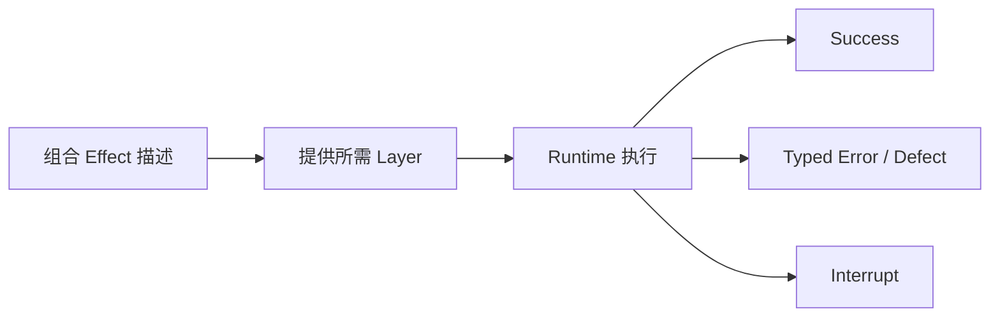
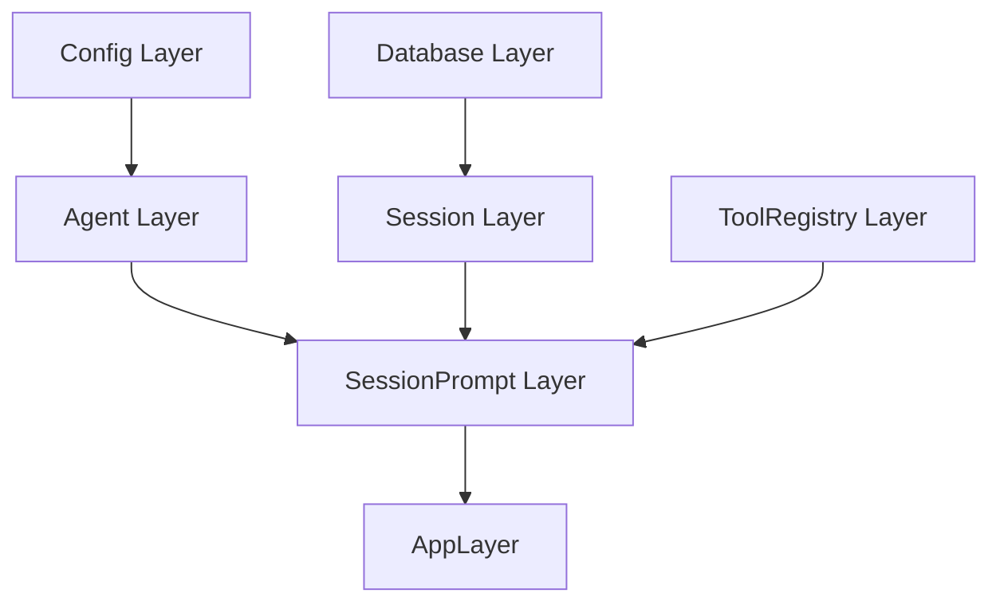
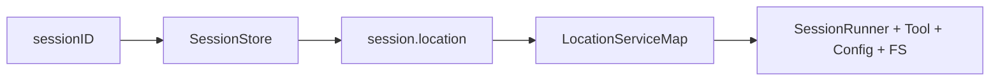
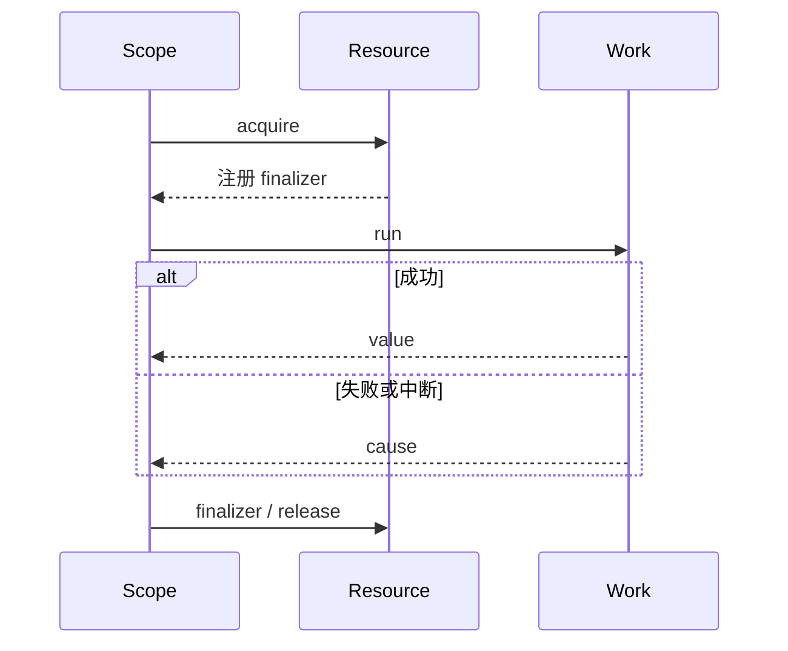
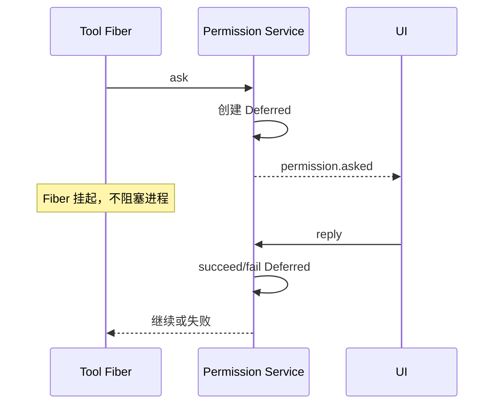

OpenCode 中的 Effect 不是为了把 TypeScript 写成“函数式风格”这么简单。它主要用来统一描述四件事：需要哪些依赖、可能怎样失败、怎样并发、结束时怎样清理。

## 1. 从 `Effect<A, E, R>` 开始

```ts
Effect<Success, Error, Requirements>
```

- `Success`：计算成功后产生什么。
- `Error`：调用者可以识别和处理的失败。
- `Requirements`：运行计算前必须提供哪些 Service。

例如可以把“按 ID 查会话”理解为：

```ts
Effect<Session, NotFoundError, Database.Service>
```

这不一定是源码中的精确类型别名，但表达了阅读方法：看到一个 Effect，应同时问结果、错误和环境，而不只是问“它返回什么”。

## 2. Effect 是描述，不等于已经执行

普通 `async function` 被调用后就开始产生 Promise。Effect 值首先是一份可组合的计算描述，只有交给 Runtime 才真正运行。



这个区分让程序可以在运行前统一加入日志、追踪、重试、超时或测试依赖。不过这些能力并不会“自动发生”：源码必须显式组合对应操作符或 Layer。

## 3. Service：模块对外的能力边界

OpenCode 大量使用 `Context.Service`：

```ts
export interface Interface {
  readonly get: (...) => Effect<...>
  readonly list: (...) => Effect<...>
}

export class Service extends Context.Service<Service, Interface>()("...") {}
```

调用方通过 `yield* Service` 取得接口，而不是直接 `new` 具体实现。这样做的价值是：

- 业务代码依赖契约而不是构造细节；
- 测试可以提供轻量实现；
- Layer 可以统一控制共享、初始化顺序和清理；
- 循环依赖和缺失依赖更容易暴露。

Service 不是网络微服务。这里通常只是进程内依赖注入标识。

## 4. Layer：怎样创建一组服务

Layer 描述“为了提供 A 服务，需要怎样初始化，以及还需要哪些服务”。



实际依赖图比这复杂得多，但阅读时可以把 `.pipe(Layer.provide(...))` 理解为“给这一层补上它需要的实现”，把 `Layer.mergeAll(...)` 理解为“把多个可并存服务组合成环境”。

## 5. `AppLayer` 与 `ManagedRuntime`

经典应用在 `packages/opencode/src/effect/app-runtime.ts` 中把大量服务合并为 `AppLayer`，包括：

- 文件、数据库、配置、Git 和日志；
- Provider、认证、Agent、Skill；
- Session、Prompt、Processor、Compaction、LLM；
- ToolRegistry、Permission、MCP、LSP、Plugin；
- Project/Instance、观测与后台任务。

随后：

```ts
const rt = ManagedRuntime.make(AppLayer, { memoMap })
```

`ManagedRuntime` 持有已经装配的服务，并提供 `runPromise`、`runFork`、`runSync`、`dispose` 等执行入口。`memoMap` 让 Layer 的共享实例在合适范围内复用，避免同一依赖图中重复启动昂贵服务。

## 6. 应用级服务与项目级状态

如果所有东西都做成一个全局单例，不同项目会共享错误的目录、配置、LSP 或文件状态。经典栈通过 Instance 相关服务建立项目上下文，并保留一层从 Promise/异步本地上下文调用方进入 Effect 的桥。

```text
AppRuntime：应用级服务和执行入口
  -> InstanceStore：按输入加载/复用项目实例
  -> InstanceContext：当前目录、worktree 等上下文
  -> InstanceState：与实例绑定的缓存或可变状态
```

例如 ToolRegistry 的动态工具、Permission 的 pending/approved 状态都放在 InstanceState 中，而不是跨所有项目共用一张裸全局 Map。

## 7. V2 的 Location 级 Layer

Session V2 把位置边界表达得更直接：`LocationServiceMap` 根据 `{directory, workspaceID}` 查找或创建一套 location-scoped 服务。



`SessionExecution` 只按 session ID 调度；执行时再查出 location 并提供对应 Layer。源码注释把未来远程放置留在这个路由边界，但当前 `execution/local.ts` 仍是进程内路由，不能据此宣称已经支持分布式调度。

## 8. Fiber：结构化并发单位

Fiber 是 Effect Runtime 管理的轻量任务。它适合表示：

- 后台生成 session 标题；
- 一个 LLM stream 消费过程；
- 若干工具调用；
- 等待权限回复；
- 事件订阅或后台 job。

Fiber 的关键价值不是“比线程更快”，而是它与 Scope、错误和中断处在同一个模型中。父作用域结束时，可以找到并结束相关工作，而不是遗留无人管理的 Promise。

并发也不是自动的。`Effect.all` 可以指定并发策略，`Effect.forkIn(scope)` 明确创建后台 Fiber；没有这些表达时，连续的 `yield*` 通常仍按顺序执行。

## 9. Scope 与资源生命周期

需要关闭的资源包括：

- MCP/LSP 子进程或连接；
- 文件监听器和事件订阅；
- 数据库或缓存句柄；
- 正在执行的模型和工具 Fiber；
- pending permission 请求。

Effect 的 Scope 让初始化和清理绑定：



经典 Permission Layer 就在 finalizer 中拒绝所有尚未回答的 Deferred，避免 Instance 被释放后仍有永远等待的工具调用。

## 10. 三种失败要区分

Effect 的 Cause 模型比 `throw Error` 更细：

| 类别 | 含义 | 典型处理 |
| --- | --- | --- |
| Typed Error | 业务预期内、类型中声明的失败 | `catchTag`、`catchIf`、返回给调用方 |
| Defect | 程序缺陷或被视为不可恢复的异常 | 记录并让上层失败，必要时 `catchDefect` |
| Interrupt | 外部取消或作用域结束 | 做清理，通常不伪装成普通业务错误 |

`Effect.orDie` 会把 typed error 提升为 defect，表示当前层不打算把它作为正常错误继续传播。读源码时不要看到 `Effect<..., never, ...>` 就断言“绝不会失败”，它仍可能 defect 或被 interrupt。

## 11. `Deferred`：等待另一个事件给答案

`Deferred<A, E>` 是一次性完成的同步原语。Permission 是最直观的例子：



这比轮询一个布尔值可靠，也能自然响应 Scope 清理和中断。

## 12. Stream：处理无限或渐进数据

LLM 返回的是随时间产生的事件序列。Stream 可以表达：

- 持续消费 `LLMEvent`；
- 对每个事件更新消息或发布 durable event；
- 在结束、失败和中断时统一 flush/cleanup；
- 对事件做映射、过滤和错误转换。

“模型流式返回”与“多个模型并行调用”不是一回事。Stream 表示增量序列；是否并行仍由 Runner 和 Fiber 结构决定。

## 13. Effect 与 Promise 世界之间的桥

OpenCode 不可能一次性让所有库都原生返回 Effect：Hono、AI SDK、插件和很多生态 API 使用 Promise。因此源码中存在明确桥接：

- `AppRuntime.runPromise(effect)`：从 Promise/API 边界执行 Effect。
- `Effect.promise(() => somePromise())`：把 Promise 接进 Effect。
- `EffectBridge`：让插件或 AI SDK 回调重新进入带正确上下文的 Effect Runtime。

桥接处是重要风险点。普通 Promise 不会自动继承 Effect 的 Service、Scope 和取消语义，所以代码需要显式把 Context 与 AbortSignal 带过去。

## 14. 怎样读 Effect generator

看到下面这种代码：

```ts
const run = Effect.gen(function* () {
  const sessions = yield* Session.Service
  const session = yield* sessions.get(id)
  return session
})
```

可以按普通顺序代码理解：

1. 从环境取得 Session Service。
2. 执行 `get(id)` 这个 Effect。
3. 若成功，拿到 session；若失败/中断，后面不再继续。
4. 整段 generator 仍只是一个新的 Effect 描述。

常见 `.pipe(...)` 操作可按类别阅读：

| 操作 | 关注点 |
| --- | --- |
| `Effect.provide(...)` | 为依赖提供 Layer/Service |
| `Effect.map/flatMap` | 转换成功值或串接下一计算 |
| `Effect.catch...` | 处理某类错误/defect |
| `Effect.ensuring` | 无论怎样结束都执行收尾 |
| `Effect.onInterrupt` | 专门处理取消 |
| `Effect.forkIn` | 在指定 Scope 启动 Fiber |
| `Effect.scoped` | 建立并关闭资源作用域 |
| `Effect.withSpan` | 添加追踪范围 |

## 15. Effect 没有替 OpenCode 自动解决什么

Effect 提供工具，但不会自动保证业务正确：

- 不会自动重试所有网络请求；重试必须有策略。
- 不会自动让工具并行；并发必须显式表达。
- 不会自动使数据库操作幂等；需要 ID、事务和冲突处理。
- 不会自动让进程内协调变成分布式协调。
- 不会自动判断哪个错误该暴露给用户。
- 不会自动保证取消后的外部系统没有副作用。

把 Effect 称为“运行模型”比称为“万能可靠性框架”更准确。

## 16. 源码入口

| 主题 | 路径 |
| --- | --- |
| 经典 AppLayer/Runtime | `packages/opencode/src/effect/app-runtime.ts` |
| Instance Runtime 桥 | `packages/opencode/src/project/instance-runtime.ts` |
| Instance Layer/Store/State | `packages/opencode/src/project`、`src/effect/instance-state.ts` |
| Promise ↔ Effect Bridge | `packages/opencode/src/effect/bridge.ts` |
| V2 Location LayerMap | `packages/core/src/location-layer.ts` |
| V2 本地执行路由 | `packages/core/src/session/execution/local.ts` |
| Fiber 协调例子 | `packages/core/src/session/run-coordinator.ts` |
| Deferred 权限例子 | `packages/opencode/src/permission/index.ts` |

## 小结

Effect 在 OpenCode 中可以概括为：

```text
Service 描述能力
Layer 组装实现
Runtime 执行计算
Fiber 管理并发
Scope 管理生命周期
Error/Cause 管理失败与中断
Stream 管理增量事件
```

它让 Agent 系统中大量“异步、会失败、有依赖、要清理”的工作共享同一套表达方式。

返回总目录：[00 OpenCode 源码阅读导航](/blog/opencode-源码阅读导航)
