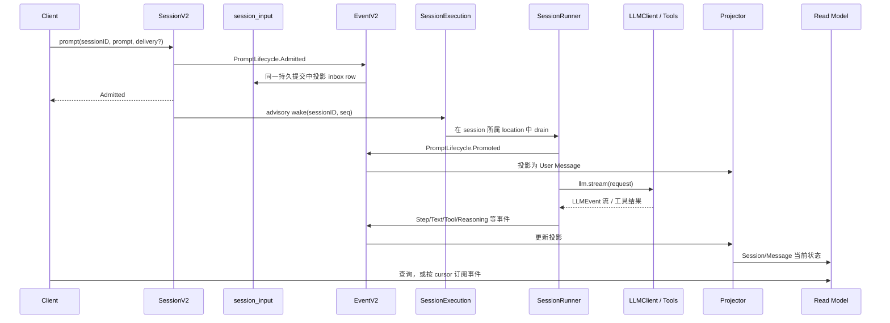
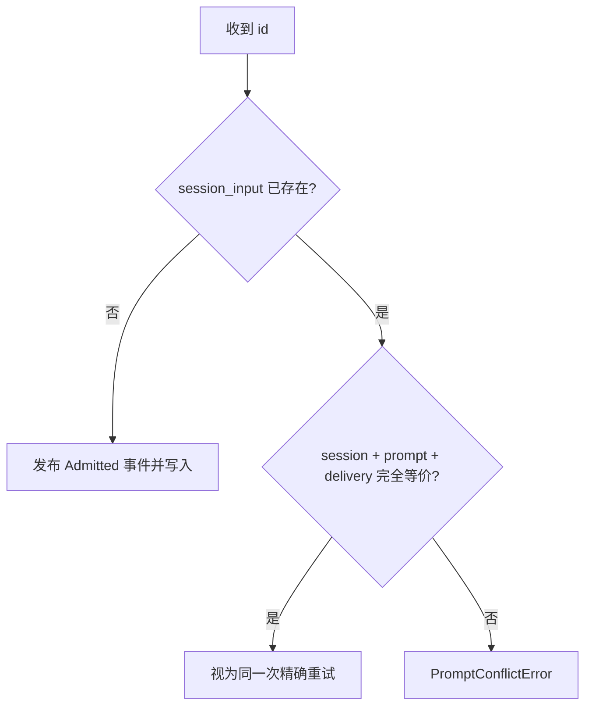
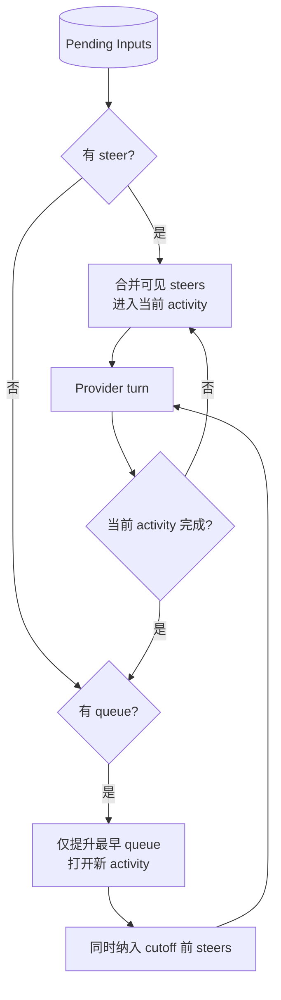
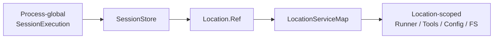
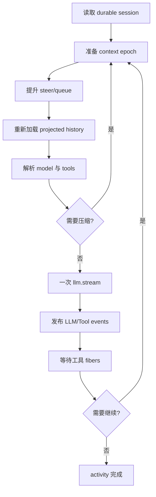
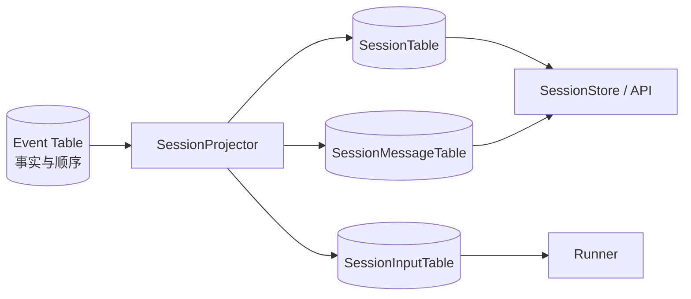

Session V2 最值得关注的变化，不是类型名后多了一个 `V2`，而是它重新定义了会话执行的可靠性边界：用户输入先成为持久事实，随后才唤醒执行；模型与工具产生事件，Projector 再把事件变成可查询的消息状态。

## 1. V2 要解决什么

经典 loop 可以正常驱动 Agent，但当系统走向更长任务、更多客户端和更可靠恢复时，会遇到几个边界问题：

1. HTTP 请求已经成功接收，模型任务还没来得及启动，进程就退出了怎么办？
2. 同一个 session 同时收到多个 prompt，哪些并入当前任务，哪些排队以后做？
3. 客户端断线后，怎样从稳定位置继续读取发生过的事件？
4. 同一 session 怎样避免并行推进，同时允许不同 session 并发？
5. 文件、配置和工具都绑定目录，调度器怎样在不知道全部目录服务的情况下路由？
6. 执行写入过程状态后，API 怎样高效查询当前消息，而不是每次重放全部事件？

V2 的答案分别是 durable inbox、delivery mode、aggregate cursor、SessionRunCoordinator、LocationServiceMap，以及 Event + Projector + Read Model。

## 2. 总体链路



这里最重要的顺序是：

```text
admit 持久化成功
  -> 返回“已接收”
  -> 尝试 wake 执行器
```

不能反过来先启动一段内存任务，再希望它稍后把输入保存下来。

## 3. `SessionV2.Interface`

V2 会话服务位于 `packages/core/src/session.ts`，接口包括：

- 查询：`list`、`get`、`messages`、`message`、`context`、`events`；
- 输入与控制：`prompt`、`resume`、`interrupt`；
- 配置变化：`switchModel`、`switchAgent`；
- 其他操作：`shell`、`skill`、`compact`、`wait`。

在当前 commit：

| 操作 | 实现状态 |
| --- | --- |
| `prompt` | 已实现 durable admission，可自动 wake |
| `resume` | 已转发给 SessionExecution |
| `interrupt` | 发布持久事件并中断当前进程拥有的执行链 |
| `switchModel` | 发布 ModelSwitched 事件 |
| `shell`、`skill`、`switchAgent`、`compact`、`wait` | 返回 `OperationUnavailableError` |

接口预留不等于功能完成。读演进中代码时，应以函数体和测试为准。

## 4. Prompt admission：先承认“已收到”

`SessionV2.prompt` 的主要逻辑：

```ts
const messageID = input.id ?? SessionMessage.ID.create()
const delivery = input.delivery ?? "steer"
const admitted = yield* SessionInput.admit(...)
if (input.resume !== false) yield* enqueueWake(admitted)
return admitted
```

整个 admission 放在不可中断区间，避免“事件写到一半、调用方取消”留下含义模糊的结果。

返回值 `SessionInput.Admitted` 包含：

```ts
{
  admittedSeq,
  id,
  sessionID,
  prompt,
  delivery,
  timeCreated,
  promotedSeq?
}
```

`admittedSeq` 是该 session 聚合内的持久顺序；`promotedSeq` 出现后，说明输入已经从 inbox 提升为执行上下文中的用户消息。

## 5. admission 与 execution 为什么分开

如果把它们写成一个不可分割的大函数：

```text
收到 HTTP 请求 -> 立刻跑模型 -> 最后保存
```

那么客户端超时、连接中断或进程退出都会让“服务到底接没接收”变得不明确。

V2 把语义拆为：

| 阶段 | 保证 |
| --- | --- |
| `prompt` 返回成功 | 输入已经作为 durable event/inbox row 被接收 |
| `wake` 成功启动 | 当前进程开始尝试 drain；它只是调度提示 |
| Runner 发布完成事件 | 相应 provider turn/工具过程已被持久记录 |

`wake` 被称为 advisory（提示性），因为正确性依据是数据库里存在待处理输入，而不是某一次内存 wake 一定不丢。

不过当前源码也明确说明：进程崩溃后自动恢复未完成 activity、决定是否重试 Provider 调用，仍需要单独设计。durable admission 是必要基础，不等于端到端 exactly-once 已经完成。

## 6. 相同 message ID 的重试与冲突

客户端可能因为网络超时重试同一个 prompt。V2 允许提供固定 `id`，并按内容判断：



这是一种幂等键设计：ID 可以消除“相同请求重复提交”，但不能允许同一个 ID 悄悄代表另一段内容。否则事件身份和用户意图会发生冲突。

## 7. `steer` 与 `queue`

V2 把运行中收到的新输入分成两种明确语义。

| Delivery | 语义 | 适合场景 |
| --- | --- | --- |
| `steer` | 在当前 activity 的下一个安全 provider-turn 边界并入；多个 steer 可合并 | “顺便把日志也看一下”“不要改配置文件” |
| `queue` | 作为未来独立 activity，按接收顺序一次处理一个 | “完成当前任务后，再重构测试” |

默认是 `steer`。它让自然对话中的补充要求尽快影响当前任务；如果所有消息都强制排队，用户纠正方向时可能要等一个错误任务先跑完。

### 7.1 提升规则

`SessionInput` 表把尚未处理的输入当作 inbox：

- `promoteSteers`：按 admitted sequence 取出 cutoff 之前所有待处理 steer，并依次发布 Promoted 事件。
- `promoteNextQueued`：只取最早的一条 queue。

Runner 启动时优先观察 steer；没有 steer 才开始最早 queue。处理 queue 时，还会把相应 cutoff 前的 steer 一并提升。一个 activity 结束后，才检查下一条 queue。



“安全边界”指一次 `llm.stream(request)` 完整结束、当前工具结算得到处理后，再用重新加载的持久历史构造下一次请求；不是在 Provider 正生成半句话时改写已发出的请求。

## 8. `SessionExecution`：只按 session ID 路由

接口只有三项：

```ts
resume(sessionID)
wake(sessionID, seq?)
interrupt(sessionID, seq?)
```

- `resume`：显式 drain，保证至少进行一次 Provider 尝试。
- `wake`：输入持久化后提示“可能有新工作”，重复 wake 可以合并。
- `interrupt`：中断当前进程拥有的该 session 执行链；空闲或不存在时是 no-op。

它故意不接收整个 Location Layer。`execution/local.ts` 会先从 SessionStore 找到 session，再通过 `LocationServiceMap.get(session.location)` 提供 Runner 需要的目录级服务。

## 9. `SessionRunCoordinator`：同会话串行，不同会话并发

Coordinator 为每个 session key 维护一条进程内执行 lane：

```text
idle
  --run/wake--> draining
  --新的 run/wake--> 保留至多一个合并后的 follow-up demand
  --settled--> follow-up 或 idle
```

关键规则：

- 同一个 session 同时只有一个 owner Fiber 在 drain。
- 多次 wake 不会启动多个重复 Runner，而会合并为后续一次需求。
- 显式 `run` 比 advisory `wake` 更强，会升级待处理需求并让调用方等待结果。
- 不同 session 使用不同 key，因此可以并发。
- interrupt sequence 会抑制中断边界之前的旧 wake，又允许边界之后的新输入重新启动。

Coordinator 内部状态是 Map、Deferred 和 Fiber，属于 process-local。它不是数据库锁，也不是跨机器共识；当前版本没有借此实现集群级 session ownership。

## 10. Location-scoped services

模型选择、工具、权限、文件系统、配置和工作树都依赖运行位置。V2 通过 `LocationServiceMap` 按 `{directory, workspaceID}` 组装并缓存相应 Layer。



这样，全局执行器只负责“哪个 session 需要运行”，位置层负责“到哪里、用哪套资源运行”。`workspaceID` 缺省时表示 implicit-local；显式 workspace 身份为未来 placement 语义保留，当前不要把它解读成已完成的远程执行系统。

## 11. SessionRunner 的一次 provider turn

`packages/core/src/session/runner/llm.ts` 的 `runTurnAttempt` 大致执行：

1. 读取 session，并确认当前提供的 Location 与 session.location 一致。
2. 选择 Agent，初始化或准备 System Context Epoch。
3. 按 delivery 规则提升 durable inputs。
4. 再次检查 Agent/Model 是否被并发修改；变化则从 durable state 重建。
5. 解析 Model，加载从 context baseline 开始的历史。
6. 为当前 Agent materialize 工具定义。
7. 构造 system、messages、tools 和 Provider 参数。
8. 必要时先做 compaction。
9. 调用一次且仅一次 `llm.stream(request)`。
10. 把 `LLMEvent` 发布为 Session Events；本地工具调用由 tool fibers 结算。
11. 等待工具完成，判断是否还需要下一 provider turn。



把一个 provider turn 限定为一个显式 `llm.stream` 很重要：持久 continuation 必须回到循环顶端重读投影历史，不能让某个内存工具循环偷偷持有不可恢复的隐藏状态。

## 12. System Context Epoch

系统上下文不仅来自一段固定 prompt，还可能由 Agent、Skill、项目文件、引用和环境共同生成。如果这些来源改变，而一次长 activity 仍混用新旧上下文，历史会难以解释。

V2 用 Context Epoch 保存某个 session/agent 下的上下文基线和 revision。Runner 在构造请求时读取对应 baseline；Agent/Model 或上下文修订发生竞争时，当前尝试会放弃内存准备结果，从 durable state 重建。

可以把 epoch 理解为“这段执行历史使用的是哪一版系统上下文”的稳定边界，而不是每轮随意重拼却不留痕。

## 13. Tool calls 怎样被结算

Runner 消费 LLMEvent 时：

- 文本、reasoning、步骤和 Provider 错误被发布成相应 Session Event。
- 遇到非 Provider 自行执行的 tool-call，就交给 materialized tool settlement。
- 工具可以在独立 Fiber 中执行；结果再作为 `toolResult` 事件发布。
- Runner 等待工具 Fibers 结算后，决定是否需要下一轮模型调用。
- 中断、Provider 未返回结果或工具失败时，会把未结算工具明确标为失败，避免永久 pending。

工具调用可能并发，但事件发布通过 permit 串行化，防止同一 session 中事件顺序因为并发回调而失控。

## 14. Runner 的活动循环与步数限制

当前实现的外层逻辑是：

```text
选择 steer 或最早 queue 打开 activity
  -> 最多执行 25 个 provider steps
  -> 每一步后先处理新的 steer
  -> 当前 activity 结束后再取下一条 queue
```

若 25 步后仍需继续，会返回 `StepLimitExceededError`。源码旁还有对这一限制合理性的 TODO/QUESTION，因此这属于当前实现参数，不应写成 OpenCode 永久规范；经典栈也使用另一套基于 Agent 配置的步数逻辑。

## 15. EventV2：保存发生过的事实

EventV2 的 durable event 带有：

- 全局 event ID；
- event type 和版本；
- 某个 aggregate（这里通常是 session）的 `seq`；
- data、location 和可选 metadata。

每个 session 的 sequence 严格递增，订阅者可以使用 cursor 请求某位置之后的事件。典型 Session Event 有：

```text
PromptLifecycle.Admitted / Promoted
ModelSwitched / AgentSwitched
Step.Started / Ended / Failed
Text.Started / Delta / Ended
Reasoning.Started / Delta / Ended
Tool.Input.Started / Delta / Ended
Tool.Called / Progress / Success / Failed
Compaction.Started / Ended
InterruptRequested
```

事件表达“发生过什么”，不应该被后来更新为另一种事实。

## 16. Projector 与 Read Model

如果每次查询都从第一条事件重放，代价很高。`SessionProjector` 为不同事件注册 projector，在 durable event 提交时更新查询表。



当前 EventV2 对 synchronized event 使用数据库事务，把 commit guard、projectors、aggregate sequence 和 event row 放进同一提交过程。这样不会出现“事件已经成功，但本地投影完全没写”的普通半完成状态。

Projector 还桥接部分经典 `SessionV1` 事件到 V2 投影，这说明迁移期间两套结构需要互操作；它不意味着两套模型已经完全相同。

## 17. Event replay 与执行 ownership 是两件事

EventV2 有 replay/claim 相关机制，用于按顺序导入或重放同步事件。SessionRunCoordinator 则决定当前进程内谁拥有某个 session 的执行链。

```text
Replay ownership：谁能把历史事件按正确顺序写入/重放
Execution ownership：谁现在可以继续调用模型和工具
```

两者解决不同竞争问题，不能因为 Event replay 有 owner claim，就推断系统已经拥有集群级 Agent 执行锁。仓库规范也明确要求把这两类 ownership 分开。

## 18. `resume: false` 的用途

调用 `SessionV2.prompt(..., resume: false)` 时，只完成 admission，不自动 wake。它适合：

- 批量写入后由另一流程统一启动；
- 测试 admission 和投影，不触发外部模型调用；
- 调度器希望自己控制执行时机。

之后可以显式调用 `resume(sessionID)`。需要注意，admit-only 输入仍是真实持久状态，不能当作“草稿参数”。

## 19. 中断语义

`SessionV2.interrupt` 在 session 存在时先发布 `InterruptRequested` 持久事件，取得 sequence，再让 process-local coordinator 中断该 session 的 owner Fiber。

sequence 帮助协调器区分中断之前与之后的 wake：旧 wake 可以被抑制，新 admission 产生的更大 sequence 仍可重新启动任务。若 session 不存在或本进程没有 active owner，中断是无害的 no-op。

这仍不能撤销已经在外部系统完成的副作用。例如 shell 命令已删除文件、远程 API 已提交数据，中断只能停止后续工作，不能自动回滚现实世界。

## 20. 与经典栈的核心差异

| 问题 | 经典栈 | Session V2 |
| --- | --- | --- |
| prompt 接收 | 创建 User Message/Parts 后进入 loop | 先写 durable inbox，再 advisory wake |
| 运行中输入 | 下一轮从消息历史发现并加 reminder | 显式 `steer`/`queue` |
| 编排中心 | `SessionPrompt.runLoop` | Session API、Execution、Coordinator、Runner 分离 |
| 状态写入 | Processor 更新 Message/Part 并发事件 | Runner 发布事件，Projector 更新消息读模型 |
| 环境隔离 | Instance Context/State | LocationServiceMap |
| 同 session 协调 | SessionRunState | SessionRunCoordinator |
| 步数 | Agent `steps`，默认 Infinity | 当前 Runner 常量 25 |
| 崩溃恢复基础 | 持久消息 | durable admission + event log；activity 自动重试仍未完成 |

V2 不是单纯把经典类换名字，而是在“接收、调度、执行、记录、查询”之间加入更明确的协议。

## 21. 阅读和评估 V2 的检查表

遇到一个新功能时，依次检查：

1. 输入是否先有 durable event/row？
2. 重试是否有稳定 ID，冲突如何处理？
3. 它属于 `steer` 还是独立 `queue` activity？
4. 同 session 的执行是否经过 Coordinator？
5. Runner 是否在正确 Location Layer 中运行？
6. 每次 continuation 是否重读 projected history？
7. 工具 pending 状态在失败/中断后能否结算？
8. Event 是否有稳定 schema、version 和 aggregate sequence？
9. Projector 是否生成 API 所需的读模型？
10. 这是进程内保证、数据库保证，还是尚未实现的分布式保证？

这十个问题比“有没有一个叫 V2 的接口”更能判断架构是否真的成立。

## 22. 源码入口

| 主题 | 路径 |
| --- | --- |
| Session V2 接口与 prompt | `packages/core/src/session.ts` |
| durable input 与提升规则 | `packages/core/src/session/input.ts` |
| SessionExecution 接口 | `packages/core/src/session/execution.ts` |
| 本地执行路由 | `packages/core/src/session/execution/local.ts` |
| 同 session 协调 | `packages/core/src/session/run-coordinator.ts` |
| LLM Runner | `packages/core/src/session/runner/llm.ts` |
| System Context Epoch | `packages/core/src/session/context-epoch.ts` |
| EventV2 | `packages/core/src/event.ts` |
| Session Events | `packages/core/src/session/event.ts` |
| 投影与查询 | `packages/core/src/session/projector.ts`、`store.ts` |
| location 服务图 | `packages/core/src/location-layer.ts` |
| V2 HTTP handlers | `packages/server/src/handlers/session.ts` |

## 小结

Session V2 的心智模型可以压缩为：

```text
Prompt 先进入 durable inbox
  -> wake 只是提示执行器
  -> Coordinator 保证同 session 的进程内串行
  -> Location 决定实际运行环境
  -> Runner 每轮从持久状态重建请求
  -> LLM/Tool 过程写成有序事件
  -> Projector 生成可查询的当前状态
```

它把“Agent 正在思考”从一段难恢复的内存流程，逐步重构成由持久输入、有序事件和显式执行边界驱动的系统。

返回总目录：[00 OpenCode 源码阅读导航](/blog/opencode-源码阅读导航)
