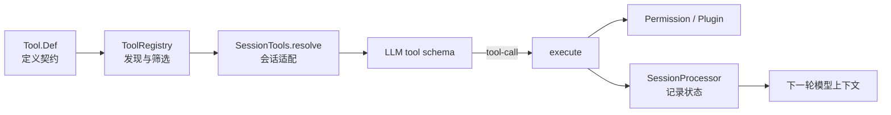
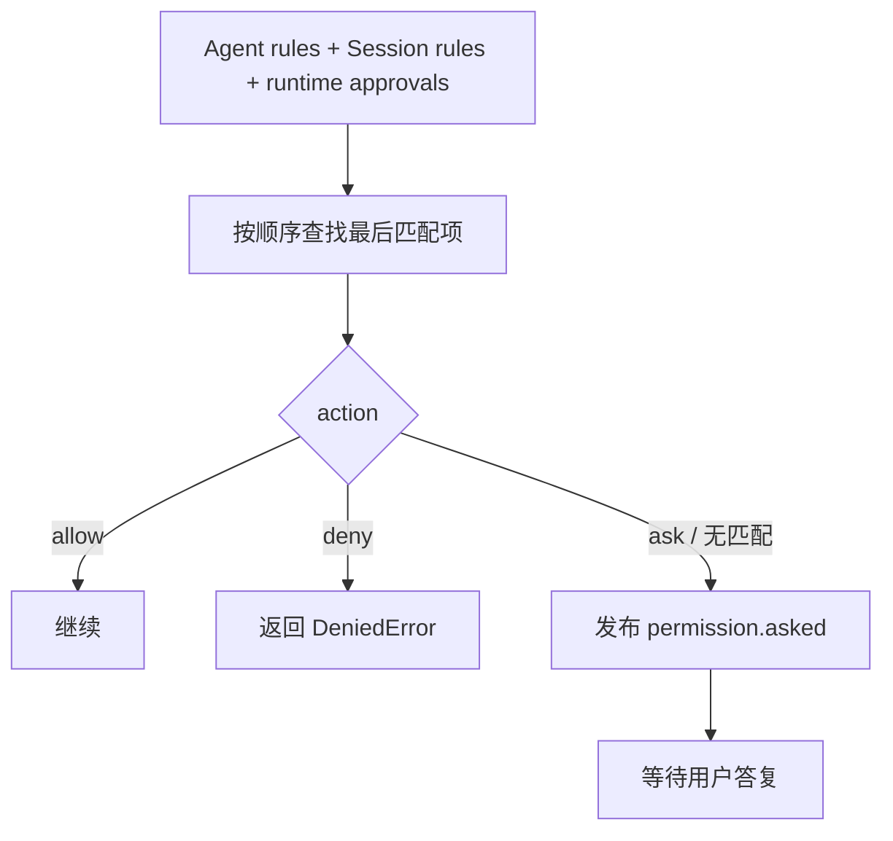
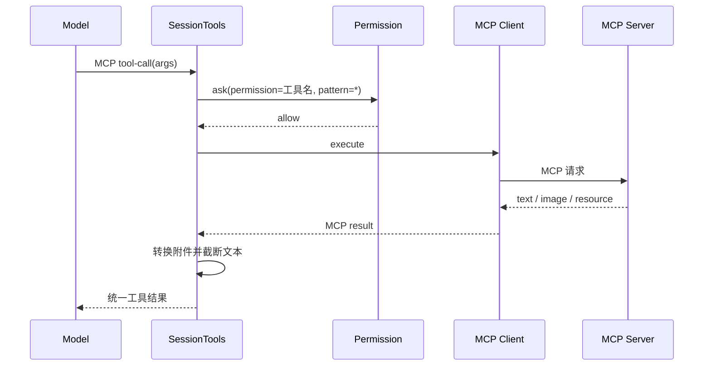
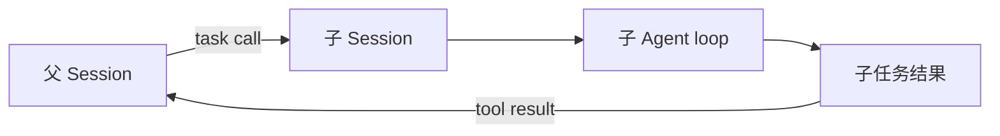

模型不能直接读文件、执行命令或访问 MCP Server。它只能产生结构化的工具调用意图；OpenCode 负责决定工具是否可见、参数是否合法、操作是否允许，以及结果怎样进入下一轮模型上下文。

## 1. 工具链的四个阶段



| 阶段 | 核心问题 |
| --- | --- |
| 定义 | 工具叫什么、接受什么参数、返回什么？ |
| 注册 | 这台机器上有哪些工具，本轮模型适合哪些？ |
| 会话适配 | 当前 session、权限、插件和 MCP 怎样注入？ |
| 执行与记录 | 工具是否成功，结果怎样展示并反馈给模型？ |

## 2. `Tool.Def`：工具的统一契约

经典工具规范位于 `packages/opencode/src/tool/tool.ts`。简化后的结构如下：

```ts
interface Def<Parameters, Metadata> {
  id: string
  description: string
  parameters: Schema.Decoder<unknown>
  jsonSchema?: JSONSchema7
  execute(args, ctx): Effect<ExecuteResult<Metadata>>
}

interface ExecuteResult<Metadata> {
  title: string
  metadata: Metadata
  output: string
  attachments?: FilePart[]
}
```

这个契约同时服务两类调用者：

- 模型依靠 `id`、`description` 和 JSON Schema 判断何时调用、怎样生成参数。
- 宿主依靠 Effect `execute`、Context 和结构化结果安全地执行并记录。

工具描述不是普通文案。它会直接影响模型选哪个工具；参数 Schema 也不是只为 TypeScript 类型检查，它会在运行时验证模型生成的不可信参数。

## 3. `Tool.define` 统一做了什么

`Tool.define`/`Tool.init` 不只包装一个函数，还把横切行为放到统一边界：

1. 编译并执行参数 Schema 校验。
2. 参数不合法时产生 `InvalidArgumentsError`，提示模型按 Schema 重写。
3. 为执行添加 tracing span 和 session/message/call 属性。
4. 在工具未自行标记截断时，统一截断过长输出。
5. 保存截断元数据；必要时保留完整输出所在路径。

这意味着每个具体工具不必重新实现参数防御、观测和上下文容量保护。

## 4. `Tool.Context`：一次工具调用的运行环境

工具执行时收到的 Context 主要包含：

```ts
{
  sessionID,
  messageID,
  agent,
  callID?,
  abort,
  messages,
  extra?,
  metadata(...),
  ask(...)
}
```

其中最关键的是：

- `abort`：用户中断后，支持取消的工具应尽快停止。
- `metadata(...)`：更新运行中的标题和元数据，让 UI 知道工具正在做什么。
- `ask(...)`：按具体 permission 和 pattern 请求授权。
- `messages`：某些工具需要了解当前会话，但这不代表所有工具都应随意依赖完整历史。

Context 把“这次调用属于谁、是否已取消、怎样请求权限”从业务参数中分离。模型只需生成业务参数，不应伪造 session ID 或授权信息。

## 5. `ToolRegistry`：发现工具

当前版本的经典内置工具 ID 主要有：

| ID | 用途 |
| --- | --- |
| `invalid` | 无法修复的错误工具调用兜底；不会作为正常选择 |
| `question` | 向用户提出结构化问题；是否启用取决于客户端/开关 |
| `bash` | 执行 shell 命令 |
| `read` | 读取文件或目录内容 |
| `glob` | 按路径模式查找文件 |
| `grep` | 搜索文件内容 |
| `edit`、`write` | 精确修改或完整写入文件 |
| `apply_patch` | 应用结构化补丁 |
| `task` | 运行子 Agent |
| `webfetch` | 获取指定 URL |
| `websearch` | 网络搜索 |
| `todowrite` | 维护任务列表 |
| `skill` | 加载 Skill 指令和资源 |
| `lsp` | LSP 语义能力；实验开关控制 |
| `plan_exit` | 规划模式相关能力；特定实验配置下启用 |

> **名称以 `Tool.define(...)` 的 ID 为准**
> Registry 组装对象时使用 `shell`、`fetch`、`search`、`todo`、`patch` 等内部属性名，但相应工具真正暴露给模型的 ID 是 `bash`、`webfetch`、`websearch`、`todowrite`、`apply_patch`。内部变量名、实现文件名和外部工具 ID 可以不同。

Registry 还会加载两类动态工具：

- 配置目录下匹配 `{tool,tools}/*.{js,ts}` 的模块；
- 插件通过 `plugin.tool` 暴露的工具。

插件工具的公开参数可能仍使用 Zod。Registry 在边界处把它转换为统一 Schema/JSON Schema，并把 Promise 风格插件调用桥接到 Effect 环境。

## 6. 可用工具不等于所有已注册工具

`ToolRegistry.tools({ providerID, modelID, agent })` 会按本轮环境筛选和调整定义。

当前代码中的典型规则：

- `websearch` 只在相应 Provider 或实验开关满足时启用。
- 对符合条件的 GPT 模型启用 `apply_patch`，同时隐藏 `edit` 与 `write`。
- 其他模型通常看到 `edit`、`write` 而不是 `apply_patch`。
- `task` 的描述会动态加入当前 Agent 有权调用的子 Agent 列表。
- 插件可以通过 `tool.definition` 钩子调整描述或参数。

因此下面三个集合不同：

```text
仓库实现的工具
  ⊇ 当前实例注册的工具
  ⊇ 当前模型和 Agent 实际看到的工具
```

## 7. `SessionTools.resolve`：把工具放进当前会话

该函数位于 `packages/opencode/src/session/tools.ts`，负责最后一公里适配。

对经典本地工具，它会：

1. 获取 Registry 为当前 Agent/Model 筛出的定义。
2. 按 Provider 特性转换 JSON Schema。
3. 用 AI SDK 的 `tool(...)` 包装 `execute`。
4. 创建带 session、message、call ID、AbortSignal 的 Context。
5. 合并 Agent 与 Session 的权限规则，构造 `ctx.ask`。
6. 在执行前后触发插件 hook。
7. 给附件补齐 Part ID 和归属关系。

最终得到的是 `Record<string, AITool>`，可以直接交给模型流运行时。

## 8. 谁决定调用哪个工具

需要区分三种决定：

| 决定 | 主要责任方 |
| --- | --- |
| 哪些工具可被看见 | OpenCode 的 Registry、Agent 权限、模型/Provider 规则、功能开关 |
| 当前应该调用哪个工具 | 通常由模型根据描述、Schema 和上下文生成 tool call |
| 调用能否真正执行 | OpenCode 的参数校验、权限服务和工具代码 |

模型的选择受到描述影响，但它不是安全边界。即使模型“认为可以”，宿主仍必须验证。

结构化输出是一个特殊例子：当用户要求 JSON Schema 结果时，经典 loop 会临时加入 `StructuredOutput` 工具，并把 `toolChoice` 设为 `required`，强制模型通过工具形态提交结构化值。

## 9. 权限规则怎样计算

权限规则包含：

```ts
{
  permission: string
  pattern: string
  action: "allow" | "ask" | "deny"
}
```

`Permission.evaluate(permission, pattern, ...rulesets)` 会把规则集合展平，并选择最后一条同时匹配 permission 与 pattern 的规则；如果没有匹配项，默认是 `ask`。



“最后匹配生效”允许先写宽泛默认规则，再在后面添加更具体的例外：

```text
shell *                ask
shell git status       allow
shell rm *             deny
```

具体 pattern 的定义仍要结合实际工具传入值，不应把这段示意当成完整配置语法。

## 10. `ask` 为什么可以暂停工具再恢复

权限服务为每个待审批请求创建 `Deferred`：

1. 工具调用 `ctx.ask`。
2. 服务记录 pending request，并发布 `permission.asked` 事件。
3. 当前 Fiber 等待 Deferred 完成，不阻塞整个 JS 进程。
4. UI 把用户答复提交给 `Permission.reply`。
5. Deferred 成功或失败，原工具 Fiber 从等待点继续或退出。

答复语义为：

| 回复 | 行为 |
| --- | --- |
| `once` | 只批准当前请求 |
| `always` | 把请求声明的 `always` patterns 加入当前实例的运行时批准列表 |
| `reject` | 拒绝该请求，并拒绝同一 session 中其他等待中的请求 |

这里的 `always` 在该实现中写入当前 Instance 的内存状态，不应自动理解为永久写回配置文件。

## 11. 为什么“工具可见性”和“执行时权限”都需要

提前隐藏被完全禁止的工具可以减少模型误选和 token 消耗，但不能代替执行时检查：

- 规则可能依赖具体路径或命令 pattern，工具名本身不够。
- Session 临时规则和运行时批准会变化。
- 插件/MCP 工具同样必须经过宿主边界。
- 防御不能假设模型严格遵循提示。

所以安全链路应是：

```text
尽量不暴露不应使用的工具
  + 参数 Schema 校验
  + 执行前按具体资源请求权限
  + 记录结果与错误
```

## 12. MCP 工具怎样并入系统

MCP 工具不直接加入经典 `ToolRegistry` 的 builtin/custom 集合，而是在 `SessionTools.resolve` 中额外合并。



MCP 返回的内容可能是：

- `text`：合并进文本输出；
- `image`：转换为 data URL 附件；
- `resource`：文本资源进入输出，二进制资源进入附件；
- metadata：随工具结果保留。

文本同样会经过截断，附件会补充 Session Part 所需的 ID 和归属字段。

## 13. 工具调用怎样落盘并回到模型

经典 `SessionProcessor` 保存 Tool Part 状态：

```text
pending
  -> running（保存已解析参数、开始时间、标题/metadata）
  -> completed（保存 output、attachments、结束时间）
  或 error（保存错误和结束时间）
```

下一轮 `MessageV2.toModelMessagesEffect` 会把 completed/error Tool Part 转成模型协议中的 tool result。于是模型“记住工具结果”的真实机制是：

```text
工具执行结果
  -> 结构化 Part 持久化
  -> 下一轮消息转换
  -> Provider 请求上下文
```

并不是模型进程在后台永久保留了某段隐藏记忆。

## 14. 输出为什么必须截断

一次 `grep`、构建日志或 MCP 查询可能返回数十万字符。如果原样塞进上下文：

- 会消耗大量 token；
- 可能直接超过模型窗口；
- 重要目标和最近对话反而被挤掉；
- 每次后续请求都重复付费。

`Truncate` 会给模型保留适量内容和“结果已截断”的信息，并可通过 metadata 指示完整结果位置。工具输出截断属于上下文管理，而不是单纯的 UI 显示优化。

## 15. `task` 工具为什么特殊

`task` 不是普通函数调用，它会启动或复用一个子 session，让指定子 Agent 独立执行 prompt，再把结果作为父会话的工具结果返回。



父子 session 分离带来三个好处：上下文隔离、权限/Agent 配置可区分、子任务执行记录可追踪。代价是系统需要维护 session tree，并正确传播取消和结果。

## 16. 常见误解

### “工具描述写得好，就不需要权限”

错误。描述只影响模型决策，不能阻止恶意、错误或越权参数。

### “Schema 能保证操作安全”

错误。Schema 只能保证形状正确。一个合法的 `{ command: "..." }` 仍可能非常危险。

### “MCP Server 已经认证，所以不必再询问”

错误。认证回答“你是谁/能否连接”，权限回答“本次 Agent 是否可以执行这个具体动作”。

### “`always` 就会永久记住”

经典权限实现把当前批准 pattern 加到 Instance 内存状态；是否持久要看更外层配置流程，不能仅凭按钮文字推断。

## 17. 源码入口

| 主题 | 路径/符号 |
| --- | --- |
| 工具契约与参数校验 | `packages/opencode/src/tool/tool.ts` |
| 内置/动态工具注册 | `packages/opencode/src/tool/registry.ts` |
| 当前会话工具适配 | `packages/opencode/src/session/tools.ts` |
| 权限计算与等待 | `packages/opencode/src/permission/index.ts` |
| 工具状态持久化 | `packages/opencode/src/session/processor.ts` |
| 内部消息转模型消息 | `packages/opencode/src/session/message-v2.ts` |
| MCP 连接和工具发现 | `packages/opencode/src/mcp` |

## 小结

OpenCode 的工具系统不是“模型调用一个 JS 函数”这么简单，而是一条受控执行管线：

```text
定义契约
  -> 注册与筛选
  -> Provider 适配
  -> 模型选择
  -> 参数验证
  -> 权限审批
  -> 工具执行
  -> 结果截断与持久化
  -> 下一轮反馈给模型
```

返回总目录：[00 OpenCode 源码阅读导航](/blog/opencode-源码阅读导航)
