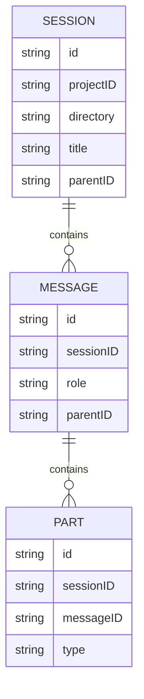
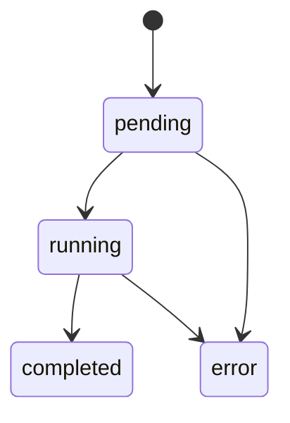
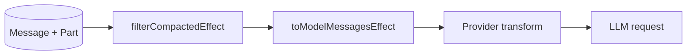
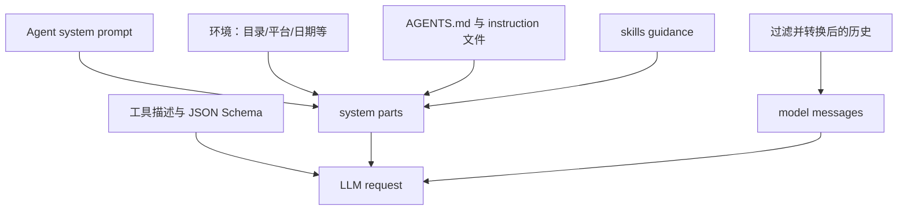
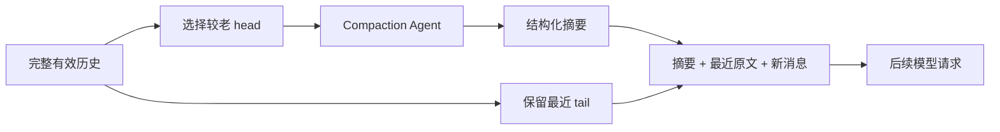

理解 Agent“记忆”的第一步，是把三个东西分开：数据库中的完整记录、OpenCode 内部的消息结构、某一次请求真正发给模型的上下文。它们有关联，但绝不是同一个对象。

```text
持久化历史
  -> 选择有效片段
  -> 转换为模型消息
  -> 按 Provider 能力适配
  -> 当次模型上下文
```

## 1. 为什么不能只保存聊天字符串

普通聊天似乎只需要：

```text
user: 帮我修改登录逻辑
assistant: 好的，已经修改
```

但编程 Agent 的中间过程还包括：

- 模型生成中的文本和 reasoning；
- 工具名称、参数、执行状态和输出；
- 文件或图片附件；
- 每一步的 token、费用和结束原因；
- 修改前后的代码快照和 patch；
- 子 Agent 任务；
- 上下文压缩标记与摘要；
- 错误、中断和重试。

如果把这些都压进一段字符串，UI 无法可靠展示进度，程序也很难恢复工具状态、重建模型上下文或统计成本。因此经典栈采用 Session → Message → Part 三层结构。

## 2. 经典三层结构



### 2.1 Session：任务容器

Session 保存会话级元信息，例如：

- `id`、标题和版本；
- `projectID`、`directory`、workspace；
- 父 session，用于表示子 Agent 会话树；
- permission 覆盖；
- summary、revert、归档和更新时间。

Session 回答“这次任务属于哪里、总体状态怎样”，不负责保存每一段正文。

### 2.2 Message：一次用户或助手记录

经典 `SessionV1` 中主要有两类 Message：

- User Message：保存本轮选择的 Agent、Model、临时 system、工具开关、输出格式等。
- Assistant Message：保存 parent、实际 Agent/Model、执行路径、token、cost、finish、error 和完成时间。

Message 更像一条“记录头”；实际内容通常拆成 Parts。

### 2.3 Part：可独立更新的内容与执行痕迹

常见 Part 包括：

| Part | 表达的事实 |
| --- | --- |
| `text` | 用户文本、助手文本或系统合成文本 |
| `reasoning` | 模型 reasoning 流及时间信息 |
| `file` | 文件、图片或 MCP resource 附件 |
| `tool` | 工具名称、call ID、参数、状态和结果 |
| `step-start` / `step-finish` | 一次模型步骤的边界、快照、token 和 cost |
| `patch` | 文件变更摘要 |
| `compaction` | 一次上下文压缩任务及保留尾部的边界 |
| `subtask` | 待执行的子 Agent 任务 |
| `retry` | Provider 重试信息 |
| `agent` | 消息中显式引用的 Agent |

Part 细粒度更新尤其适合流式输出：Text Part 可以持续追加 delta，Tool Part 可以在同一个 ID 上从 pending 变成 running，再变成 completed。

## 3. Tool Part 是一个状态机

经典 Tool Part 结构的核心是 `state`：



| 状态 | 典型信息 |
| --- | --- |
| `pending` | 工具名、call ID、仍在生成的原始输入 |
| `running` | 已解析参数、开始时间、标题和 metadata |
| `completed` | 参数、文本输出、附件、开始/结束时间、截断信息 |
| `error` | 参数、错误文本、metadata、开始/结束时间 |

它同时服务三类消费者：UI 展示进度，恢复逻辑识别未完成调用，消息转换器在下一轮生成 tool call/result。

## 4. 持久化历史怎样变成模型上下文

经典主链路是：



### 4.1 `filterCompactedEffect`

该函数不是简单删除“旧消息”。它会围绕最近一次已完成压缩，组织成类似下面的模型消费顺序：

```text
压缩请求
  -> 压缩摘要
  -> 被选中保留的最近原文尾部
  -> 压缩后继续发生的用户消息
```

因此返回数组的位置可能不再严格等同于原始时间顺序。源码中的 `MessageV2.latest` 使用单调递增 Message ID 找最新用户、助手和已完成消息，而不是直接取数组最后一项。

### 4.2 `toModelMessagesEffect`

它把内部 Parts 转成模型 SDK 能处理的消息：

| 内部结构 | 模型侧表达 |
| --- | --- |
| User Text Part | user text |
| Assistant Text Part | assistant text |
| Completed Tool Part | assistant tool call + tool result |
| Error Tool Part | 可反馈给模型的工具错误 |
| File Part | file/media，或兼容性文本 |
| Compaction Part | 触发摘要语义的用户文本 |
| Subtask Part | 表示已有外部/子任务执行记录的文本 |

转换器还要处理 Provider 差异。例如某些 API 不允许在 tool result 中直接放某种媒体，代码会在模型确实支持该媒体输入时，把附件移到额外用户消息；不支持时则需要显式报错或剥离。

## 5. 一次模型请求的上下文由哪些部分组成

模型收到的不只是会话历史：



因此上下文长度消耗不仅来自聊天文字，也来自：

- 系统和项目指令；
- 工具描述与参数 Schema；
- 工具的大段输出；
- 文件附件；
- 模型输出和 reasoning；
- 历史摘要本身。

“对话只有十轮”并不能说明上下文一定很短。一次构建日志就可能比十轮对话更长。

## 6. 模型上下文不是内存数据库

可以把状态分成三层：

| 层 | 能否跨进程保留 | 是否每轮都发给模型 |
| --- | --- | --- |
| 数据库中的 Session/Message/Part | 是 | 否 |
| 当前 `runLoop` 读取到的有效历史 | 当前计算期间存在，也可重新构造 | 仍需转换 |
| Provider 收到的请求上下文 | 仅服务于这一次模型调用 | 是 |

模型结束一次请求后，不会神秘地永久持有 OpenCode 的数据库。所谓连续对话，本质是宿主在下一轮重新选择并发送相关历史。

这也解释了两个现象：

1. 数据还在 UI 里，不代表模型本轮仍看到了全文。
2. 历史被压缩后，模型记住的是摘要表达，不是原始细节的无损副本。

## 7. 为什么需要上下文压缩

每个模型都有有限上下文窗口，而且还要为本轮输出留空间。当历史接近可用上限时，继续原样追加会导致 Provider 拒绝请求或截断重要信息。

OpenCode 的策略不是立刻删除整个旧历史，而是把较老部分总结成任务状态，并尽量保留最近几轮原文。



## 8. 经典压缩的实际步骤

`packages/opencode/src/session/compaction.ts` 的关键过程如下：

1. 根据模型上下文和配置判断是否 overflow。
2. 创建带 `compaction` Part 的用户消息。
3. 选择需要总结的较老 `head`，并计算尽量保留的最近 `tail`。
4. 用名为 `compaction` 的 Agent 调模型生成摘要，不提供普通工具。
5. 把摘要保存为 `summary: true` 的 Assistant Message。
6. 在 Compaction Part 中记录 `tail_start_id`，供后续过滤器重建“摘要 + 尾部”。
7. 自动压缩成功后，可以加入合成的继续消息，让原任务接着运行。

当前基线的默认选择策略大致是：优先尝试保留最近 2 个 turn，并把保留预算限制在可用窗口约 25%，同时约束在 2,000～8,000 token；配置可以覆盖这些默认值。这些数字属于实现参数，不是 Agent 架构的不变量。

## 9. 摘要应该保存什么

当前 V2 共享的 compaction prompt 使用固定 Markdown 骨架，经典压缩也复用该 prompt 构造逻辑。摘要包括：

```text
Goal
Constraints & Preferences
Progress：Done / In Progress / Blocked
Key Decisions
Next Steps
Critical Context
Relevant Files
```

这不是为了写一篇漂亮总结，而是为了支持下一位“失去原始长上下文的执行者”继续完成任务。好的压缩摘要应保留精确路径、命令、错误、关键约束和未完成事项。

## 10. 压缩是有损编码

摘要一定会丢信息。尤其容易丢失：

- 某个边界条件的原话；
- 很长工具输出中的局部错误；
- 用户微妙的偏好；
- 先前被否决方案的完整理由；
- 图片或二进制附件细节。

因此 OpenCode 同时保留最近原文尾部，而不是只留下摘要。工程上要追求的不是“摘要等于原文”，而是“在固定 token 预算内，最大化继续任务所需的信息”。

## 11. 工具输出修剪与会话压缩不同

经典 `SessionCompaction.prune` 会从较老的已完成工具调用向前统计输出大小，并在达到阈值后把更旧的大段输出标记为已修剪；`skill` 工具受到保护。当前实现还会保留最近 turn，并设置最低收益门槛，避免为了很少空间频繁改写状态。

| 机制 | 主要对象 | 目的 |
| --- | --- | --- |
| 工具执行时截断 | 单次工具的 output | 阻止一次异常大输出进入上下文 |
| `prune` | 历史中的旧 Tool Part 输出 | 释放长期累积的工具输出空间 |
| `compaction` | 一段完整对话历史 | 用任务摘要替代旧语义细节 |

三者解决的是不同尺度的问题。

## 12. Overflow 不一定来自纯文本

图片、PDF 或其他媒体可能让 Provider 在请求前后判断超限。经典压缩对 overflow 还包含特殊处理：必要时重放之前的用户请求，并把过大的媒体转换为说明性文本，避免相同附件无限触发超限。

如果连剥离媒体后的压缩请求本身也超过模型上限，系统会写入 `ContextOverflowError` 并停止，而不是无限递归压缩。

## 13. V2 的消息视图有何不同

Session V2 更接近“事件 → 投影消息”的结构。`packages/core/src/session/message.ts` 中的读模型消息类型包括：

- `user`、`assistant`；
- `agent-switched`、`model-switched`；
- `synthetic`、`system`；
- `shell`、`compaction`。

Assistant 内部仍有 text、reasoning、tool content，工具也有 pending/running/completed/error 状态。区别在于这些状态由 `SessionEvent` 经 `SessionProjector` 更新，而不是让编排器直接把每个最终对象写进表。

详细见 [opencode源码解析——Session V2与事件溯源](/blog/opencode-源码解析-session-v2-与事件溯源)。

## 14. 调试“模型为什么忘了”时怎样排查

按以下顺序会比只看 UI 有效：

1. 原始 Message/Part 是否确实保存？
2. 是否存在最新 compaction，以及 `tail_start_id` 指向哪里？
3. `filterCompactedEffect` 的有效历史里还有该信息吗？
4. `toModelMessagesEffect` 是否忽略、替换或剥离了对应 Part？
5. Provider transform 是否因媒体/协议限制再次改写？
6. 工具输出是否在执行时截断，或后来被 prune？
7. 系统提示和工具 schemas 是否挤占了大量上下文预算？

“数据库没丢”只能排除第一类问题，不能证明模型看见了内容。

## 15. 源码入口

| 主题 | 路径 |
| --- | --- |
| 经典 Session/Message/Part Schema | `packages/core/src/v1/session.ts` |
| 经典消息读写与模型转换 | `packages/opencode/src/session/message-v2.ts` |
| 经典压缩与修剪 | `packages/opencode/src/session/compaction.ts` |
| 上下文溢出判断 | `packages/opencode/src/session/overflow.ts` |
| 经典 Agent loop | `packages/opencode/src/session/prompt.ts` |
| V2 Message 读模型 | `packages/core/src/session/message.ts` |
| V2 历史与压缩 | `packages/core/src/session/history.ts`、`compaction.ts` |

## 小结

OpenCode 的“记忆”不是一个神秘模块，而是一条明确的数据管线：

```text
执行事实被结构化保存
  -> 根据压缩边界选择有效历史
  -> 将内部消息转换成模型协议
  -> 在有限上下文中继续推理
```

理解这条管线后，工具结果回传、长对话遗忘、流式 UI 和恢复机制就会落在同一个模型里。

返回总目录：[00 OpenCode 源码阅读导航](/blog/opencode-源码阅读导航)
