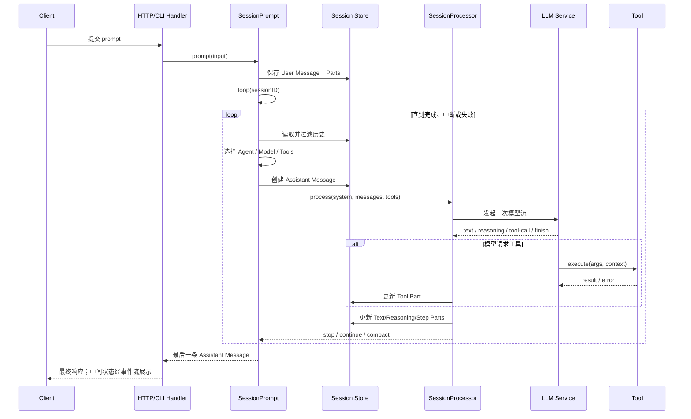
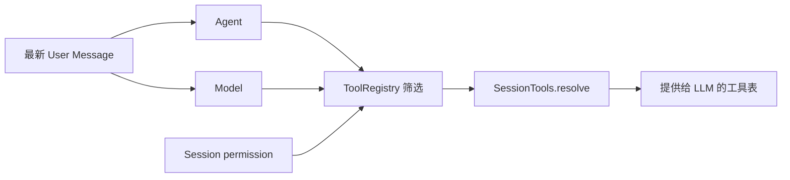
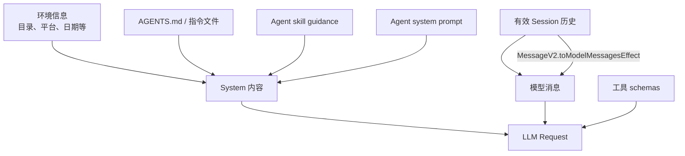
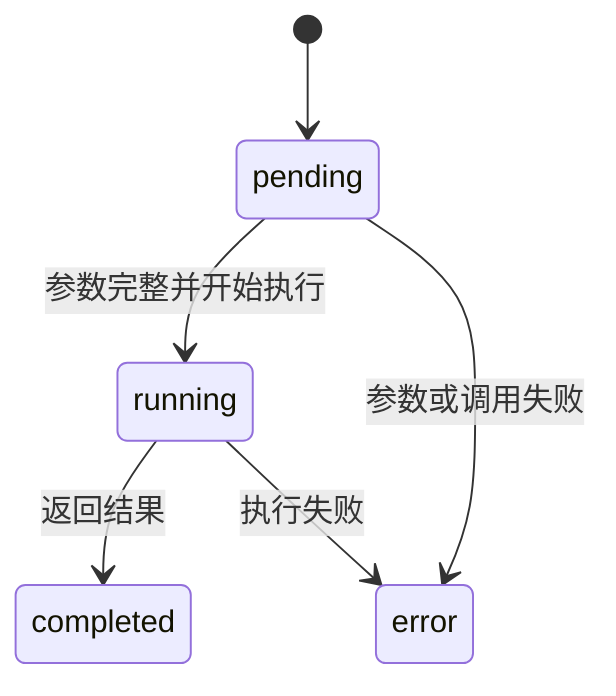
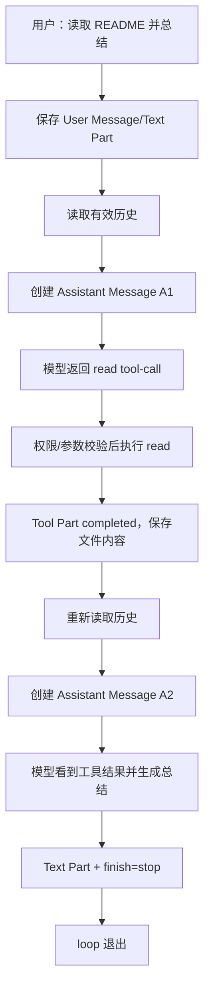

这篇只追踪 `packages/opencode` 中的经典执行栈。目标是回答一个具体问题：用户输入“读取 README 并总结”后，系统怎样从一条消息走到工具调用，再走到最终回答？

> **范围说明**
> 当前仓库还有一套新的 Session V2 执行结构，见 [opencode源码解析——Session V2与事件溯源](/blog/opencode-源码解析-session-v2-与事件溯源)。这里的 `MessageV2` 是经典栈里的消息转换模块，不代表本篇已经切换到 Session V2。

## 1. 主链路



把它压缩成一句伪代码：

```ts
while (任务尚未完成) {
  const history = 读取有效会话历史()
  const request = 构造模型上下文(history, agent, tools)
  const events = 调用模型(request)
  持久化文本、工具和步骤事件(events)
  如果模型调用工具，下一轮把工具结果重新交给模型
}
```

真正的源码比这段伪代码多出的部分，几乎都在处理可靠性：权限、取消、消息并发、上下文溢出、结构化输出、子任务和错误状态。

## 2. 第零步：先建立应用和项目上下文

CLI 入口位于 `packages/opencode/src/index.ts`。具体命令或 HTTP handler 不会各自创建数据库、模型和工具服务，而是进入已经装配好的 Effect Runtime。

`packages/opencode/src/effect/app-runtime.ts` 中：

```text
AppLayer
  = Database + Config + Provider + Agent
  + Session + SessionPrompt + SessionProcessor + LLM
  + ToolRegistry + Permission + MCP + LSP
  + Project/Instance + Observability + ...
```

请求还需要绑定一个项目实例。工作目录决定项目配置、Git worktree、文件访问、LSP 和工具行为，所以“当前目录”不是随手传下去的字符串，而是运行边界的一部分。

## 3. `SessionPrompt.prompt`：把输入变成可持久化消息

经典会话的主要入口是 `packages/opencode/src/session/prompt.ts` 中的 `SessionPrompt.prompt`。

输入不只是文本，通常还包含：

```ts
{
  sessionID,
  messageID?,
  agent?,
  model?,
  parts,
  tools?,
  format?,
  noReply?
}
```

它大致做四件事：

1. 确认 session，并清理可能存在的 revert 状态。
2. 通过 `createUserMessage` 生成 User Message 和对应 Parts。
3. 更新 session 的时间和本轮工具权限覆盖。
4. 若 `noReply` 不是 `true`，进入 `loop({ sessionID })`。

为什么先保存用户消息再调用模型？因为用户输入是任务事实。模型调用失败，也不应该让刚才的输入凭空消失；UI 和恢复逻辑同样需要看到它。

## 4. `loop`：同一 session 的执行闸门

公开的 `loop` 本身很薄，它把真正的 `runLoop` 交给 `SessionRunState.ensureRunning`。其目的不是增加一层命名，而是避免同一个 session 被多个循环同时推进。

如果两个循环同时读到相同历史，又各自创建 assistant message，会出现：

- 工具被重复执行；
- 消息父子关系混乱；
- 后写入的结果覆盖先写入的状态；
- 用户无法判断哪条回答对应哪次输入。

因此“一个 session 同一时间只有一条主执行链”是一致性要求，不只是性能选择。不同 session 则可以各自运行。

## 5. `runLoop` 每一轮先重新读取历史

`runLoop` 不会只在开始时把历史装进变量然后一直使用。每轮都会调用：

```ts
MessageV2.filterCompactedEffect(sessionID)
```

随后由 `MessageV2.latest` 找到：

- 最新 User Message；
- 最新 Assistant Message；
- 最新已完成的 Assistant Message；
- 尚未处理的 `subtask` 或 `compaction` Part。

每轮重读有三个重要作用：

1. 上轮产生的工具结果自然进入下一轮。
2. 任务运行时新到达的用户消息可以被观察到。
3. 压缩和其他状态更新不会只停留在旧内存快照里。

`filterCompactedEffect` 生成的是“供模型消费的有效历史”，数组位置不一定等于原始时间顺序。因此 `latest` 使用单调递增的 Message ID 判断新旧，而不是盲目拿数组最后一项。

## 6. 开始新一轮前的分支判断

每一轮并不一定马上调用主模型。`runLoop` 会依次处理几类情况：

### 6.1 已经完成

如果最新 assistant 有完成原因、不是 `tool-calls`，并且没有仍需回传给模型的工具调用，就退出循环。

这里不能只检查 `finish === "stop"`。有些 Provider 即使消息含工具调用也可能返回 `stop`，所以源码还会检查 Assistant Message 中是否真的存在未被清理的 Tool Part。

### 6.2 有子任务

若历史里存在尚未处理的 `subtask` Part，就由 `handleSubtask` 运行子 Agent，并把结果写回对应的 task 工具状态，然后进入下一轮。

### 6.3 有压缩任务或上下文溢出

- 已有 `compaction` Part：执行摘要生成。
- 最新完成步骤超过可用上下文：先创建 compaction 任务，再继续循环。

### 6.4 正常模型步骤

只有前面几类情况都不成立，才解析 Agent、Model 和 Tools，创建新的 Assistant Message 并调用模型。

## 7. 解析 Agent、Model 和 Tools

最新 User Message 决定本轮使用的 Agent 与 Model；Session 和 Agent 的配置又共同影响权限和工具。



`SessionTools.resolve` 不只是拿工具列表。它还会：

- 把 Effect 工具适配为模型 SDK 能调用的工具；
- 针对 Provider 转换 JSON Schema；
- 注入 session、message、call ID、AbortSignal 等上下文；
- 注入 `ctx.ask` 和 `ctx.metadata`；
- 合并 MCP 工具；
- 触发工具执行前后的插件钩子。

详细见 [opencode源码解析——工具、权限与MCP](/blog/opencode-源码解析-工具-权限与-mcp)。

## 8. 先创建 Assistant Message，再开始流式生成

模型请求发出前，OpenCode 会先写入一条尚未完成的 Assistant Message，其中记录：

- 它对应的 `parentID`；
- Agent、Provider 和 Model；
- 当前 `cwd` 与项目 root；
- 初始 token、cost 和创建时间。

这让后续所有流式事件都有稳定的 `messageID` 可以归属。即使中途断网或被用户取消，系统也能把错误和完成时间写在同一条消息上，而不是留下没有身份的文本碎片。

## 9. 构造模型真正看到的上下文

传给模型的内容来自多个来源：



在进入转换前，插件还有机会通过 `experimental.chat.messages.transform` 调整消息。

`MessageV2.toModelMessagesEffect` 负责把 OpenCode 内部的 Part 转成模型 SDK 消息，包括：

- Text Part → 用户或助手文本；
- File Part → 文件/媒体内容，或必要的文本替代；
- Tool Part → tool call 与 tool result；
- Compaction Part → 摘要任务提示；
- Subtask Part → 对模型可理解的执行记录。

内部数据库结构不等于 Provider API 格式，中间必须有这层防腐转换。详见 [opencode源码解析——消息、上下文与压缩](/blog/opencode-源码解析-消息-上下文与压缩)。

## 10. LLM Service：把不同模型运行时归一化

经典 `packages/opencode/src/session/llm.ts` 负责模型配置、认证、Provider 参数、插件钩子和实际流调用。

当前版本有两条底层路径：

- AI SDK 是默认运行时。
- Native runtime 由实验开关启用，只支持有限 Provider；不满足条件时会回退。

上层 `SessionProcessor` 不需要分别处理两套底层协议，因为它们最终都被归一成 `LLMEvent` 流，例如文本增量、推理增量、tool call、tool result、usage 和 finish。

## 11. `SessionProcessor`：把瞬时事件变成会话状态

模型流是短暂的；Message/Part 是可查询的。Processor 位于二者之间。

```text
LLMEvent                         持久化结构
-------------------------------------------------
text-start / text-delta          Text Part
reasoning-start / delta          Reasoning Part
tool-input-start / tool-call     Tool Part
start-step / finish-step         Step Parts
provider error                   Assistant error
usage / finish                   tokens、cost、finish
```

Tool Part 典型状态机是：



UI 因此可以展示“参数还在生成”“工具正在运行”“已完成”或“失败”，而不必等整轮结束。

## 12. 为什么工具执行完还要再调用一次模型

以“读取 README 并总结”为例：

| 阶段 | 模型当前掌握的信息 | 产生的结果 |
| --- | --- | --- |
| 第一次模型调用 | 用户目标，但没有 README 内容 | `read({filePath: ...})` 工具意图 |
| 工具执行 | 宿主程序读取真实文件 | Tool Part 中的文件内容或错误 |
| 第二次模型调用 | 用户目标 + read 调用 + read 结果 | 基于真实内容生成总结 |

工具执行函数不能代替第二次模型调用，因为 `read` 只负责得到字节/文本，不负责理解用户究竟想怎样总结。

下一轮开始时，Tool Part 会经 `toModelMessagesEffect` 转成 Provider 能理解的 assistant tool call + tool result。模型看到结果后，才有条件回答或决定继续调用其他工具。

## 13. 完整示例：读取 README 并总结



需要注意：A1 和 A2 可以是两条 Assistant Message。一次用户输入并不保证只对应一次 Provider 调用，也不保证只产生一个内部执行步骤。

## 14. 继续、停止和压缩

Processor 的结果会让编排器做三类决定：

- `stop`：任务结束，返回最后一条 Assistant Message。
- `continue`：通常因为有工具结果需要让模型继续处理。
- `compact`：上下文不足，先创建压缩任务再继续。

经典栈用 Agent 的 `steps` 配置计算步骤阈值；未配置时是 `Infinity`。达到阈值后，系统会向模型附加“步骤已用尽、禁止再调用工具、请总结”的强提示。当前代码依赖模型遵守这条提示，并没有在该判断处直接 `break`，所以把它理解成“硬性循环上限”也不够准确。可以确定的是：旧笔记里“统一固定最多 100 次”的说法不成立。

## 15. 运行中的新用户消息

如果任务运行过程中又出现了新的用户文本，下一轮重读历史时可以发现它。源码会把相关文本包进 `<system-reminder>`，提醒模型在继续原任务时同时处理用户的新要求。

这是一种“在当前活动中转向”的语义。V2 把这件事进一步建模为默认的 `steer`，并另外提供 FIFO 的 `queue`，两者差别见 [opencode源码解析——Session V2与事件溯源](/blog/opencode-源码解析-session-v2-与事件溯源)。

## 16. 中断与异常收尾

中断不能只关闭 HTTP 连接。经典链路还需要：

- 取消 LLM 流和正在执行的工具；
- 给未完成 Assistant Message 写入 aborted/error 与完成时间；
- 避免孤立 Tool Part 被下一轮误认为仍需执行；
- 清理 instruction 临时状态和相关资源；
- 把 session 状态从 busy 恢复到可理解的状态。

源码中的 `Effect.onInterrupt`、`Effect.ensuring`、AbortSignal 和 Scope 一起完成这些收尾。相关运行机制见 [opencode源码解析——Effect运行时与生命周期](/blog/opencode-源码解析-effect-运行时与生命周期)。

## 17. 读这条链路时最值得关注的源码符号

| 符号 | 路径 | 作用 |
| --- | --- | --- |
| `SessionPrompt.prompt` | `packages/opencode/src/session/prompt.ts` | 接收并保存输入 |
| `SessionPrompt.runLoop` | 同上 | 经典 Agent 主循环 |
| `SessionRunState.ensureRunning` | `packages/opencode/src/session/run-state.ts` | 同 session 运行协调 |
| `SessionTools.resolve` | `packages/opencode/src/session/tools.ts` | 组装本轮工具 |
| `SessionProcessor` | `packages/opencode/src/session/processor.ts` | 消费并落盘模型事件 |
| `LLM` | `packages/opencode/src/session/llm.ts` | 发起模型请求 |
| `MessageV2.toModelMessagesEffect` | `packages/opencode/src/session/message-v2.ts` | 内部消息转模型消息 |
| `MessageV2.filterCompactedEffect` | 同上 | 生成有效历史 |
| `SessionCompaction` | `packages/opencode/src/session/compaction.ts` | 压缩和工具输出修剪 |

## 小结

经典执行栈最重要的心智模型是：

```text
Session 是事实容器
SessionPrompt 决定下一步
LLM 产生文本或工具意图
Tool 接触真实世界
SessionProcessor 把过程写回结构化历史
下一轮基于更新后的历史继续
```

返回总目录：[00 OpenCode 源码阅读导航](/blog/opencode-源码阅读导航)
