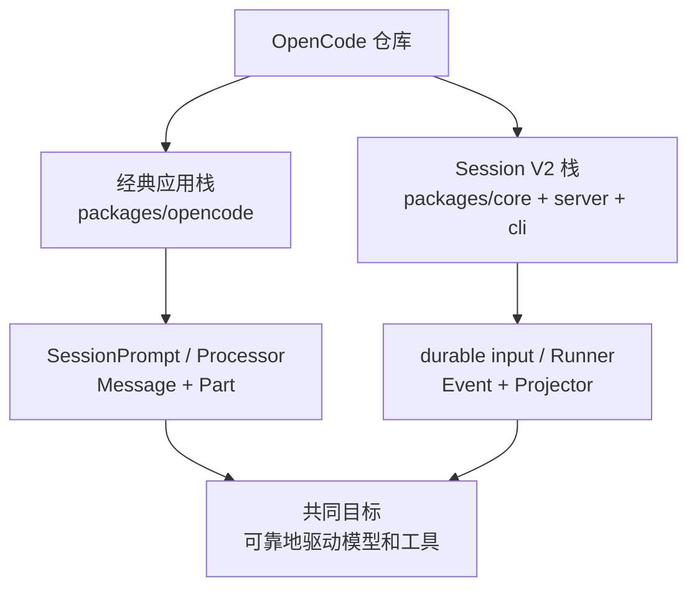
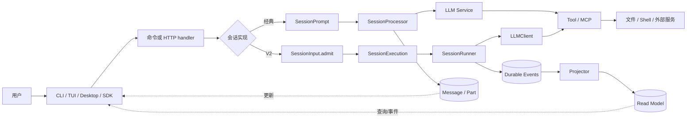

这组笔记以一次 Agent 请求为主线，解释 OpenCode 怎样接收输入、调用模型、执行工具、保存过程，并把实时状态返回客户端。目标不是逐文件翻译源码，而是建立一套能够继续验证和更新的心智模型。

> **源码基线**
> 本地仓库：`本地路径`  
> package 版本：`1.17.8`  
> 分支：`dev`  
> commit：`355a0bcf5bb5e6c7baa271a4b2439a40f286e55d`

## 先记住：当前有两条会话主线

| 主线 | 适合回答的问题 | 当前状态 |
| --- | --- | --- |
| 经典栈 | 现有 CLI/HTTP 如何完整运行一个 Agent；工具、权限、压缩如何协作 | 功能完整，入口集中在 `packages/opencode` |
| Session V2 | 怎样可靠接收并排队 prompt；怎样用事件、投影和 location 边界重构执行 | 已有核心链路，部分接口仍未实现 |

这两条线不能揉成一张伪造的调用图。笔记会在需要时分别描述，再解释它们的对应关系。

另外，下面三个名字不是同一件事：

- `message-v2.ts`：经典栈中的消息转换模块。
- `@opencode-ai/sdk/v2`：客户端 API 版本。
- `SessionV2`：`packages/core` 中的新会话核心。

## 推荐阅读顺序

| 顺序 | 笔记 | 读完应能回答 |
| --- | --- | --- |
| 1 | [opencode源码解析——总体概览](/blog/opencode-source-overview) | OpenCode 有哪些层，两套会话结构怎样并存？ |
| 2 | [opencode源码解析——一些概念](/blog/opencode-core-concepts) | Runtime、Effect、Session、MCP、事件投影分别是什么？ |
| 3 | [opencode源码解析——经典请求执行链路](/blog/opencode-源码解析-经典请求执行链路) | 一次“读取 README 并总结”到底经过哪些函数？ |
| 4 | [opencode源码解析——工具、权限与MCP](/blog/opencode-源码解析-工具-权限与-mcp) | 模型怎样看到工具，工具怎样校验、授权和落盘？ |
| 5 | [opencode源码解析——消息、上下文与压缩](/blog/opencode-源码解析-消息-上下文与压缩) | 完整历史与模型上下文为何不是同一回事？ |
| 6 | [opencode源码解析——Effect运行时与生命周期](/blog/opencode-源码解析-effect-运行时与生命周期) | Service、Layer、Fiber、Scope 怎样支撑整个应用？ |
| 7 | [opencode源码解析——Session V2与事件溯源](/blog/opencode-源码解析-session-v2-与事件溯源) | durable inbox、steer/queue、Runner、Projector 解决了什么？ |
| 8 | [opencode源码解析——模块设计](/blog/opencode-module-design) | 各模块为什么这样拆，边界和依赖方向是什么？ |

如果只想快速了解，先读第 1、3、7 篇；如果准备继续跟源码，建议完整按顺序读。

## 一张总地图

## 按问题查笔记

### “模型为什么会调用 read，而不是 shell？”

先读 [opencode源码解析——工具、权限与MCP](/blog/opencode-源码解析-工具-权限与-mcp)。OpenCode 决定哪些工具可见、参数怎样校验、操作是否允许；在这些约束内，通常由模型根据工具描述和当前上下文选择具体工具。

### “工具结果是怎样回到模型的？”

先读 [opencode源码解析——经典请求执行链路](/blog/opencode-源码解析-经典请求执行链路)，再读 [opencode源码解析——消息、上下文与压缩](/blog/opencode-源码解析-消息-上下文与压缩)。工具结果先成为持久化的结构化状态，下一轮才被转换成 Provider 能理解的 tool result。

### “用户在任务运行中又发了一条消息，会发生什么？”

经典栈会在下一轮把新用户文本作为 reminder 纳入上下文；V2 则显式区分 `steer` 和 `queue`。详见 [opencode源码解析——Session V2与事件溯源](/blog/opencode-源码解析-session-v2-与事件溯源)。

### “为什么不用一个 while 循环加几张数据库表就够了？”

简单原型确实可以。但真实系统还要同时处理断线、取消、重复请求、并发 session、工具审批、跨目录资源、上下文溢出和事件回放。[opencode源码解析——模块设计](/blog/opencode-module-design) 解释了这些复杂度分别落在哪个边界。

### “Effect 是不是业务核心？”

Effect 是组织业务的运行模型，不是 Agent 决策逻辑本身。先读 [opencode源码解析——Effect运行时与生命周期](/blog/opencode-源码解析-effect-运行时与生命周期)，再回头看 `AppLayer` 和各个 `Context.Service`，会比直接读所有 generator 容易得多。

## 主要源码入口

### 经典栈

| 主题 | 路径 |
| --- | --- |
| CLI 入口 | `packages/opencode/src/index.ts` |
| Effect 应用装配 | `packages/opencode/src/effect/app-runtime.ts` |
| 会话 prompt 与 loop | `packages/opencode/src/session/prompt.ts` |
| 模型流处理 | `packages/opencode/src/session/processor.ts` |
| LLM 调用 | `packages/opencode/src/session/llm.ts` |
| 消息转换与压缩过滤 | `packages/opencode/src/session/message-v2.ts` |
| 工具定义与注册 | `packages/opencode/src/tool/tool.ts`、`tool/registry.ts` |
| 会话工具适配 | `packages/opencode/src/session/tools.ts` |
| 权限 | `packages/opencode/src/permission/index.ts` |

### Session V2

| 主题 | 路径 |
| --- | --- |
| 会话接口 | `packages/core/src/session.ts` |
| 持久输入 inbox | `packages/core/src/session/input.ts` |
| 执行路由 | `packages/core/src/session/execution/local.ts` |
| 同 session 协调 | `packages/core/src/session/run-coordinator.ts` |
| Agent Runner | `packages/core/src/session/runner/llm.ts` |
| 事件 | `packages/core/src/event.ts`、`session/event.ts` |
| 投影与查询 | `packages/core/src/session/projector.ts`、`store.ts` |
| location 服务装配 | `packages/core/src/location-layer.ts` |
| V2 HTTP handler | `packages/server/src/handlers/session.ts` |

## 阅读约定

### 1. 区分事实、推断与示例

- “源码接口中存在某字段”是事实。
- “这个边界为未来分布式执行做准备”通常是基于结构和注释的推断，应明确写成推断。
- 示例 ID、模型名和输出内容只用于说明数据形状，不代表运行时固定值。

### 2. 少依赖行号，多依赖符号

源码更新后行号很容易漂移，而 `SessionPrompt.runLoop`、`SessionInput.admit` 这样的符号更容易重新搜索。因此笔记以路径和符号为主。

### 3. 不把接口存在当成功能完成

尤其是 V2。阅读实现时要继续追到函数体，查看它是真正执行、返回占位错误，还是只转发给其他服务。

### 4. 不把数据库历史等同于模型上下文

持久记录可能被过滤、压缩、转换，Provider 最终看到的只是当次请求上下文。相关细节集中在 [opencode源码解析——消息、上下文与压缩](/blog/opencode-源码解析-消息-上下文与压缩)。

## 后续更新检查表

当本地 OpenCode 更新后，按这个顺序复查即可：

1. `packages/opencode/package.json` 的版本和 Git commit。
2. 当前 HTTP session handler 注入的是 `SessionPrompt.Service` 还是 `SessionV2.Service`。
3. `SessionV2.Interface` 中哪些 `OperationUnavailableError` 已被实现替换。
4. `ToolRegistry` 的内置工具列表和 Provider 过滤规则。
5. 经典 `runLoop` 和 V2 `SessionRunner` 的继续/停止/步数限制。
6. Event schema、Projector 和数据库表是否调整。

这样维护的是“架构事实”，而不是一份很快过时的目录清单。
