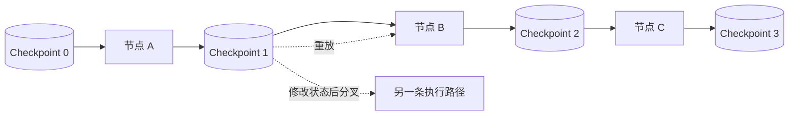
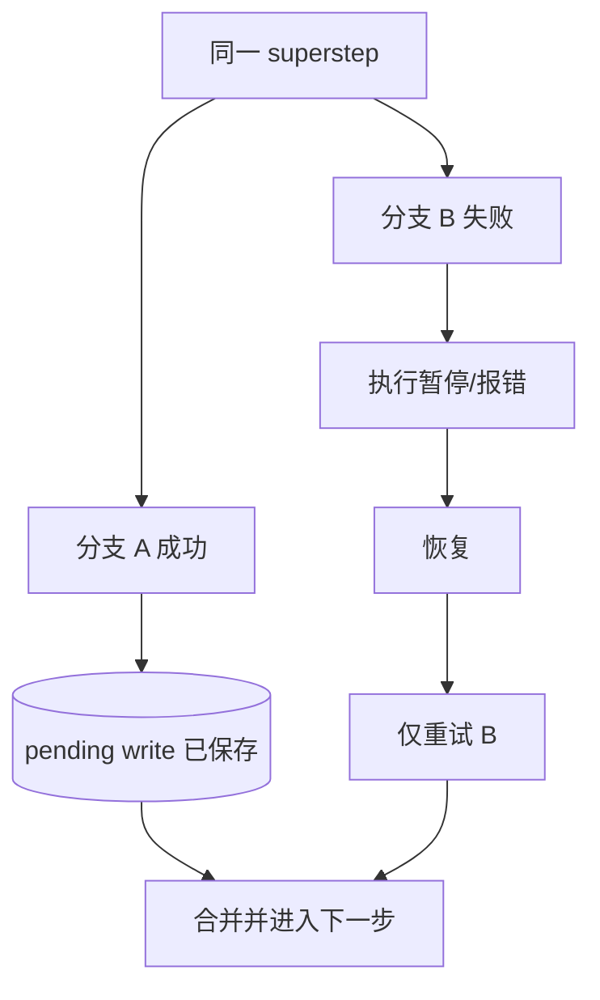

## 1. 持久化层解决什么问题

没有持久化时，图只存在于当前进程内：程序崩溃、部署重启或等待人工输入，执行上下文都可能丢失。

LangGraph 通过 Checkpointer 在执行过程中保存 State 快照，从而支持：

- 同一会话连续对话；
- interrupt 后隔很久再恢复；
- 从故障前的步骤继续；
- 检查历史状态；
- 回放旧路径；
- 从历史节点分叉出另一条路径。



## 2. Thread 是检查点的组织单位

Checkpoint 不是孤立文件，而是按 `thread_id` 归档。一个 thread 可以理解为一条连续的任务/会话时间线。

```python
config = {
    "configurable": {
        "thread_id": "user-42:conversation-8"
    }
}

graph.invoke(input_state, config)
```

### 2.1 `thread_id` 的设计

- 同一段连续会话复用同一个 ID；
- 新会话使用新 ID；
- 不要只用 `user_id` 作为 thread，否则该用户的多个会话会混在一起；
- 生产中优先使用 UUID 或稳定的业务会话 ID；
- 权限校验不能只相信客户端提交的 thread ID，服务端必须验证所属用户/租户。

`thread_id` 是恢复位置的索引，不是访问控制机制。

## 3. 最小 Checkpointer 示例

```python
from langgraph.checkpoint.memory import InMemorySaver


checkpointer = InMemorySaver()
graph = builder.compile(checkpointer=checkpointer)

config = {"configurable": {"thread_id": "thread-001"}}
result = graph.invoke(initial_state, config)
```

`InMemorySaver` 适合开发和测试。进程退出后数据会消失，不能当作生产持久化方案。

常见选择：

| 实现 | 特点 | 适用场景 |
|---|---|---|
| `InMemorySaver` / `MemorySaver` | 仅内存，启动简单 | 单元测试、演示 |
| `SqliteSaver` | 本地文件 | 单机开发、原型 |
| `PostgresSaver` | 数据库持久化、可用于服务端 | 生产系统 |
| Agent Server 托管持久化 | 基础设施由服务处理 | 使用 LangGraph/LangSmith 部署体系 |

对应数据库实现通常位于独立包中，例如 PostgreSQL Saver 需要安装 `langgraph-checkpoint-postgres`。初始化方式和迁移步骤应以项目锁定版本的文档为准。

## 4. Checkpoint 保存的是什么

`graph.get_state(config)` 返回 `StateSnapshot`。关键字段包括：

| 字段 | 含义 |
|---|---|
| `values` | 此检查点的完整 State 值 |
| `next` | 下一步计划执行的节点 |
| `config` | thread、checkpoint 等标识，可用于恢复 |
| `metadata` | step、来源等执行元数据 |
| `tasks` | 待执行任务、错误、interrupt，以及可能的子图状态 |
| `created_at` | 创建时间 |

```python
snapshot = graph.get_state(config)
print(snapshot.values)
print(snapshot.next)
print(snapshot.tasks)
```

Checkpoint 保存的是业务 State 与调度信息，不应被理解为“把 Python 进程完整冻住”。打开的文件句柄、数据库连接、线程对象等不应写进 State，也通常不可序列化。

## 5. 查看状态历史

```python
history = list(graph.get_state_history(config))

for snapshot in history:
    print(
        snapshot.metadata.get("step"),
        snapshot.next,
        snapshot.values,
    )
```

历史默认按**最新在前**返回。可以寻找：

- 某节点运行前的状态：`snapshot.next == ("node_name",)`；
- 某一步：`snapshot.metadata["step"]`；
- 人工更新产生的分叉：`metadata["source"] == "update"`；
- 带 interrupt 的任务：检查 `snapshot.tasks`。

生产界面可以据此制作执行时间线，但应过滤敏感字段，避免把密钥、个人数据或完整模型上下文无条件展示。

## 6. Replay：从旧检查点重新执行后续步骤

```python
history = list(graph.get_state_history(config))
before_generate = next(
    s for s in history if s.next == ("generate_answer",)
)

result = graph.invoke(None, before_generate.config)
```

这里会跳过检查点之前已完成的步骤，并重新执行其后的节点。

必须注意：Replay 不是简单读取旧结果。检查点之后的模型调用、API 请求和 interrupt 都会重新发生，结果可能不同。

## 7. Fork：修改旧状态，再走出一条新路径

```python
fork_config = graph.update_state(
    before_generate.config,
    values={"query": "修改后的问题"},
)

forked_result = graph.invoke(None, fork_config)
```

`update_state()`：

- 不会篡改原来的历史检查点；
- 会基于旧检查点创建一个新的分支检查点；
- 更新仍会经过对应字段的 Reducer；
- 必要时可用 `as_node=` 指明把更新视为哪个节点产生，从而影响下一步调度。

这使“时间旅行”同时具备调试器、撤销按钮和情景模拟的作用。

## 8. 故障恢复与 pending writes

同一 superstep 中可能有多个并行节点。若其中一个失败，成功分支的写入可以作为 pending writes 被保存。恢复时，运行时能够避免重复执行那些已成功的分支，只重试失败部分。



这能减少昂贵计算的重复，但不表示副作用可以不幂等。节点可能因为更早的故障、人工时间旅行、部署策略或业务重试而再次运行。

## 9. Checkpointer 与 Store 不要混淆

| 对比项 | Checkpointer | Store |
|---|---|---|
| 保存内容 | 图状态快照 | 应用自定义键值数据 |
| 作用域 | 单一 thread | 可跨 thread |
| 典型数据 | 当前消息、任务阶段、中间结果 | 用户偏好、长期事实、共享知识 |
| 主要用途 | 恢复、HITL、时间旅行、短期记忆 | 长期记忆 |

详见 [2.2 Memory：短期记忆与长期记忆](/blog/memory-短期记忆与长期记忆)。

## 10. 生产环境的关键问题

### 10.1 State 大小

每一步都可能形成快照。把大文件、完整二进制、海量检索结果直接塞进 State，会快速推高存储和序列化成本。

更好的方式是：

- 大对象存对象存储或数据库；
- State 只保存 URI、内容哈希和必要元数据；
- 对消息历史做裁剪或摘要；
- 为 Checkpoint 设置保留和清理策略。

### 10.2 数据安全

- 不把 API key、数据库密码写入 State；
- 对个人数据做分级、加密和访问审计；
- 日志与追踪中的 State 也要脱敏；
- 删除用户数据时同时考虑 Checkpoint、Store、备份和追踪系统。

### 10.3 图版本升级

持久化线程可能在旧节点上暂停数天。此时删除节点、重命名 State 字段或修改 Reducer，可能让旧线程无法恢复。

安全做法包括：

- 保持 State 向后兼容；
- 新增字段时提供默认处理；
- 节点重命名与删除前检查仍在运行/暂停的线程；
- 用 staging 和历史 Checkpoint 验证恢复路径；
- 对不可兼容变更设计显式状态迁移。

## 11. 一个重要心智模型

> Checkpoint 保证的是“工作流有位置可回去”，幂等性保证的是“回去再执行不会造成灾难”。

两者缺一不可。

## 12. 官方资料

- [Persistence](https://docs.langchain.com/oss/python/langgraph/persistence)
- [Use time travel](https://docs.langchain.com/oss/python/langgraph/use-time-travel)
- [Backward compatibility](https://docs.langchain.com/oss/python/langgraph/backward-compatibility)
