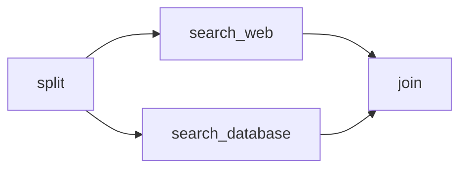
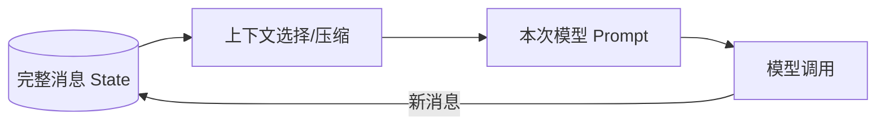

## 1. Reducer 是什么

节点返回的不是完整新状态，而是对某些字段的更新。Reducer 决定一条更新如何与旧值合并：

```text
字段的新值 = reducer(字段的旧值, 节点提交的更新值)
```

如果一个字段没有声明 Reducer，默认行为通常是**覆盖**：

```python
class State(TypedDict):
    status: str


def node_a(state: State):
    return {"status": "done"}  # 旧 status 被替换
```

覆盖对标量字段很自然，但对列表、消息历史和并行结果往往不够。

## 2. 用 `Annotated` 声明 Reducer

```python
import operator
from typing import Annotated
from typing_extensions import TypedDict


class State(TypedDict):
    query: str
    results: Annotated[list[str], operator.add]
```

此时节点只需返回新增部分：

```python
def search_web(state: State):
    return {"results": ["网页结果"]}


def search_database(state: State):
    return {"results": ["数据库结果"]}
```

两个更新会通过列表加法合并：

```text
[] + ["网页结果"] + ["数据库结果"]
```

节点不需要读取旧列表再手工拼接。事实上，在并行场景中“读取旧值 → 自己追加 → 返回完整列表”很容易造成重复和覆盖。

## 3. 为什么并行分支必须认真设计 Reducer

假设同一 step 中有两个节点：



它们都写入 `results`：

- 没有 Reducer：运行时无法判断哪个更新应该覆盖哪个，可能抛出 `InvalidUpdateError`；
- 使用追加 Reducer：两个结果会被合并；
- 使用错误的 Reducer：程序虽然能跑，但结果可能重复、顺序不稳定或语义错误。

Reducer 不是为了消除异常而随便加一个 `operator.add`，它是在定义字段的**冲突解决规则**。

## 4. 常见字段与合并策略

| 字段类型 | 常见策略 | 注意事项 |
|---|---|---|
| 当前状态、计数上限 | 覆盖、`max` | 谁拥有写权限要明确 |
| 累积结果列表 | 拼接 | 恢复或重复执行时可能产生重复项 |
| 集合 | 并集 | 序列化时可考虑改为有序列表 |
| 字典 | 按 key 合并 | 同 key 冲突时仍需定义规则 |
| 消息历史 | `add_messages` | 支持按消息 ID 更新，不只是简单追加 |
| 审批结果 | 覆盖 | 通常应只有一个节点负责写入 |

自定义字典 Reducer 示例：

```python
from typing import Annotated
from typing_extensions import TypedDict


def merge_by_key(left: dict[str, dict], right: dict[str, dict]):
    return {**left, **right}


class State(TypedDict):
    artifacts: Annotated[dict[str, dict], merge_by_key]
```

这里仍然要回答：如果 `left` 和 `right` 含同一个 key，右侧覆盖是否符合业务语义？

## 5. 好 Reducer 的代数性质

并行更新的完成顺序可能受网络、线程和外部服务延迟影响。为了让结果尽可能稳定，Reducer 最好满足：

### 5.1 结合律

```text
reduce(reduce(a, b), c) == reduce(a, reduce(b, c))
```

这样批次如何分组不影响结果。

### 5.2 交换律（能满足时更好）

```text
reduce(a, b) == reduce(b, a)
```

这样并行完成先后不影响结果。列表拼接并不满足交换律，因此不能把并行列表的自然顺序当成业务保证。需要稳定顺序时，应在结果中附带 `index`，汇总节点再排序。

### 5.3 幂等性（对可重试数据尤其有价值）

```text
reduce(a, x, x) == reduce(a, x)
```

简单列表追加不幂等。如果某个外部动作可能重复提交，宜使用稳定 ID 去重：

```python
def merge_unique(left: list[dict], right: list[dict]):
    by_id = {item["id"]: item for item in [*left, *right]}
    return list(by_id.values())
```

## 6. 消息状态为什么使用 `add_messages`

聊天历史不是普通字符串列表。消息包含：

- `id`；
- 角色；
- 内容块；
- tool call；
- token 使用信息等元数据。

LangGraph 提供 `add_messages` 来处理消息更新：

```python
from typing import Annotated
from typing_extensions import TypedDict
from langchain.messages import AnyMessage
from langgraph.graph.message import add_messages


class ChatState(TypedDict):
    messages: Annotated[list[AnyMessage], add_messages]
```

它与简单的列表加法相比有两个重要特点：

1. 新消息通常追加到历史；
2. 如果新消息带有与已有消息相同的 ID，可以更新对应消息，而不是无条件复制一份。

如果 State 只需要消息字段，也可以直接使用：

```python
from langgraph.graph import MessagesState


def call_model(state: MessagesState):
    response = model.invoke(state["messages"])
    return {"messages": [response]}
```

节点应返回 `[response]` 这一增量，而不是 `state["messages"] + [response]`，否则 Reducer 会把旧消息再次追加。

## 7. State 中的消息，不等于每次都完整塞给模型

State 可以保存完整、可审计的消息历史，但模型上下文不必照单全收。



长会话中应区分：

- **记录层**：系统保存了什么；
- **上下文层**：本次模型真正看到了什么。

可以在调用模型前裁剪旧消息、生成摘要、只选与当前任务相关的证据。否则即使没有超出上下文窗口，也可能变慢、变贵，并被过期信息干扰。

## 8. 并行结果需要显式汇总

以并行评估候选方案为例：

```python
import operator
from typing import Annotated
from typing_extensions import TypedDict


class State(TypedDict):
    candidates: list[str]
    scores: Annotated[list[dict], operator.add]
    best: str


def score_a(state: State):
    return {"scores": [{"candidate": "A", "score": 0.81}]}


def score_b(state: State):
    return {"scores": [{"candidate": "B", "score": 0.87}]}


def choose_best(state: State):
    best = max(state["scores"], key=lambda x: x["score"])
    return {"best": best["candidate"]}
```

Reducer 负责“收集”，汇总节点负责“解释和决策”。不要让 Reducer 承担复杂业务流程；Reducer 应快速、确定、无副作用。

## 9. 常见错误

### 错误一：节点返回完整列表

```python
def bad_node(state):
    return {"results": state["results"] + ["new"]}
```

若 `results` 使用追加 Reducer，旧结果会被重复追加。正确写法：

```python
return {"results": ["new"]}
```

### 错误二：依赖并行分支的自然顺序

并行完成顺序不应成为业务协议。给任务附序号，再在 join 节点排序。

### 错误三：多个节点随意覆盖同一个标量

如果 `status` 同时由多个并行节点写入，通常不是缺一个 Reducer，而是状态所有权设计不清。可以拆为 `search_status`、`validation_status`，最后由汇总节点生成总状态。

### 错误四：Reducer 中执行 I/O

Reducer 可能在状态合并、恢复和更新时被调用。不要在其中请求网络、写数据库或调用模型。

## 10. 设计建议

- 先为每个 State 字段写一句“它代表什么”；
- 再列出哪些节点拥有写权限；
- 最后决定覆盖、追加、去重还是自定义合并；
- 并行字段默认考虑顺序不确定；
- 要求可重放时，优先选择确定、可序列化的 Reducer；
- 复杂决策放到节点，不放到 Reducer。

下一步：[1.2 条件路由、Command 与 Send](/blog/条件路由-command-与-send)。

## 11. 官方资料

- [Graph API overview — Reducers](https://docs.langchain.com/oss/python/langgraph/graph-api)
- [Use the Graph API](https://docs.langchain.com/oss/python/langgraph/use-graph-api)
