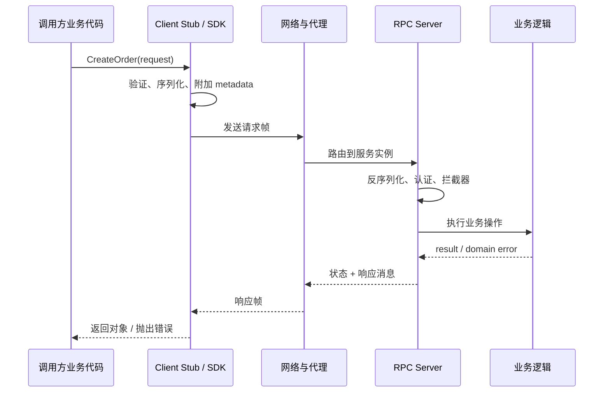
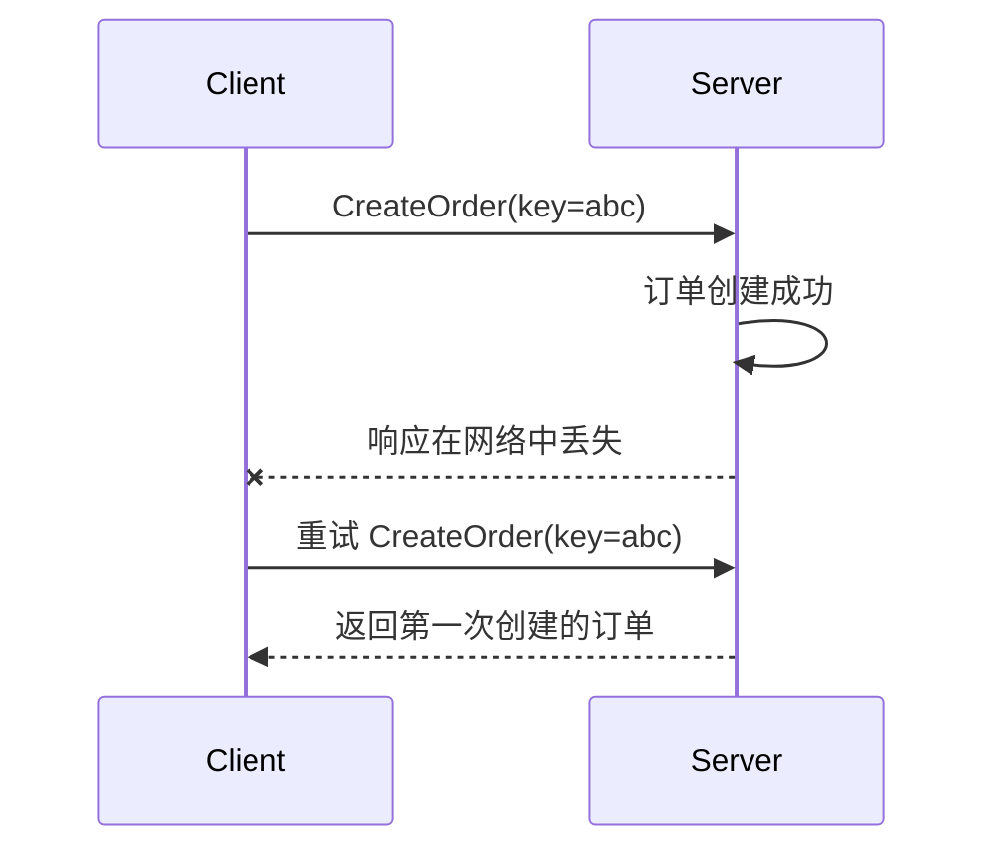
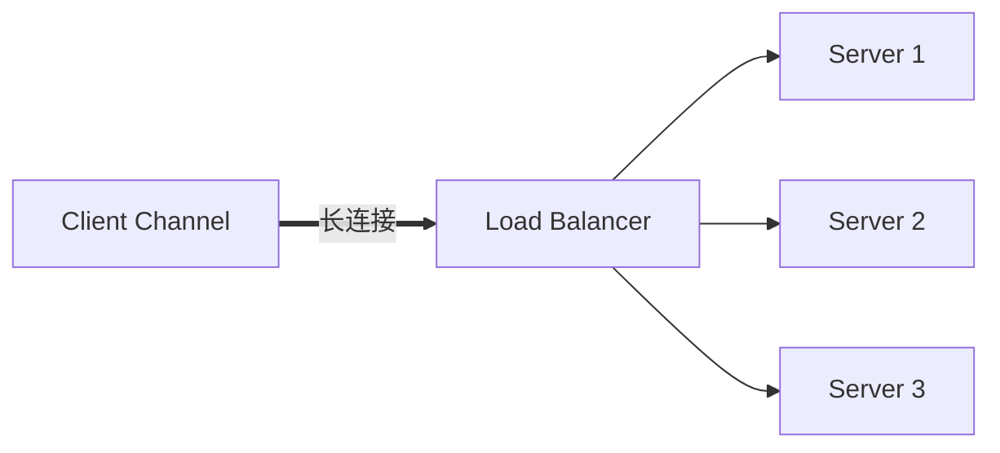
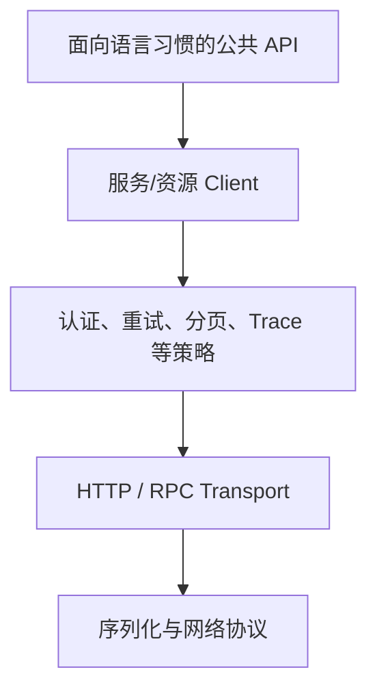
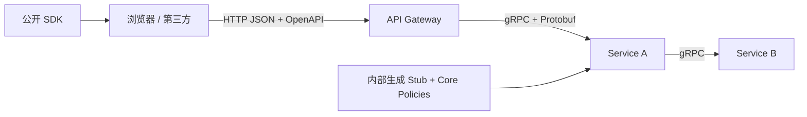

一段 RPC 客户端代码看起来可能像普通函数调用：

```ts
const order = await ordersClient.createOrder({
  userId: "user-42",
  items: [{ productId: "book-7", quantity: 1 }],
});
```

它有参数、有返回值、能被 IDE 补全，甚至错误也表现为语言里的异常。真正发生的事情却远比一次本地函数调用复杂：数据要序列化，连接可能失败，请求可能已经执行但响应丢失，客户端和服务端版本也可能不一致。

RPC 和 SDK 的价值，是把这些复杂性整理成稳定、可使用的接口；它们的危险，则是把复杂性隐藏得太成功，让调用者忘记网络仍然存在。

这篇文章讨论的核心不是某一个框架，而是三个问题：RPC 抽象了什么、它无法抽象什么，以及一个 SDK 应该在哪些地方提供帮助、在哪些地方保持诚实。

---

## API、RPC、IDL 和 SDK 不是同一个层次

这些词经常混在一起使用，先建立一张坐标表：

| 概念 | 回答的问题 | 例子 |
|---|---|---|
| API | 系统允许外部做什么 | 创建订单、查询用户 |
| RPC | 以远程过程/方法调用组织交互 | `CreateOrder(request)` |
| IDL | 如何机器可读地描述接口 | Protobuf、Thrift IDL、OpenAPI |
| Wire Protocol | 字节如何在网络上传输 | HTTP/2 + Protobuf、HTTP + JSON |
| Stub | 根据契约生成或实现的调用代理 | `OrdersClient` |
| SDK | 面向某语言开发者交付的完整使用层 | 客户端、模型、认证、重试、文档和示例 |

RPC 是一种交互抽象；SDK 是一个交付给开发者的产品。SDK 可以包装 RPC，也可以包装 REST、GraphQL、WebSocket，甚至本地硬件接口。

一个生成出来的 Stub 也不自动等于好 SDK。它通常只解决了“如何把方法调用变成协议消息”，未必解决认证、分页、重试、资源生命周期、错误解释和语言习惯。

---

## 一次 RPC 调用实际上经历了什么



从应用视角是一行 `await`，从系统视角却至少跨越了：

- 语言类型与线上的 Schema；
- 客户端进程与服务端进程；
- 名称解析与负载均衡；
- 网络、代理和服务实例；
- 身份认证与授权；
- 超时、取消、重试和错误映射；
- 版本兼容与可观测性上下文。

RPC 框架可以把这些步骤标准化，不能让它们不存在。

---

## RPC 的真正吸引力是契约，而不只是二进制性能

RPC 经常以“比 JSON 快”被介绍。紧凑编码和 HTTP/2 多路复用确实可能带来优势，但对多数业务系统，更持久的价值来自**机器可读契约**。

下面是一段简化的 Protobuf 定义：

```proto
syntax = "proto3";

package orders.v1;

service OrderService {
  rpc CreateOrder(CreateOrderRequest) returns (Order);
  rpc WatchOrder(WatchOrderRequest) returns (stream OrderEvent);
}

message CreateOrderRequest {
  string user_id = 1;
  repeated OrderItemInput items = 2;
  string idempotency_key = 3;
}

message OrderItemInput {
  string product_id = 1;
  int32 quantity = 2;
}

message Order {
  string id = 1;
  string status = 2;
}
```

同一份契约可以生成多种语言的消息类型、服务端接口和客户端 Stub。由此得到：

- 编译阶段发现字段和方法不匹配；
- 生产者与消费者共享明确的 Schema；
- IDE 自动补全和文档更准确；
- 跨语言调用不必手写序列化代码；
- 可以自动进行兼容性检查；
- 网关、Mock、测试和文档工具有统一输入。

这也是 OpenAPI 对 HTTP API 的重要价值。是否使用 RPC，与是否采用机器可读契约是两个问题；一个 JSON/HTTP API 同样应该拥有清晰 Schema。

---

## “像本地函数”是好用的界面，也是危险的幻觉

本地调用：

```ts
const result = calculatePrice(input);
```

远程调用：

```ts
const result = await pricingClient.calculatePrice(input);
```

两者看起来只差一个 `await`，语义却不同。

| 本地调用 | 远程调用 |
|---|---|
| 通常微秒或更快 | 可能毫秒到秒 |
| 失败大多有确定异常 | 超时可能处于未知结果状态 |
| 参数按内存模型传递 | 参数必须序列化，有大小限制 |
| 调用方和实现通常一起部署 | 两端版本可能长期不同 |
| 进程内堆栈连续 | 跨进程后需要显式 Trace |
| 很少需要幂等键 | 重试可能重复产生副作用 |

分布式计算的经典教训仍然有效：延迟不是零、网络不是可靠的、带宽不是无限的、拓扑会变化、管理员不止一个、传输也不是免费的。

一个诚实的 SDK 应该让调用写起来顺手，但不应把超时、取消、分页和错误语义藏到调用者无法控制。

---

## REST 与 RPC 并不是 HTTP 和非 HTTP 的对立

REST 是一组以资源和统一接口为中心的架构约束；RPC 是以动作或方法为中心的调用模型。两者都可以使用 HTTP，也都可以发送 JSON。

```http
# 资源风格
POST /v1/orders
GET  /v1/orders/ord-42

# HTTP 上的 RPC 风格
POST /v1/orders:create
POST /v1/orders/ord-42:cancel
```

gRPC 是具体 RPC 框架，典型组合是 Protobuf、代码生成和基于 HTTP/2 的传输能力。JSON-RPC 则是另一种在 JSON 消息中表达方法调用的协议。不要把“RPC”当作某个单一 Wire Protocol。

资源风格适合：

- 面向浏览器和广泛第三方开发者；
- 需要利用成熟 HTTP 缓存、代理和调试生态；
- 操作能自然表达为资源状态变化；
- 希望调用者不必安装特定语言库。

RPC 风格适合：

- 内部服务间有大量强类型交互；
- 多语言团队希望从 IDL 生成一致代码；
- 需要客户端流、服务端流或双向流；
- 方法语义比资源映射更自然；
- 对协议效率和统一中间件有明确要求。

这不是非此即彼。许多系统内部使用 gRPC，对外提供 HTTP/JSON 或 GraphQL，再由网关做协议转换。

真正的选型问题是客户端生态、契约演进、调试能力和运行环境，而不是哪一种名称“更现代”。

---

## Unary 与 Streaming 是四种不同交互模型

gRPC 常见四种方法形态：

```text
Unary：               1 request  → 1 response
Server streaming：    1 request  → N responses
Client streaming：    N requests → 1 response
Bidirectional stream：N requests ↔ N responses
```

Unary 最接近传统请求—响应，适合绝大多数业务命令和查询。

Server streaming 可用于持续接收任务进度或结果片段；Client streaming 适合分块上传或汇总输入；双向流适合双方都要持续发送独立消息的场景。

Streaming 并不只是把返回类型从对象改成数组。它引入：

- 长连接生命周期；
- 消息顺序与部分结果；
- 流量控制和背压；
- 中途失败后的恢复位置；
- 负载均衡与连接迁移；
- 心跳和空闲超时；
- 每条消息还是整条流的认证与计费。

如果业务只需要每分钟刷新一次状态，引入双向流可能是在用更复杂的生命周期解决简单轮询问题。参见 [3.7 WebSocket、SSE 与实时通信](/blog/3-7-websocket-sse-与实时通信)。

---

## IDL 设计一旦上线，就成为兼容承诺

Protobuf 使用字段编号表示线上的字段身份：

```proto
message User {
  string id = 1;
  string display_name = 2;
}
```

`display_name` 可以改语言层面的名称，但编号 `2` 不能随意拿给另一个不兼容字段使用。删除字段后应保留编号和旧名称：

```proto
message User {
  reserved 2;
  reserved "display_name";

  string id = 1;
  string name = 3;
}
```

常见演进原则包括：

- 增加可选、具有安全默认语义的新字段；
- 不改变已有字段编号；
- 删除字段后将编号标记为 reserved；
- 不把同一字段改成线格式不兼容的类型；
- 枚举要考虑未知值和默认值；
- 不假设所有客户端与服务端同时升级；
- 在 CI 中做 Schema breaking-change 检查。

“旧解析器会忽略未知字段”只解决了语法兼容，不代表业务兼容。

例如服务端新增 `status = SUSPENDED`，旧客户端虽然能解析消息，却可能把未知枚举当默认状态并错误允许操作。兼容性要同时考虑 Wire、类型和业务语义。

---

## Deadline 是远程调用契约的一部分

没有 Deadline 的调用可能一直占用：

- 客户端线程或异步任务；
- 连接和流；
- 服务端计算；
- 数据库连接；
- 上游请求的整体时间预算。

调用者应表达“超过什么时候，这个结果对我已经没有价值”：

```ts
await ordersClient.getOrder(request, {
  timeoutMs: 800,
});
```

一个 1 秒的上游请求不能依次给三个下游各 1 秒。时间预算要沿调用链递减：


Deadline 到期后，客户端停止等待；服务端也应感知取消并停止无意义工作。但取消通常是协作式的：已经提交的数据库事务、已发送的邮件或不支持取消的下游操作，不会因为调用者离开而自动撤销。

这会带来一个关键状态：**客户端不知道操作是否成功。** `DEADLINE_EXCEEDED` 可能发生在服务端执行之前，也可能发生在提交成功、响应尚未到达之后。

超时是等待结果失败，不是业务执行失败的可靠证明。

---

## 重试必须与幂等性一起设计

读取请求通常比较容易重试。创建订单、扣款和发送消息则可能产生重复副作用。



幂等键通常应：

- 由调用者为一个逻辑操作生成；
- 在合理作用域内唯一，例如租户 + 操作类型；
- 与请求内容或摘要绑定，避免同一个 Key 被用于不同参数；
- 在权威存储中用唯一约束抵御并发；
- 保存或能够重建第一次操作结果；
- 有与业务重试窗口匹配的保留期。

重试策略还应限制：

- 哪些状态码可重试；
- 最大尝试次数和总 Deadline；
- 指数退避与随机抖动；
- 服务端过载时的 pushback；
- 重试产生的额外流量和指标。

若客户端、API 网关和服务端各重试三次，一次调用最坏可能放大成 27 次下游尝试。重试责任应该集中、可观测，并受同一个时间预算约束。

---

## 错误模型要让机器能决策，也让人能诊断

只返回字符串：

```text
something went wrong
```

调用者无法判断应该修参数、重新登录、等待重试，还是立即报警。

一个实用错误至少包含：

```text
稳定错误类别 + 人类可读说明 + 可选结构化详情 + 请求/Trace 标识
```

gRPC 的状态码区分了几类重要语义：

- `INVALID_ARGUMENT`：输入本身无效；
- `UNAUTHENTICATED`：没有有效身份凭据；
- `PERMISSION_DENIED`：身份存在但无权限；
- `NOT_FOUND`：目标不存在；
- `ALREADY_EXISTS`：创建目标已存在；
- `FAILED_PRECONDITION`：当前系统状态不允许操作；
- `ABORTED`：并发等原因使本次操作中止，可能需重做更高层序列；
- `RESOURCE_EXHAUSTED`：配额或资源耗尽；
- `UNAVAILABLE`：服务暂时不可用，某些调用可退避重试；
- `DEADLINE_EXCEEDED`：时间预算耗尽，结果可能未知。

业务错误不应全部映射成 `INTERNAL`，也不要把数据库错误原文直接泄露给客户端。

SDK 可以把协议错误映射为该语言自然的异常或结果类型，但必须保留稳定错误码、可重试提示、请求 ID 和原始 Cause，方便程序判断和人工排查。

---

## Metadata 是控制信息，不是业务参数垃圾桶

RPC Metadata 常用于传递：

- 身份令牌；
- Trace Context；
- 请求 ID；
- Deadline；
- 语言、SDK 版本等客户端信息；
- 灰度或路由所需的受控上下文。

订单金额、用户选择和资源版本等业务数据应放在消息 Schema 中，受到契约和兼容规则约束。把业务参数偷偷塞入 Metadata，会让接口文档、代码生成和审计都看不到它。

Metadata 也不可信。客户端传来的租户 ID、角色或内部路由标签必须由服务端根据已验证身份重新确认，不能因为它在 Header 中就获得权威性。

---

## 长连接改变了负载均衡的形态

HTTP 请求级负载均衡可以让每个请求选择一个实例。gRPC Channel 通常会复用长连接并在其上多路复用调用；如果客户端只建立一条连接，而代理只在连接建立时选后端，所有流量可能长期落在同一实例。



因此需要理解实际部署中的平衡位置：

- 客户端侧名称解析和负载均衡；
- 支持 gRPC 的七层代理；
- 连接级四层负载均衡；
- 服务网格 Sidecar；
- DNS 返回多个地址后的客户端行为。

Keepalive 也不是越频繁越好。它可帮助发现断连和维持必要连接，也可能给服务端和代理制造大量无业务价值的 PING。应根据 NAT、空闲超时和移动网络特征配置，而不是复制默认片段。

---

## 认证、授权和传输安全仍然分层存在

RPC 框架不会自动完成安全设计：

```text
TLS / mTLS       → 保护传输并验证对端
Access Token     → 表达调用身份或授权委托
Interceptor      → 提取和验证通用上下文
业务授权          → 判断该身份能否操作具体资源
```

mTLS 能证明调用来自某个受信工作负载，不代表该工作负载中的当前用户有权读取任意订单。服务身份、用户身份和资源授权应分别建模。

还要限制：

- 单消息与整条流大小；
- 并发调用数；
- 每租户配额；
- 解压缩放大；
- 反射服务在生产的暴露范围；
- 错误详情中的敏感信息；
- 证书和令牌轮换。

参见 [3.4 身份认证与权限控制](/blog/3-4-身份认证与权限控制) 与 [3.6 Web 安全基础](/blog/3-6-web-安全基础)。

---

## 可观测性必须跨过 Stub 边界

一段 SDK 调用失败时，最没用的日志是：

```text
RPC failed
```

客户端和服务端至少应能关联：

- 服务与方法名；
- 客户端和服务端版本；
- 状态码；
- 总耗时与尝试次数；
- Deadline 是否耗尽；
- 请求和响应大小；
- 选中的服务实例；
- `trace_id` 与 `request_id`。


拦截器适合统一注入认证、Trace、基础指标和日志，但拦截器顺序本身也会影响语义。例如重试拦截器外层记录的是整个逻辑调用，内层则应记录每次 Attempt；二者最好都有，但名称要清楚。

不要默认记录完整消息体。RPC 请求常包含用户数据、凭据和大字段，采样与脱敏策略必须先于日志便利。参见 [5.2 日志、指标与链路追踪](/blog/5-2-日志-指标与链路追踪)。

---

## SDK 是 API 的“最后一公里”

服务端 API 设计决定系统能做什么，SDK 决定开发者实际怎样感知它。

一个面向用户的 SDK 通常应包含：



公共接口不应只是把服务端字段名机械翻译成代码。它要处理：

- 该语言习惯的命名、异步和资源管理方式；
- 凭据加载和安全默认值；
- Timeout、取消与重试配置；
- 分页迭代器和流式接口；
- 错误类型；
- 日志与 Trace 集成；
- 代理、TLS 和自定义 Endpoint；
- 测试替身；
- 示例、参考文档和迁移指南。

Azure SDK 的公开设计原则把“符合目标语言习惯”和“同一语言内保持一致”放在很高位置，这个优先级是合理的：Python 用户不应被迫使用 Java 风格 Builder，JavaScript 用户也不应因为服务端是同步语言就失去 Promise 和异步迭代器。

---

## 生成代码与手写体验层应该分工

纯手写客户端容易与协议漂移；纯生成客户端则常把 Wire 细节全部暴露给业务代码。

比较稳健的结构是：

```text
IDL / OpenAPI
    ↓ code generation
底层模型 + Stub + 序列化
    ↓ handwritten layer
认证、重试、分页、便利方法、文档与语言习惯
```

生成层尽量可重复生成，不接受大量人工修改；体验层通过组合或包装扩展它。生成器版本应固定，生成结果是否提交仓库则取决于构建可用性、代码评审和用户安装方式。

如果生成代码进入 Git，CI 应重新生成并检查无差异，防止契约和产物漂移。如果安装 SDK 需要用户本地拥有 Protobuf 编译器和内部插件，交付体验通常不完整。

---

## 好的 Client 构造方式让重要策略显式可控

一个客户端通常需要 Endpoint、Credential、Timeout 和其他选项：

```ts
const client = new OrdersClient({
  endpoint: "https://orders.example.com",
  credential,
  timeoutMs: 1500,
  retry: {
    maxAttempts: 3,
    retryableCodes: ["UNAVAILABLE"],
  },
});
```

设计时应避免：

- 导入包时就读取全局环境并建立网络连接；
- 把生产地址硬编码到库里且无法替换；
- 每次调用新建昂贵连接；
- 隐式无限重试；
- 无法设置 Deadline 或取消；
- 单例全局客户端使测试互相污染；
- 接受 `any` 配置，错误到运行很久以后才暴露。

默认值应该对初次使用安全，但高影响策略必须允许调用者覆盖。SDK 不知道每个业务请求的完整时间预算，因此不能用一个神秘全局 Timeout 解决所有场景。

---

## 分页接口不应强迫用户手写游标循环

服务端可能返回：

```proto
message ListOrdersResponse {
  repeated Order orders = 1;
  string next_page_token = 2;
}
```

底层 Client 可以保留逐页控制：

```ts
const page = await client.listOrders({ pageSize: 100 });
```

同时提供符合语言习惯的惰性迭代：

```ts
for await (const order of client.iterateOrders({ status: "PAID" })) {
  await process(order);
}
```

迭代器必须保持惰性和背压，不能悄悄把所有页面读进内存。还应允许用户获取原始 Page Token、限制最大项目数，并正确响应取消和 Deadline。

Convenience API 的价值是减少样板代码，不是剥夺控制权。

---

## SDK 中的自动重试是一种业务策略

SDK 作者很容易认为“自动重试能提高成功率”，然后默认重试所有临时错误。问题是 SDK 通常不知道一个方法是否真的幂等，也不知道上层是否已经重试。

更稳健的原则是：

- 只为明确安全或带幂等键的方法启用默认重试；
- 重试次数计入总 Deadline；
- 指数退避、抖动并尊重服务端限流提示；
- 向日志、指标或响应元数据暴露尝试次数；
- 允许按方法覆盖或禁用；
- 流式调用明确断线后是否以及从何位置恢复；
- 不对认证失败、参数错误等永久问题重试。

把 Retry 隐藏得毫无痕迹，会让调用者看到一次请求，服务端却承受多次负载，也会让延迟分布难以解释。

---

## SDK 版本与服务 API 版本是两条轴

```text
SDK package version:  3.4.1
Service API version:  v1 / 2026-09-01
```

SDK 发新版可能只是修复客户端内存泄漏，不代表服务 API 改版；服务端可以增加兼容字段，也未必要求 SDK 主版本变化。

稳定 SDK 应明确：

- 默认调用哪个服务 API 版本；
- 是否允许显式选择其他受支持版本；
- SDK 版本与服务版本的支持矩阵；
- 废弃功能何时警告、何时移除；
- 最低语言运行时和依赖版本；
- 服务端关闭旧版本前，怎样识别仍在使用的客户端。

客户端遥测可以统计 SDK 语言与版本，但必须避免收集业务数据和可识别用户信息，并允许符合隐私要求的控制。

---

## 兼容性不只看能否编译

一次 SDK 变更可能在多个层面破坏用户：

| 层面 | 例子 |
|---|---|
| 源码兼容 | 方法改名，旧代码无法编译 |
| 二进制兼容 | 已编译程序加载新版库失败 |
| 行为兼容 | 默认重试从 0 次变成 5 次 |
| Wire 兼容 | Protobuf 字段编号被复用 |
| 性能兼容 | 列表方法从惰性分页变为一次加载全部 |
| 运维兼容 | 日志字段或 User-Agent 格式改变 |

语义化版本只能表达发布者对兼容性的判断，不能自动保证兼容。公共 API Diff、跨版本契约测试、行为测试和迁移指南才是实际证据。

某些看似“Bug 修复”的变化也可能破坏用户对旧行为的依赖。高影响修复应在变更日志中明确说明，并提供测试或过渡开关。

---

## 测试 RPC 不应只有两端各自的单元测试

一套完整验证通常包括：

### Schema 与生成验证

- IDL 可以编译；
- 没有不兼容字段变更；
- 生成代码与仓库状态一致；
- 多语言生成器版本固定。

### Client 单元测试

- 参数验证；
- 错误映射；
- Deadline 与取消；
- 分页和流量控制；
- 重试只发生在允许条件下；
- 凭据不会进入日志。

### 进程内或本地集成测试

- 真实序列化和反序列化；
- Interceptor 顺序；
- Metadata 传播；
- 状态码和详情；
- 健康检查和优雅关闭。

### 故障测试

- 服务端执行后丢失响应；
- Deadline 在不同阶段耗尽；
- 连接重置、代理断流；
- 服务端过载与限流；
- 客户端和服务端版本交叉组合；
- 流处理中途断开并恢复。

如果所有测试都把 Stub Mock 成立即成功，就没有验证 RPC 最关键的网络语义。

---

## 什么时候值得提供正式 SDK

并非每个内部 HTTP 接口都需要一套 SDK。SDK 值得投入的信号包括：

- 有多个独立消费者；
- 认证、签名或分页存在重复复杂度；
- 调用必须统一 Deadline、重试和遥测；
- 面向第三方开发者，体验直接影响采用；
- 需要支持多种主流语言；
- 协议细节复杂或生成代码必不可少；
- 服务演进需要集中提供兼容适配。

不值得的情况包括：只有一个同仓消费者、接口极小且变化很快，或者 SDK 只是机械地把 `fetch` 换成同名方法，却引入独立版本和维护负担。

SDK 一旦发布，就形成长期支持承诺。每多支持一种语言，就多一套包管理、运行时兼容、文档、测试、发布、安全响应和社区预期。

---

## 选择 RPC 之前应该回答的问题

| 问题 | 为什么重要 |
|---|---|
| 调用者是谁，使用什么语言和运行环境？ | 决定代码生成、浏览器支持和分发方式 |
| 调用是公网 API 还是受控内部网络？ | 影响调试、兼容、安全和网关需求 |
| 是否真正需要 Streaming？ | 决定连接、背压和恢复复杂度 |
| 客户端能否及时升级？ | 决定 Schema 演进策略 |
| 请求是否有副作用？ | 决定重试和幂等模型 |
| Deadline 如何沿调用链传播？ | 防止无界等待和资源浪费 |
| 错误能否被机器稳定判断？ | 决定恢复、提示和告警 |
| 现有代理、LB 和监控是否理解该协议？ | 决定上线后的可运营性 |
| 谁维护各语言 SDK？ | 决定长期交付成本 |

如果团队只因为“二进制更快”就选择 RPC，却没有回答这些问题，最先遇到的通常不是编码性能，而是代理不兼容、超时失控和接口演进困难。

---

## 一个成熟的组合方式

对于典型服务体系，可以形成如下分层：



外部接口优先考虑广泛兼容、可调试和稳定生命周期；内部 RPC 优先提高类型一致性、调用效率和统一治理。两层之间不必一一透传：网关应该保留清晰的外部产品边界，而不是把内部服务结构直接暴露出去。

公开 SDK 也不应强迫用户理解内部 RPC 拓扑。它面对的是用户任务，不是公司组织图。

---

## 最后：抽象网络，但不要否认网络

RPC 最成功的地方，是让跨语言、跨进程调用拥有像函数一样清楚的契约；最容易犯错的地方，也是让它太像函数。

一次可靠远程调用必须显式面对：

- Deadline 与取消；
- 重试与幂等；
- 部分成功与未知结果；
- Schema 和业务语义兼容；
- 错误分类；
- 连接、负载均衡与背压；
- 身份、权限与可观测性。

SDK 则应该把这些机制组织成目标语言里自然、一致、可测试的产品界面。它可以提供安全默认值和便利抽象，但必须保留调用者在关键策略上的控制权。

好的 RPC 让远程调用不再混乱；好的 SDK 让它不再繁琐。二者都不应该让工程师忘记：函数的另一端，隔着一条会延迟、会断开、会重复、也会版本不一致的网络。

---

## 参考资料

- [gRPC：Core concepts, architecture and lifecycle](https://grpc.io/docs/what-is-grpc/core-concepts/)
- [gRPC：Deadlines](https://grpc.io/docs/guides/deadlines/)
- [gRPC：Retry](https://grpc.io/docs/guides/retry/)
- [gRPC：Status Codes](https://grpc.io/docs/guides/status-codes/)
- [Protocol Buffers：Proto Best Practices](https://protobuf.dev/best-practices/dos-donts/)
- [Protocol Buffers：Updating a Message Type](https://protobuf.dev/programming-guides/proto3/#updating)
- [OpenAPI Specification](https://spec.openapis.org/oas/latest.html)
- [Google Cloud API Design Guide](https://docs.cloud.google.com/apis/design)
- [Azure SDK General Guidelines](https://azure.github.io/azure-sdk/general_introduction.html)
