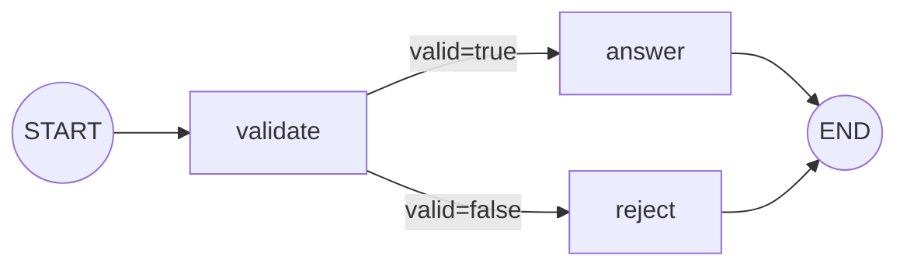
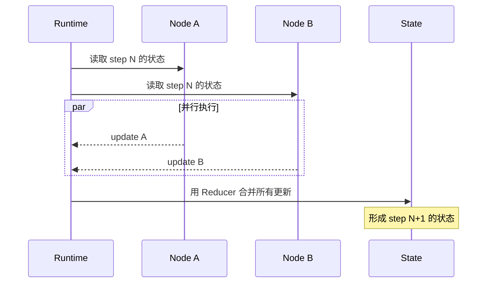

## 1. StateGraph 到底是什么

`StateGraph` 可以理解为一个**围绕共享状态运行的状态机**：

1. 运行时读取当前状态；
2. 调度当前可执行的节点；
3. 节点返回局部更新；
4. Reducer 把更新合并进状态；
5. 边根据结果决定下一批节点；
6. 直到没有后续任务或到达 `END`。

图不是静态的数据处理管道。它可以分支、汇合、循环、暂停并恢复，因此比传统 DAG 更适合 Agent。

## 2. State：业务过程的唯一事实来源

### 2.1 状态应描述事实，而不是描述动作

好的状态字段：

```python
class ResearchState(TypedDict):
    question: str
    documents: list[str]
    answer: str
    retry_count: int
    approved: bool
```

不理想的状态字段：

```python
class BadState(TypedDict):
    should_search_now: bool
    call_model_again: bool
    go_to_node_b: bool
```

前一组描述“现在知道什么”，后一组把控制流细节塞进数据模型。少量状态标记是必要的，但如果 State 充满节点名和跳转开关，业务含义会越来越难理解。

### 2.2 三类数据不要混在一起

| 数据 | 生命周期 | 应放在哪里 |
|---|---|---|
| 当前任务产生的业务数据 | 随图执行不断变化 | `State` |
| 本次调用不应被节点修改的依赖 | 一次运行期间保持稳定 | `Runtime.context` |
| 跨会话共享的用户事实 | 跨 thread 长期存在 | `Store` |

例如：

- 当前查询和检索结果放 State；
- `user_id`、数据库连接、租户信息放 runtime context；
- 用户长期偏好放 Store。

这比把所有东西都塞进一个巨大的 State 更清晰，也更安全。

### 2.3 选择 State schema

LangGraph 常见的三种 schema：

| 类型 | 优点 | 代价 | 适用场景 |
|---|---|---|---|
| `TypedDict` | 轻量、类型提示好、开销小 | 运行时不主动校验 | 大多数图 |
| `dataclass` | 可提供默认值，语义清晰 | 写法稍多 | 需要默认值的状态 |
| Pydantic `BaseModel` | 递归校验能力强 | 性能开销更大 | 边界输入复杂、必须严格校验 |

模型返回的数据仍应在边界处做结构化校验，不要误以为使用 `TypedDict` 就会在运行时自动拦截错误类型。

## 3. Node：读取状态，返回更新

一个节点通常是普通同步或异步 Python 函数：

```python
def normalize_question(state: ResearchState):
    normalized = state["question"].strip()
    return {"question": normalized}
```

节点返回的是**局部更新**，不必复制整份 State：

```python
# 推荐
return {"answer": answer}

# 没必要这样做
return {**state, "answer": answer}
```

返回整份状态会模糊“这个节点实际修改了什么”，并可能使并行更新产生不必要的冲突。

### 3.1 节点的理想粒度

一个节点最好对应一个具有独立失败语义的业务步骤，例如：

- 校验输入；
- 调用一次外部 API；
- 让模型生成检索计划；
- 保存一份业务记录；
- 执行质量检查。

判断是否该拆节点，可以问：

> 如果这一步失败，我是否希望单独重试、单独观察、单独暂停，或从它之前恢复？

如果答案是“是”，它通常值得成为独立节点。

但也不要把每个字符串处理都拆成节点。过细会让图难读、检查点增多、调试噪声变大。

### 3.2 纯计算与副作用

- 纯计算：相同输入总得到相同输出，如格式转换、规则判断；
- 副作用：调用模型、请求 API、写数据库、发邮件、修改文件。

副作用节点要默认自己可能因重试或恢复而再次执行。生产设计见 [4.0 错误恢复、测试与生产实践](/blog/错误恢复-测试与生产实践)。

## 4. Edge：控制下一步执行什么

### 4.1 固定边

```python
builder.add_edge("validate", "plan")
```

表示 `validate` 完成后总是执行 `plan`。

### 4.2 条件边

```python
from typing import Literal


def route(state: ResearchState) -> Literal["search", "answer"]:
    return "search" if not state["documents"] else "answer"


builder.add_conditional_edges("plan", route)
```

路由函数应尽量只做判断，不要在里面调用昂贵 API 或产生副作用。这样执行轨迹更容易解释，失败边界也更明确。

### 4.3 `START` 和 `END`

`START` 与 `END` 是虚拟节点：

- `START` 指定初始要调度的节点；
- `END` 表示某条路径结束。

图也可以有多个入口分支或多个终止分支。

## 5. 一个完整的最小 StateGraph

```python
from typing import Literal
from typing_extensions import TypedDict
from langgraph.graph import StateGraph, START, END


class State(TypedDict):
    query: str
    valid: bool
    answer: str
    error: str | None


def validate(state: State):
    query = state["query"].strip()
    if not query:
        return {"valid": False, "error": "问题不能为空"}
    return {"query": query, "valid": True, "error": None}


def route_after_validation(state: State) -> Literal["answer", "reject"]:
    return "answer" if state["valid"] else "reject"


def answer(state: State):
    return {"answer": f"已处理：{state['query']}"}


def reject(state: State):
    return {"answer": f"无法处理：{state['error']}"}


builder = StateGraph(State)
builder.add_node("validate", validate)
builder.add_node("answer", answer)
builder.add_node("reject", reject)
builder.add_edge(START, "validate")
builder.add_conditional_edges("validate", route_after_validation)
builder.add_edge("answer", END)
builder.add_edge("reject", END)

graph = builder.compile()

result = graph.invoke(
    {"query": "  什么是状态机？  ", "valid": False, "answer": "", "error": None}
)
```

执行路径为：



## 6. 编译阶段做了什么

```python
graph = builder.compile(
    checkpointer=checkpointer,  # 可选：线程状态持久化
    store=store,                # 可选：跨线程长期数据
)
```

`compile()` 的作用不只是“生成对象”，还会：

- 检查图结构是否基本合法；
- 固化节点和边的定义；
- 接入 Checkpointer、Store、缓存和中断点等运行能力；
- 返回支持 `invoke/ainvoke/stream/astream` 的可执行图。

Builder 负责“定义图”，compiled graph 负责“运行图”。通常把图的构建封装成函数，便于测试时为每个用例传入独立的 Checkpointer。

## 7. Superstep：理解并行和状态可见性的关键

LangGraph 的执行思想受 Pregel 启发。可把一次运行理解为多个 superstep：



同一 superstep 中并行节点通常读取的是同一份起始状态；一个分支不会在中途看见另一个分支尚未提交的更新。所有更新在步末统一合并。

这解释了两个现象：

1. 并行写同一个字段时需要 Reducer；
2. 若后一个节点必须看见前一个节点的结果，就应让它们处于不同 step，也就是用边串联。

详见：[1.1 Reducer、消息状态与并行更新](/blog/reducer-消息状态与并行更新)。

## 8. 输入、内部状态与输出可以分开

大型应用并不一定让调用者提交完整内部 State。可以分别声明输入和输出 schema，使内部实现细节不泄露到接口层。

设计原则是：

- 输入只包含调用者应该提供的数据；
- 内部状态可包含中间计划、错误、证据等；
- 输出只暴露调用者真正需要的结果。

这类似普通后端中的 Request DTO、领域模型和 Response DTO，不要让一个类型承担所有角色。

## 9. 图的可视化

开发阶段可以生成 Mermaid 文本：

```python
print(graph.get_graph().draw_mermaid())
```

可视化最适合检查：

- 是否有意外的死路；
- 条件分支是否完整；
- 循环是否有退出条件；
- 节点粒度是否过细；
- 一个“上帝节点”是否承担了太多职责。

但图画得漂亮不代表执行语义正确。真正重要的是状态字段、Reducer、失败边界与副作用策略。

## 10. 设计检查清单

- State 字段是否具有清楚的业务含义？
- 每个节点返回的是局部更新吗？
- 节点是否有明确的输入、输出和失败语义？
- 路由函数是否保持轻量、可预测？
- 必须串行的数据依赖是否真的用边串联？
- 可能并行写入的字段是否定义了正确的 Reducer？
- 循环是否有显式退出条件和最大次数？
- 外部依赖是否放入 runtime context，而不是反复写入 State？

## 11. 官方资料

- [Graph API overview](https://docs.langchain.com/oss/python/langgraph/graph-api)
- [Use the Graph API](https://docs.langchain.com/oss/python/langgraph/use-graph-api)
- [Thinking in LangGraph](https://docs.langchain.com/oss/python/langgraph/thinking-in-langgraph)
