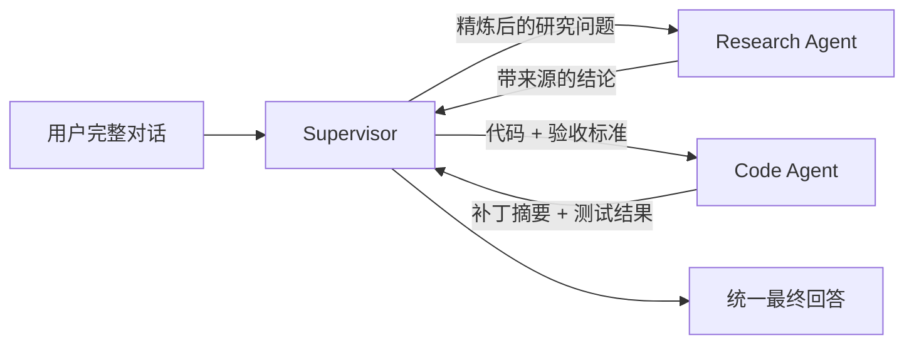

## 1. Streaming 不只是逐 token 输出

Agent 的一次运行可能持续很久。若前端只等待最终字符串，用户无法区分“系统正在工作”和“系统已经卡死”。

LangGraph 可以流式暴露多个层面的信息：

| 类型 | 你看到什么 | 典型 UI |
|---|---|---|
| messages | 模型文本、推理/工具调用相关消息事件 | 回答逐步出现 |
| updates | 每个节点产生的 State 增量 | “检索完成”“开始审核” |
| values | 每一步之后的完整 State | 调试状态面板 |
| custom | 业务主动发送的数据 | 文件处理进度 7/20 |
| checkpoints | 检查点事件 | 执行时间线 |
| tasks | 任务开始、结束、错误 | 并行任务监控 |
| debug | 更完整的运行时信息 | 本地诊断 |

模型 token 流只是 Streaming 的一个子集。

## 2. 新应用优先使用 Event Streaming

LangGraph 1.2 引入了类型化 projection 的 event streaming。它把消息、状态、子图和最终输出拆成独立读取视图，应用代码不必自己解析每种底层 chunk。

```python
stream = graph.stream_events(
    {"messages": [{"role": "user", "content": "分析图层质量"}]},
    config,
    version="v3",
)

for message in stream.messages:
    for token in message.text:
        print(token, end="", flush=True)

final_state = stream.output
```

还可以读取：

```python
for snapshot in stream.values:
    print(snapshot)

print(stream.interrupted)
print(stream.interrupts)
```

在异步 Web 服务中，应使用 `astream_events()` 并把事件转换为 SSE、WebSocket 或框架支持的流式响应。

## 3. 底层 stream-mode API

需要直接访问运行时事件时，可以用 `stream()` / `astream()`：

```python
for chunk in graph.stream(
    input_state,
    config,
    stream_mode=["updates", "custom"],
    version="v2",
):
    if chunk["type"] == "updates":
        print("状态增量：", chunk["data"])
    elif chunk["type"] == "custom":
        print("业务进度：", chunk["data"])
```

v2 的统一结构为：

```python
{
    "type": "updates",  # 事件类型
    "ns": (),            # 所属父图/子图 namespace
    "data": {...},       # 具体数据
}
```

旧版 v1 输出形状会随单/多 mode、是否包含子图而变化。新代码显式写出版本，可以减少升级和前端解析歧义。

## 4. 节点主动发送业务进度

```python
from langgraph.config import get_stream_writer


def import_features(state: State):
    writer = get_stream_writer()
    total = len(state["files"])

    for index, path in enumerate(state["files"], start=1):
        import_one(path)
        writer({
            "stage": "import",
            "completed": index,
            "total": total,
            "current": path,
        })

    return {"imported": total}
```

调用端使用 `stream_mode="custom"` 读取。业务进度应该是稳定 schema，而不是给前端发送任意日志字符串。

```python
class ProgressEvent(TypedDict):
    stage: str
    completed: int
    total: int
    current: str
```

这样前端能可靠渲染进度条，也便于版本演进。

## 5. 流式系统的工程问题

### 5.1 断线不等于取消执行

浏览器断开 SSE 连接时，后台任务是否继续、是否取消，要由服务端明确设计。长任务通常应绑定 run/thread 标识，客户端重连后查询状态，而不是把 TCP 连接当作唯一生命线。

### 5.2 背压

生产者比消费者快时，事件会堆积。不要为每处理一行数据发送一次事件；可以按时间间隔或百分比采样。

### 5.3 敏感信息

`values` 和 `debug` 可能包含完整 Prompt、工具参数、用户数据。开发调试方便，不代表适合原样发送给最终用户。

### 5.4 顺序与去重

网络重连后可能重收事件。UI 可使用 run ID、namespace、任务 ID 和序号去重，不要仅凭显示文本判断。

## 6. Subgraph：把一张图当作另一个图的节点

Subgraph 适合：

- 复用一段多步骤流程；
- 把大型图分成领域模块；
- 让不同团队只约定输入输出 schema；
- 构建多 Agent 系统。

有两种基本接法。

### 6.1 父子图共享状态字段

可直接把编译后的子图作为节点：

```python
subgraph = sub_builder.compile()

parent_builder.add_node("quality_pipeline", subgraph)
```

适合父子图读写相同 State channel 的情况。

### 6.2 父子图状态不同

用包装节点做输入输出转换：

```python
def call_subgraph(state: ParentState):
    sub_result = subgraph.invoke({
        "document": state["raw_document"],
        "criteria": state["review_rules"],
    })
    return {
        "review_result": sub_result["result"],
    }
```

这能保护子图私有状态，避免父图的全部消息和数据无意中泄露给子 Agent。

## 7. 子图的持久化模式

子图 `.compile(checkpointer=...)` 的选择会影响记忆和恢复：

| 配置 | 模式 | 行为 |
|---|---|---|
| `None`（默认） | per-invocation | 每次调用从新状态开始，但单次调用内继承父图 Checkpointer，可 interrupt/恢复 |
| `True` | per-thread | 同一 thread 中跨多次调用积累子图状态 |
| `False` | stateless | 不使用 Checkpoint，不能 interrupt，也没有 durable execution |

多数“把专家 Agent 当工具调用”的场景适合默认 per-invocation，因为每个请求应相互隔离。只有子 Agent 确实需要跨轮保留自己的私有上下文时，才使用 per-thread。

持久子图还要注意 checkpoint namespace 冲突；同一个持久子图实例不适合在同一节点内被并行调用多次。

## 8. 从 Streaming 看见子图

底层 API：

```python
for chunk in parent_graph.stream(
    input_state,
    subgraphs=True,
    stream_mode="updates",
    version="v2",
):
    print(chunk["ns"], chunk["data"])
```

- 根图的 `ns` 通常是空元组；
- 子图事件的 namespace 包含从父到子的运行路径；
- 每次调用的 runtime ID 会变化，不应把完整 namespace 字符串当作稳定业务主键。

Event Streaming 则可以使用 `stream.subgraphs` 观察嵌套执行，减少手工解析路径。

## 9. 多 Agent 不是一种单一架构

| 模式 | 控制方式 | 适合场景 |
|---|---|---|
| Subagents / Supervisor | 主 Agent 把子 Agent 当工具调用 | 多领域、多步动态协作，集中控制 |
| Handoffs | 状态或工具调用切换当前 Agent/阶段 | 多阶段对话、不同角色直接接待用户 |
| Skills | 单 Agent 按需加载专业提示和知识 | 主要问题是上下文太大，而非执行主体不足 |
| Router | 一次分类后派发一个或多个专家 | 领域边界明确，可并行查询 |
| Custom workflow | 用 LangGraph 自定义混合结构 | 有确定性阶段、审批或复杂业务规则 |

### 9.1 Router 与 Supervisor 的区别

- Router 更像分诊台：分类、派发、汇总，通常是一跳；
- Supervisor 是持续工作的协调者：可在多轮中反复调用不同子 Agent。

### 9.2 Handoff 与 Subagent 的区别

- Handoff 把“与用户对话的主导权”转给另一个角色/阶段；
- Subagent 通常不直接面向用户，只向主 Agent 返回任务结果。

## 10. 多 Agent 的核心其实是上下文工程

把多个模型实例连起来并不难，难的是决定每个 Agent 看见什么。



需要显式设计：

- 子 Agent 输入是完整历史，还是一条精炼任务？
- 子 Agent 是否知道用户身份和权限？
- 返回完整消息历史，还是结构化摘要？
- 工具错误和引用证据如何传回？
- 哪些内部推理与敏感数据不能进入上层上下文？

上下文过少会让子 Agent无法完成任务；上下文过多则增加成本、泄漏和干扰。

## 11. 什么时候不要上多 Agent

以下情况通常一个 Agent 加多个工具就够了：

- 工具总数少且职责清楚；
- 任务不需要并行专业判断；
- 各领域共享几乎全部上下文；
- 无法定义子 Agent 的清晰输入和输出；
- 只是希望“多几个 Agent 会不会更聪明”。

多 Agent 会额外引入路由错误、上下文丢失、重复工作、费用膨胀和更复杂的测试。只有专业隔离、并行化或组织边界带来的收益明显时才值得使用。

## 12. 官方资料

- [Event streaming](https://docs.langchain.com/oss/python/langgraph/event-streaming)
- [Streaming modes](https://docs.langchain.com/oss/python/langgraph/streaming)
- [Subgraphs](https://docs.langchain.com/oss/python/langgraph/use-subgraphs)
- [Multi-agent patterns](https://docs.langchain.com/oss/python/langchain/multi-agent/index)
