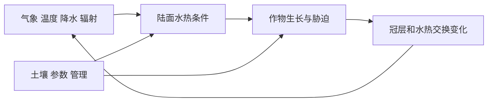

## 为什么气象模型需要作物过程

在本研究采用的框架中，WRF 描述区域大气变化，Noah-MP-Crop 把作物生长纳入陆面过程。作物不是一层始终不变的绿色表面：冠层、根区水分和生长阶段会随天气与管理变化，陆面的水热交换也随之变化。

开题报告把“气象—陆面—作物—事件”四层评价放在一起，正是因为某一层看起来合理，不代表其他层没有补偿误差。例如 LAI 接近观测，仍可能对应错误的气象驱动或土壤水分。

这是开题所采用耦合思路的概念图，不是逐个代码模块的调用图。

## 本土化不是让一条 LAI 曲线更好看

本土化包括让气候、品种物候、土壤和管理设置符合研究区。参数可以分组理解：

| 参数组 | 要解决的问题 | 本项目相关项 |
|---|---|---|
| 物候/积温 | 何时出苗、进入不同阶段和成熟 | GDDTBASE、GDDS |
| 生物量与冠层 | 生物量如何分配到叶片，如何转换为叶面积 | LFPT、BIO2LAI |
| 衰老与周转 | 叶片何时、以什么速度减少 | DILE_FC、DILE_FW、LF_OVRC |
| 水分与管理 | 根区供水、灌溉触发和季节用水 | 灌溉开关、触发参数与定额 |

以上是用于理解本项目实验的分组。参数确切单位、下标对应阶段和触发方向，最终要以该次 WRF 版本、参数表及源码为准。

## 合理的校准顺序

1. 固定数据、区域、时间窗口与评价掩膜，保证实验可比。
2. 先检查气象和基本物候，避免用作物参数掩盖天气输入错误。
3. 分组敏感性试验，再做联合率定；保存每次参数与指标。
4. 同时看 LAI 时序、土壤水分、ET 和可获得的产量/物候证据。
5. 在未用于率定的年份或区域评价泛化，而不只重复计算训练窗口。

“参数率定”和“状态同化”不同：前者改变生长规则，后者在某个时刻调整系统状态。状态被拉近观测后仍可能重新偏离，因为后续演化仍由原来的过程控制。参见 [玉米case31与晚季误差诊断](/blog/玉米-case31-与晚季误差诊断)。

## 本项目尺度与版本要说准确

开题拟设置三层嵌套，内层约 5 km；现有历史试验记录主要涉及 5 km 的 d01 主玉米带。**三层嵌套是方案信息，不能据此写为已完成的实际配置。**

历史记录采用 WRF 4.4.2 表述；正式复现实验应保存具体构建版本、编译选项、namelist、静态数据、参数表和运行日志，不仅保存软件名称。

## 论文写作边界

可以围绕“玉米本土化后 LAI 时序与晚季过程仍存哪些误差”展开，而不要仅报告一个全季 RMSE。新增灌溉和地块模型后，也不能直接继承此前 LAI 精度声明；模型链条增加了新的误差来源。

依据：S01 第 12—13、19 页，S03、S04。关联 [04 校准验证与不确定性](/blog/校准-验证与不确定性)、[99 资料索引与维护约定](/blog/资料索引与维护约定)。
