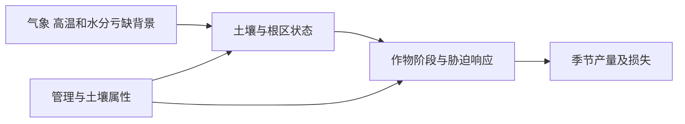

## 高温少雨的一天，不一定是农业干旱

本研究需要区分天气事件、土壤水分状态、作物胁迫和最终损失。前几天有灌溉或根区仍有水时，一天无雨不必然引起水分胁迫；同样的高温出现在不同生育阶段，也未必带来相同影响。

这是研究中需要验证的解释链，不代表现有数据已证明各环节因果。

## 原开题定义与代码占位指标

| 项目 | S01 开题方案 | S07 当前 CSV 脚本 |
|---|---|---|
| 热 | 日最高温超过日历日 90% 分位阈值，持续不少于 3 天 | Tmax ≥ 35℃ 的单日标志 |
| 旱 | 月尺度 SPEI ≤ -1.0 | 当日降水 ≤ 1 mm |
| 复合 | 同一生育阶段同时或连续发生 | 两个单日布尔条件交集 |

两者不是同一事件定义。脚本 `hot_dry_index` 只能作为当前输入检查/探索性占位变量，不得直接当作开题中的复合事件识别成果。

正式实现还需要固定气候基准期、分位数计算窗口、SPEI 时间尺度及参数估计资料，以及“连续发生”的最大间隔。单个 2020 年不能稳定承担长期气候分位数与干旱标准化基准的任务。

## 事件强度与损失分别存储

事件表建议保存起止日期、持续时间、热强度、干旱强度、生育阶段、空间对象和定义版本。产量损失另存策略、参照情景及计算口径，避免用一个“风险分数”混合所有含义。

若定义相对损失：

$$L_s(x)=\frac{Y_{ref,s}(x)-Y_s(x)}{Y_{ref,s}(x)},\qquad Y_{ref,s}(x)>0.$$

其中 $x$ 是管理策略，$s$ 是事件/天气情景。必须明确参照产量是什么：配对非胁迫反事实、历史常年、潜在产量，还是当地管理基准。不同参照回答不同问题。

若用一个策略无关的固定高产值作分母，得到的可能混合了“管理本身减产”和“干热额外减产”。如果允许事件下增产，损失可为负；若截断为 0，需提前声明。

## 如何识别复合效应

可设计基准、仅热、仅旱、干热四组配对情景，保持其他条件一致，并定义相对同一基准的绝对减产量 $D$。交互量可写为：

$$\Delta=D_{HD}-D_H-D_D.$$

正值表示在该实验及尺度下，复合损失大于两个单因子损失之和；这只是约定下的交互指标。人工修改温度或降水时，要解释湿度、辐射和 ET0 的处理，避免构造物理不协调的天气。

## 2020 年可以支持什么风险表述

可以比较“2020 天气条件下各策略表现”，也可以对明确构造的扰动做敏感性评价。不能仅凭一个年份声称估计了真实世界的尾部损失概率。

概率风险需要多个具有来源和权重的情景。等权的人工情景只代表这个设计集合的表现，除非有概率校准依据，否则不代表真实发生频率。

具体期望与 CVaR 目标见 [NSGA-II与稳健策略评价](/blog/nsga-ii-与稳健策略评价)。依据：S01 第 12 页、S03、S05、S07。本页阈值是项目历史方案记录，不是对通用干热标准的宣称。
