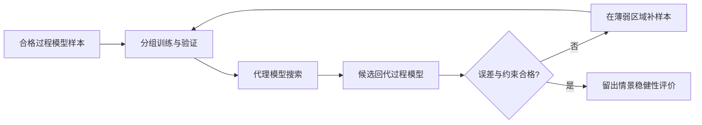

## 代理模型究竟替代了什么

它替代的是反复调用过程模型的计算成本，不替代观测事实。若训练标签来自 AquaCrop，它学习的是“指定模型及其假设下的响应”，而不是直接学到了真实世界的产量规律。

必须区分两类误差：代理相对过程模型的误差，以及过程模型相对观测的误差。前者很小，并不能消除后者。

## 每一行样本代表一次完整情景

建议的样本键为：响应单元 × 天气情景 × 作物参数版本 × 管理策略 × 运行版本。

| 字段组 | 例子 | 注意 |
|---|---|---|
| 天气情景 | 年份、阶段温度/降水/ET0 摘要 | 摘要不能丢掉研究所关心的事件时序 |
| 地块属性 | 土壤参数、根区条件、分区 | 不把 ID 本身误当可解释的环境变量 |
| 管理决策 | 播期、灌溉总上限、分阶段触发规则 | 值域必须可执行，并被实际模型接口支持 |
| 响应标签 | 干产量、灌溉、ET、损失 | 标签口径与质量标志明确 |
| 审计字段 | 模型版本、输入哈希、运行状态 | 排除失败与 smoke 数据 |

同一策略在不同天气下应保留相同管理定义。如果策略含“按土壤状态触发”，实际浇水时间随天气改变是合理响应，不能误认为策略定义变了。

## 从小样本实验到样本库

1. 先验证端点和基准：无灌溉、当地基准、受约束的高供水设置。
2. 在合理范围内使用分层或空间填充抽样，例如方案中提到的拉丁超立方/Sobol 思路。
3. 对高温、缺水、晚播和边界定额情景加密，避免样本只集中在容易预测的中间区域。
4. 把不收获、超额、数值失败等分别记录，不能统一删掉后假装整个空间都可行。
5. 在独立验证合格后再扩大计算。

S05 提出的 500—1500 组管理样本是初步预算建议，不是已运行数量，也不是足够性的证明。需要说明它是每个单元、每个天气情景还是全局总量。

如果有 80 单元、10 个天气情景、500 组管理设置，完整乘积就是 400,000 次运行；这是计算量示例，不是本项目已经具备 10 年数据。先测单次耗时再确定样本预算。

## 为什么随机拆分容易产生虚高精度

同一地块、同一年份的相邻管理样本很相似。如果训练和测试两边都有，测试主要检验局部插值，而不是新年份或新地块泛化。

建议分别设置：

- 留出天气年份/事件：评价气候迁移；
- 留出网格/空间组：评价地理迁移；
- 留出管理区间：评价边界与外推；
- 固定最终测试集：不参与调参或反复模型筛选。

对重复随机种子或同源派生情景也应按来源成组，防止近重复信息泄漏。

## 模型比较看什么

历史方案候选包括随机森林、CatBoost、XGBoost、高斯过程等；目前没有足够证据宣布哪种在本项目最佳。

除 MAE、RMSE、R² 外，还应关注极端情景误差、低产情景误差、灌溉边界误判、Pareto 候选回代误差，以及计算加速比。不同标签单位不同，不能把所有误差混成一个无解释的平均数。

## 搜索与回代形成闭环

候选超出训练支持范围时，应标记为外推并限制推荐。不能只给出平滑的预测曲面而隐去支持范围。

本页属于实验设计整理，尚非代理模型完成报告。依据：S01、S03、S05。关联 [NSGA-II与稳健策略评价](/blog/nsga-ii-与稳健策略评价)、[04 校准验证与不确定性](/blog/校准-验证与不确定性)。
