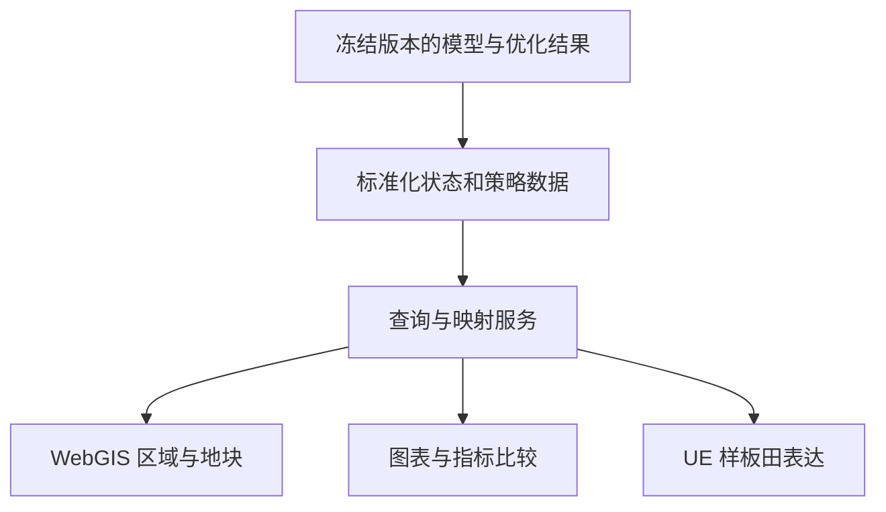

## 系统应该帮助解释什么

本课题的系统价值在于让使用者回答：哪块田受影响、影响发生在何时、模型如何解释、有什么替代策略、各策略代价是什么。

开题第 19 页已展示既有 WebGIS 与 UE 场景基础；但“已有场景”不等于“本研究数据和优化结果已完整联通”。当前缺少完整闭环验收证据，应表述为已有开发基础、研究联动待完善。

## 区域—地块—样板田三级对象

| 层级 | 主要问题 | 适合展示的数据 |
|---|---|---|
| 区域 | 风险集中在哪里 | 网格气象、事件范围、分区与覆盖率 |
| 地块 | 这块田发生了什么，有何选择 | 作物、土壤、时序、基准与候选、质量状态 |
| 样板田 | 如何直观理解状态变化 | 有说明的物候与胁迫视觉表达 |

区域场的原始网格尺度应可见；地块结果应注明是否为响应单元回填。代表样板田的三维状态不是逐株测量。

## 数据与画面解耦

这是 S01/S02 的架构意图，不是已经部署的服务清单。本页不涉及具体 CesiumJS/UE 开发实现。

建议关联键包括 parcel_id、response_unit_id、event_id、date、strategy_id、run_id。前四类对象不同，不能用一个 ID 混代。每次查询还应返回结果版本与质量标志，防止画面与指标来自不同批次。

## 视觉映射不是新的观测

叶色、萎蔫和株高等视觉效果应有明确的数据映射规则。若只有 LAI、CC 或胁迫指数，没有实测株高/颜色，就应标注“示意映射”，不能反过来声称模型已经预测了这些视觉属性。

界面应能区分无数据、未运行、不适用与低可信，而不全部渲染成零值或绿色。

## 论文建议章节结构

在 S02 六章框架基础上，按当前路线统一编号。以下是写作建议，不是学校已批准目录。

| 章节 | 核心内容 | 可关联笔记 | 需要补齐的主要成果 |
|---|---|---|---|
| 第 1 章 绪论 | 问题、研究现状、目标与假设 | [01 研究问题与技术路线](/blog/研究问题与技术路线) | 经核验的相关文献及明确研究边界 |
| 第 2 章 研究区、数据与总体方法 | 试点、资料、处理和质量控制 | [03 数据来源与成果字典](/blog/数据来源与成果字典) | 数据清单、空间图和时间一致性报告 |
| 第 3 章 区域模拟与地块作物响应 | WRF 校准、天气衔接、AquaCrop、响应单元 | [WRF-Crop原理与本土化](/blog/wrf-crop-原理与本土化)、[网格到地块与响应单元](/blog/网格到地块与响应单元) | 独立验证与尺度误差试验 |
| 第 4 章 干热情景下管理策略优化 | 事件、样本、代理、约束与稳健策略 | [NSGA-II与稳健策略评价](/blog/nsga-ii-与稳健策略评价) | 正式前沿、回代和留出情景结果 |
| 第 5 章 风险可视分析与案例 | 三级对象、状态映射、案例闭环 | 本页 | 联动原型与系统性能/可用性评价 |
| 第 6 章 结论与展望 | 回答假设，说明局限 | [02 研究进展与证据台账](/blog/研究进展与证据台账) | 只总结有证据支撑的结论 |

## 优先准备的论文图表

1. 研究区、网格、地块与数据覆盖图。
2. case31 全季及晚季 LAI 对照图，注明样本掩膜。
3. WRF 天气与作物基线验证图。
4. 响应单元数量—误差—耗时对照。
5. 代理分组验证与极端情景误差图。
6. 回代后 Pareto 图及代表策略的水量/产量对比。
7. 一次具体事件从区域定位到地块策略比较的系统案例。

前两类有历史材料线索，其余需要补齐正式实验，不宜先绘出看似已经成立的结果图。

## 关于“数字孪生”的措辞

应交代更新频率、模型与现实对象的关联和观测反馈能力。如果当前只回放离线结果，可准确称为“模型驱动的农业风险可视分析原型”；是否达到论文采用的数字孪生定义，需要用功能与证据说明，而非只靠三维场景命名。

依据：S01 第 15—19 页、S02、S03。关联 [05 正式实验前的检查与待办](/blog/正式实验前的检查与待办)。
