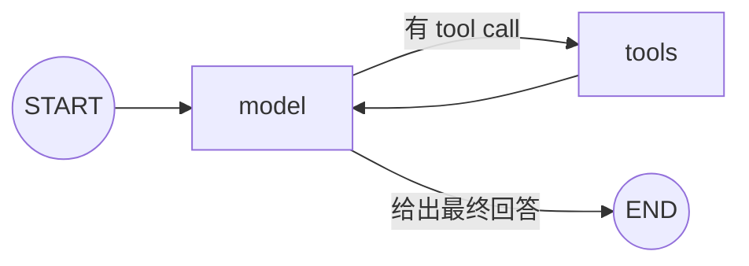
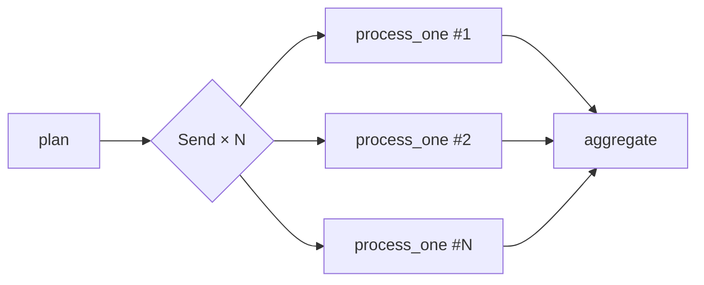
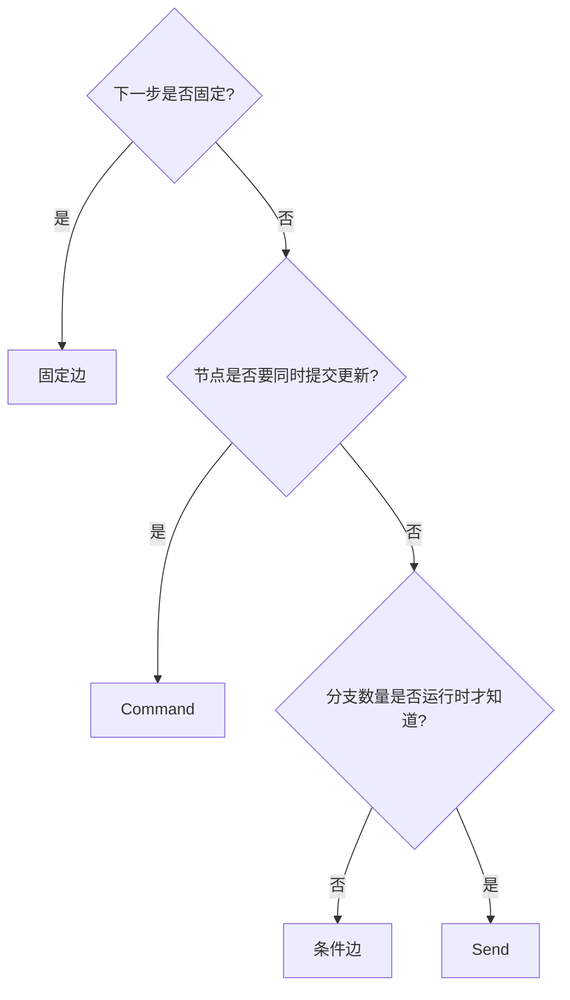

## 1. LangGraph 中的四种控制方式

| 方式 | 下一步何时确定 | 是否同时更新状态 | 典型用途 |
|---|---|---|---|
| 固定边 `add_edge` | 构图时 | 否 | 稳定顺序 |
| 条件边 `add_conditional_edges` | 节点完成后 | 路由函数本身不应更新 | 分支与循环 |
| `Command` | 节点运行时 | 是 | 更新状态并立即决定跳转 |
| `Send` | 路由时动态生成 | 每个分支可带独立输入 | 数量未知的并行任务 |

控制流应选择最简单、最能表达业务意图的方式。能用固定边时，不必使用 `Command`；只有动态任务数量不确定时，才需要 `Send`。

## 2. 固定边与条件边

### 2.1 固定顺序

```python
builder.add_edge(START, "validate")
builder.add_edge("validate", "execute")
builder.add_edge("execute", END)
```

### 2.2 条件分支

```python
from typing import Literal


def route_after_check(state: State) -> Literal["execute", "ask_user", "stop"]:
    if state["missing_fields"]:
        return "ask_user"
    if state["risk"] == "high":
        return "stop"
    return "execute"


builder.add_conditional_edges("check", route_after_check)
```

给路由函数写 `Literal[...]` 返回类型，不仅改善类型检查，也能帮助图可视化推断可能目的地。

如果路由函数返回业务标签而非节点名，可提供映射：

```python
builder.add_conditional_edges(
    "check",
    route_after_check,
    {
        "execute": "execute_action",
        "ask_user": "collect_information",
        "stop": END,
    },
)
```

## 3. 循环：Agent 的基本形态

工具调用 Agent 本质上通常是一个循环：



```python
from typing import Literal


def should_continue(state: MessagesState) -> Literal["tools", "__end__"]:
    last = state["messages"][-1]
    return "tools" if last.tool_calls else "__end__"
```

循环必须有退出条件。调用时还可设置递归上限作为最后一道保险：

```python
graph.invoke(
    {"messages": [{"role": "user", "content": "处理任务"}]},
    config={"recursion_limit": 30},
)
```

`recursion_limit` 不是业务终止逻辑，只是防止错误路由或模型反复调用工具导致无限循环。达到上限应该被视为异常，需要记录原因。

## 4. `Command`：把更新与跳转绑定在一次返回中

当节点既产生新状态，又需要根据刚得到的结果决定下一步时，使用 `Command` 很自然：

```python
from typing import Literal
from langgraph.types import Command


def assess_quality(
    state: State,
) -> Command[Literal["publish", "revise"]]:
    score = evaluate(state["draft"])

    if score >= 0.8:
        return Command(
            update={"score": score, "status": "approved"},
            goto="publish",
        )

    return Command(
        update={"score": score, "status": "needs_revision"},
        goto="revise",
    )
```

`Command` 的四个主要参数：

| 参数 | 作用 |
|---|---|
| `update` | 提交 State 更新 |
| `goto` | 指定下一节点或节点集合 |
| `graph` | 指定跳转目标属于当前图还是父图 |
| `resume` | 从 interrupt 恢复时提交外部输入 |

注意：`Command(goto=...)` 不会自动取消构图时已经定义的固定边。如果一个节点既有静态出边，又返回 `Command` 跳转，两者可能都被调度。除非确实需要并行，否则应避免混用。

### 4.1 什么时候不该用 `Command`

若判断完全基于节点执行前已经存在的 State，条件边通常更清楚：

```text
节点只负责计算，路由函数只负责选择。
```

若节点产生的局部结果与路由不可分割，`Command` 可以避免为了传一个临时判断再增加额外节点。

## 5. 从子图跳回父图

子图内部可以把更新和控制权交给父图：

```python
from langgraph.types import Command


def handoff_to_parent(state):
    return Command(
        update={"handoff_reason": "需要人工专家处理"},
        goto="human_expert",
        graph=Command.PARENT,
    )
```

如果更新的是父子图共享字段，父图对应字段必须有合适的 Reducer，否则并行或累计更新仍可能冲突。

## 6. `Send`：运行时动态 fan-out

普通边在构图时就知道有哪些分支。但有时任务数量只有运行后才知道，例如：

- 用户上传了多少个文件；
- 检索计划生成了多少个查询；
- 一份 GeoJSON 中有多少个图层；
- 需要调用多少个专业子 Agent。

这时可用 `Send` 为每个项目创建一份动态任务：



```python
import operator
from typing import Annotated
from typing_extensions import TypedDict
from langgraph.graph import StateGraph, START, END
from langgraph.types import Send


class OverallState(TypedDict):
    items: list[str]
    results: Annotated[list[dict], operator.add]
    summary: str


class WorkerState(TypedDict):
    item: str


def plan(state: OverallState):
    return {"items": ["roads.geojson", "rivers.geojson", "pois.geojson"]}


def fan_out(state: OverallState):
    return [Send("process_one", {"item": item}) for item in state["items"]]


def process_one(state: WorkerState):
    return {"results": [{"file": state["item"], "ok": True}]}


def aggregate(state: OverallState):
    ok_count = sum(item["ok"] for item in state["results"])
    return {"summary": f"成功处理 {ok_count} 个文件"}


builder = StateGraph(OverallState)
builder.add_node("plan", plan)
builder.add_node("process_one", process_one)
builder.add_node("aggregate", aggregate)
builder.add_edge(START, "plan")
builder.add_conditional_edges("plan", fan_out)
builder.add_edge("process_one", "aggregate")
builder.add_edge("aggregate", END)
graph = builder.compile()
```

这里有两个关键点：

1. 每个 `Send` 都可以给同一工作节点传入不同的局部输入；
2. `results` 由多个并行任务写入，必须定义能合并结果的 Reducer。

## 7. `Send` 不等于“无限并发”

动态分发会带来真实资源压力：

- 模型供应商有并发和速率限制；
- 数据库连接池容量有限；
- 一次分发数千个任务会放大费用；
- 大结果集会让 State 和 Checkpoint 迅速膨胀。

调用时可以限制最大并发：

```python
graph.invoke(
    input_state,
    config={"max_concurrency": 8},
)
```

更大规模的任务通常还需要分页、批处理、背压或外部任务队列。LangGraph 管理的是工作流语义，不会替业务自动解决所有容量规划问题。

## 8. 路由设计原则

### 8.1 用结构化数据做路由

不要解析模型自然语言：

```python
# 脆弱：模型可能回答“建议调用搜索工具”
if "search" in model_text:
    ...
```

应让模型返回受 schema 约束的字段，例如：

```python
class RouteDecision(BaseModel):
    route: Literal["search", "answer", "clarify"]
    reason: str
```

业务可以记录 `reason` 用于审计，但真正跳转只读取受约束的 `route`。

### 8.2 把“能否做”放在确定性代码中

模型可以判断“做什么更合适”，但权限、额度、参数范围和安全规则应由普通代码校验。不要让模型决定自己是否有权删除数据。

### 8.3 为循环保留预算

State 中可以显式记录：

```python
class State(TypedDict):
    attempts: int
    max_attempts: int
    last_error: str | None
```

这样循环为何终止是业务状态的一部分，而不是只依赖运行时异常。

## 9. 选择指南



下一步可学习两种 API 的另一种表达方式：[1.3 Functional API：entrypoint 与 task](/blog/functional-api-entrypoint-与-task)。

## 10. 官方资料

- [Graph API overview — Command and Send](https://docs.langchain.com/oss/python/langgraph/graph-api)
- [Use the Graph API](https://docs.langchain.com/oss/python/langgraph/use-graph-api)
