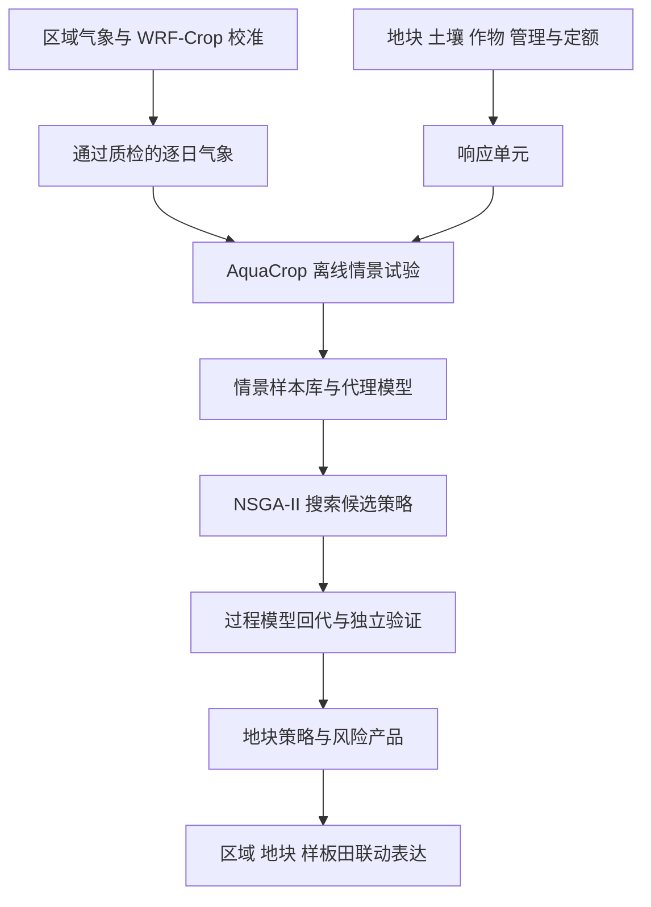

这套知识库回答三个问题：**我的论文究竟研究什么？已有工作能支撑哪些结论？下一步怎样把流程变成可信的研究成果？**

正式开题题目为《干热复合胁迫下新疆主要农作物风险模拟与减灾策略优化技术研究》。目前可追溯的实施主线已收敛到“塔城市—玉米—2020 基准年”，以小范围闭环支撑后续扩展；这不等于已经正式修改论文题目。

> **当前完成度**
> 已有玉米 WRF-Crop 校准记录、地块底座和 AquaCrop 接口试跑记录；尚不能据此宣布完成地块产量验证、干热风险优化或整个数字孪生系统。2026 年 8 月的运行百分比是历史快照，不是现在的实时进度。

## 一张图看懂研究链条

图表示当前整理后的实施路线，不表示所有环节已经完成。WRF 与 AquaCrop 之间是气象驱动的离线衔接；不能写成已经实现双向耦合。

## 阅读路径

| 想解决的问题 | 从这里开始 |
|---|---|
| 用几分钟讲清论文 | [01 研究问题与技术路线](/blog/研究问题与技术路线) |
| 找到已做实验和数值 | [02 研究进展与证据台账](/blog/研究进展与证据台账) |
| 查数据放在哪里、字段是什么意思 | [03 数据来源与成果字典](/blog/数据来源与成果字典) |
| 理解 WRF 校准 | [WRF-Crop原理与本土化](/blog/wrf-crop-原理与本土化) → [玉米case31与晚季误差诊断](/blog/玉米-case31-与晚季误差诊断) |
| 理解灌溉试验 | [动态灌溉与DB65约束](/blog/动态灌溉与-db65-约束) |
| 理解网格如何落到地块 | [网格到地块与响应单元](/blog/网格到地块与响应单元) → [AquaCrop与气象驱动接口](/blog/aquacrop-与气象驱动接口) |
| 设计情景和训练代理 | [情景样本库与代理模型](/blog/情景样本库与代理模型) |
| 理解优化与风险 | [NSGA-II与稳健策略评价](/blog/nsga-ii-与稳健策略评价) → [干热事件与损失风险口径](/blog/干热事件与损失风险口径) |
| 判断结果可信不可信 | [04 校准验证与不确定性](/blog/校准-验证与不确定性) |
| 决定接下来做什么 | [05 正式实验前的检查与待办](/blog/正式实验前的检查与待办) |
| 准备写论文与系统章节 | [06 数字孪生与论文章节映射](/blog/数字孪生与论文章节映射) |
| 追溯原始依据 | [99 资料索引与维护约定](/blog/资料索引与维护约定) |

## 三条使用原则

1. **原理、方案、记录、结论分开。**“模型可以模拟”不等于“本项目已经验证”；“脚本存在”不等于“完整实验已经完成”。
2. **每个数字附带范围。**年份、区域、作物、掩膜、时间窗口、实验编号和数据版本缺一不可。
3. **以新证据更新状态，而非覆盖历史。**保留失败试验及其原因，它们同样是论文方法选择的依据。

本次整理依据开题报告、项目方案、当前本地脚本和历史任务“论文第二部分”。未重跑模型，未核验远端 Windows 最新产物。详见 [99 资料索引与维护约定](/blog/资料索引与维护约定)。
