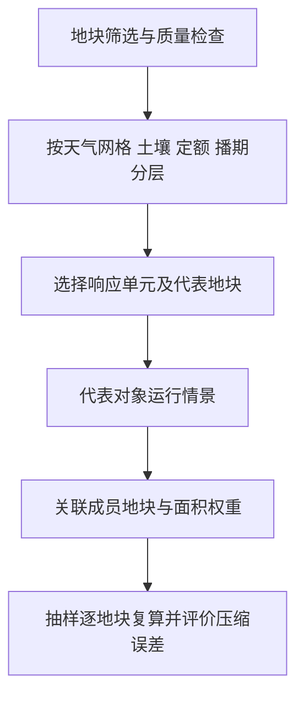

## “落到地块”包含三件不同的事

| 操作 | 真正增加了什么 | 没有自动增加什么 |
|---|---|---|
| 网格值分配到地块 | 每个地块有了可查询的属性 | 气象空间信息和独立验证精度 |
| 有依据的空间细化/订正 | 利用地形、站点或遥感等辅助信息表达差异 | 不保证全部变量都得到同样改善 |
| 田块过程模型模拟 | 土壤、作物和管理差异下的响应 | 真实地块观测或高分辨率天气 |

当前路线主要是网格气象分配 + 地块属性驱动的 AquaCrop 响应模拟。更稳妥的说法是“地块尺度模拟产品生成”，而不是未经验证就称“精确降尺度”。

## 跨网格地块如何表达

对连续的、可面积平均的网格变量，可定义：

$$w_{pg}=\frac{A(P_p\cap G_g)}{A(P_p)},\qquad X_p=\sum_g w_{pg}X_g.$$

前提是网格完整覆盖地块，面积计算正确；否则权重和不足 1 应显示为覆盖缺口。分类变量不能简单按此平均。对于最高温等非线性统计，先做日极值再空间平均，与先平均逐时场再求极值并不等价，必须固定产品定义。

### 当前实现与目标方法的区别

本地 `_join_nearest_grid` 用地块中心经纬度与网格中心建立最近邻关系，并非地块—网格交叠面积权重。经纬度上的欧氏最近邻也不是严格的测地距离。

这可以支撑接口原型，但应通过中心点归属、边界地块和跨格地块抽查量化误差。不要在论文中把现有实现直接写成“完成面积加权叠置”。

## 为什么引入响应单元

如果一组地块共用相近天气、土壤和管理条件，可以先选代表对象运行模型，再回填成员地块，降低情景计算成本。

这个近似的关键不是聚类名称，而是“被合并的地块在研究所关心的响应上是否足够接近”。相同响应单元内回填相同单产，并没有得到每块田独立的预测。

## 当前脚本具体做了什么

`build_response` 按 WRF 网格、土壤水力类别、DB65 分区和约 7 天播期分组；纯度阈值为 0.8。分层数过多时，保留总面积最大的前若干层；不足目标下限时，按地块排序分拆层。

层内代表点由若干数值属性的标准化偏差计算，选择最接近属性中位数的真实地块。虽然输出名称含 medoid，这并不等于已经实现或验证了完整的 k-medoids 最优化。

这些细节带来三个待检查点：

1. 截取面积最大层可能丢掉小面积但特殊、脆弱的地块；必须报告数量和面积覆盖率。
2. 为凑单元数而分拆同质层，不必然增加有效环境信息。
3. 当前相似度使用的浅层纹理等属性，不一定能代表根区水分响应差异。

## 用实验决定单元数

建议比较多种单元数与抽样逐地块基准，报告面积加权产量误差、灌溉误差、极端地块误差、推荐策略一致率和耗时。不能仅凭“80 个看起来合适”确定最终方案。

同时验证 2019/2023 地块变化：选取可确认稳定的地块子集，报告分裂、合并和边界变化的处理。几何稳定也不意味着 2020 年种植作物一定不变。

依据：S05、S07 中 `_join_nearest_grid`、`build_response`；历史数量见 [02 研究进展与证据台账](/blog/研究进展与证据台账)。
