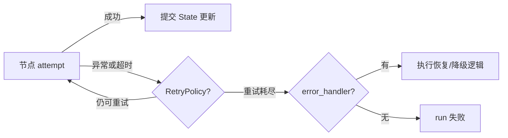

## 1. 先按“谁能修复”给错误分类

错误处理不是统一 `try/except`。不同故障应进入不同恢复路径：

| 错误类型 | 例子 | 推荐处理 |
|---|---|---|
| 暂时性 | 429、网络抖动、数据库短暂断开 | RetryPolicy + 退避 |
| 模型可修正 | 工具参数格式错、查询条件无效 | 把结构化错误写回 State，让模型重试 |
| 用户可修正 | 缺字段、目标含糊、需授权 | interrupt 或澄清问题 |
| 可降级 | 主模型不可用、非关键数据源失败 | fallback 节点/错误处理器 |
| 永久业务错误 | 无权限、对象已删除 | 明确终止，不重试 |
| 程序缺陷 | 类型错误、违反内部不变量 | 失败并告警，修代码 |

一个好错误不仅说明“发生了什么”，还说明“下一步由谁做什么”。

## 2. 节点级重试

```python
import httpx
from langgraph.types import RetryPolicy


builder.add_node(
    "call_remote_api",
    call_remote_api,
    retry_policy=RetryPolicy(
        max_attempts=3,
        initial_interval=1.0,
        backoff_factor=2.0,
        retry_on=(httpx.TimeoutException, httpx.ConnectError),
    ),
)
```

重试要点：

- 明确哪些异常可重试；
- 使用指数退避与 jitter，避免大量实例同时重试；
- 设最大次数和总时间预算；
- 记录每次尝试的节点、异常类型和延迟；
- 节点副作用必须幂等。

不要重试 `ValueError`、权限拒绝等确定性失败，除非输入或外部状态会在下一次尝试前改变。

## 3. 超时与错误处理器

较新的 LangGraph Python 1.2 API 支持给异步节点设置 attempt timeout，并在重试耗尽后进入 `error_handler`：

```python
from langgraph.types import RetryPolicy, TimeoutPolicy


builder.add_node(
    "call_model",
    call_model,
    timeout=TimeoutPolicy(idle_timeout=30),
    retry_policy=RetryPolicy(max_attempts=3),
    error_handler=model_fallback,
)
```

执行顺序是：



超时和节点级 error handler 属于较新的能力，且 timeout 只能安全取消异步节点。项目使用前应以锁定版本的 reference 为准。

## 4. 让模型修正工具错误

模型可修复的错误可以进入受限循环：

```python
from typing import Literal
from langgraph.types import Command


def execute_query(state: State) -> Command[Literal["model", "finish"]]:
    try:
        result = database.query(state["query_plan"])
        return Command(
            update={"tool_result": result, "tool_error": None},
            goto="finish",
        )
    except InvalidQuery as exc:
        return Command(
            update={
                "tool_error": {
                    "type": "invalid_query",
                    "message": str(exc),
                },
                "attempts": state["attempts"] + 1,
            },
            goto="model",
        )
```

循环中必须有预算：

```python
if state["attempts"] >= 3:
    return Command(update={"status": "failed"}, goto="finish")
```

错误内容要经过过滤，数据库堆栈、服务器路径和密钥不应原样送给模型。

## 5. 幂等：可恢复系统的底座

LangGraph 的节点可能因以下原因重复执行：

- RetryPolicy；
- interrupt 恢复时节点从头运行；
- Replay / Fork；
- 进程在外部副作用完成后、Checkpoint 提交前崩溃；
- 调用方重复提交请求。

所以“节点看起来已经跑过”不能作为唯一防重依据。

### 5.1 业务幂等键

```python
def publish_layer(state: State):
    result = catalog.publish(
        layer_id=state["layer_id"],
        idempotency_key=f"publish:{state['request_id']}",
    )
    return {"publish_result": result}
```

外部系统应保证相同 key 重复请求得到同一结果，而不是重复创建资源。

### 5.2 Inbox / Outbox

跨服务事件可采用：

- Inbox：记录已经处理的事件 ID；
- Outbox：业务写入与待发送事件在同一本地事务中提交，再由后台可靠发送。

这样可以应对“数据库已更新，但消息没发出去”之类的部分失败。

### 5.3 Saga / 补偿

多个不可原子提交的步骤，可为每个正向动作设计补偿动作：

```text
创建数据集 → 建索引 → 发布目录
     ↓失败       ↓失败
删除数据集 ← 删除索引/撤销发布
```

补偿不是数据库回滚，它本身也可能失败，必须可重试且被审计。

## 6. 状态设计决定恢复质量

为了让恢复逻辑可靠，State 应记录：

- 稳定的 `request_id`；
- 当前业务阶段或足以推导阶段的事实；
- 外部资源 ID，而不是临时 Python 对象；
- 每个副作用的结果和幂等键；
- 可分类的错误对象；
- 尝试次数与质量判断；
- 产生结论所依赖的证据引用。

不要只记录一长段模型自然语言，然后期望恢复代码从中猜出系统状态。

## 7. 测试金字塔

### 7.1 Reducer 与路由函数测试

它们是纯函数，成本最低、回报最高：

```python
def test_route_high_risk_to_review():
    state = {"risk": "high", "approved": False}
    assert route_after_check(state) == "human_review"


def test_merge_unique_is_idempotent():
    item = {"id": "x", "value": 1}
    assert merge_unique([item], [item]) == [item]
```

应覆盖分支边界、空输入和重复更新。

### 7.2 单节点测试

编译后的图可通过 `graph.nodes` 单独调用节点：

```python
result = graph.nodes["validate"].invoke(test_state)
assert result["valid"] is True
```

这种调用绕过 Checkpointer，适合测试节点逻辑，不适合验证恢复语义。

### 7.3 图路径测试

每个测试使用新的 InMemorySaver，避免 thread 互相污染：

```python
def build_test_graph():
    return build_graph().compile(checkpointer=InMemorySaver())


def test_reject_path():
    graph = build_test_graph()
    result = graph.invoke(
        invalid_input,
        {"configurable": {"thread_id": "test-reject"}},
    )
    assert result["status"] == "rejected"
```

至少覆盖：正常路径、每条条件分支、循环上限、工具失败、interrupt 与 resume、并行合并。

### 7.4 恢复与幂等测试

模拟节点在副作用前后崩溃，验证：

- 相同 thread 能恢复；
- 已成功并行分支不被不必要地重做；
- 外部资源不会重复创建；
- 旧 Checkpoint 能被新代码读取；
- resume 使用错误用户身份时会被拒绝。

## 8. 模型相关测试不要只比较完整字符串

模型输出非确定。更稳定的断言包括：

- 路由是否进入允许集合；
- 是否调用了正确类别的工具；
- 工具参数是否满足 schema；
- 引用是否来自提供的证据；
- 高风险动作是否必经审批；
- 结构化输出字段是否完整；
- token、延迟和调用次数是否在预算内。

对少量关键样例可做 golden test，但不要让标点变化导致整个测试套件失败。

## 9. 可观测性：要能回答“为什么”

至少记录：

| 层面 | 关键数据 |
|---|---|
| Run | run ID、thread ID、版本、总耗时、最终状态 |
| Node | 开始/结束时间、attempt、错误、输入输出摘要 |
| Model | 模型名、token、费用、延迟、停止原因 |
| Tool | 工具名、参数摘要、结果状态、外部 request ID |
| Route | 选择的分支、理由、置信度 |
| HITL | 审批人、决定、时间、变更前后差异 |
| Memory | 检索到哪些 memory ID、写入/删除了什么 |

LangSmith 可用于追踪、调试和评估，但敏感字段是否上传、保存多久、谁可访问，仍需按照项目的数据规范配置。

## 10. 生产指标

只看“请求成功率”不够。Agent 特有指标包括：

- 每次成功任务的模型调用数与工具调用数；
- 工具参数校验失败率；
- 每个节点的重试率与超时率；
- 循环步数分布、recursion limit 触发率；
- 人工审批等待时间和驳回率；
- Checkpoint 大小与历史增长速度；
- Memory 检索命中率、错误记忆纠正率；
- 最终答案有据率和任务完成率；
- 单任务成本 P50/P95/P99。

## 11. 版本与状态迁移

部署新图时，数据库中可能仍有旧版本暂停的 thread。变更风险从低到高大致是：

1. 增加一个不影响旧路径的节点；
2. 给 State 增加可选字段；
3. 修改路由条件；
4. 修改 Reducer；
5. 重命名/删除 State key；
6. 重命名/删除旧线程下一步正等待的节点。

生产发布前应检查活跃和 interrupted thread，针对历史 Checkpoint 做恢复测试。必要时让旧图版本继续服务旧 thread，新版本只接新 thread。

## 12. 上线检查清单

### 状态与流程

- [ ] State 可序列化，没有连接、文件句柄等运行时对象
- [ ] 并行写字段都有明确 Reducer
- [ ] 每个循环有业务退出条件和最大预算
- [ ] 高风险操作必经确定性授权或人工审批
- [ ] 大对象外存，State 只保留引用

### 可靠性

- [ ] 可重试异常范围明确
- [ ] 每次重试有退避、上限和监控
- [ ] 外部写操作使用业务幂等键
- [ ] 恢复、interrupt、replay 路径均经过测试
- [ ] Checkpointer/Store 使用持久化生产实现

### 安全与运维

- [ ] thread 与用户/租户的所有权由服务端校验
- [ ] Prompt、State、日志和 tracing 已脱敏
- [ ] 工具遵循最小权限，参数有白名单校验
- [ ] 有 Checkpoint 清理、备份和恢复策略
- [ ] 有成本、延迟、循环次数和错误率告警
- [ ] 图升级考虑仍在运行的旧 thread

## 13. 官方资料

- [Fault tolerance](https://docs.langchain.com/oss/python/langgraph/fault-tolerance)
- [Test LangGraph applications](https://docs.langchain.com/oss/python/langgraph/test)
- [Thinking in LangGraph](https://docs.langchain.com/oss/python/langgraph/thinking-in-langgraph)
- [LangSmith Studio](https://docs.langchain.com/oss/python/langgraph/studio)
